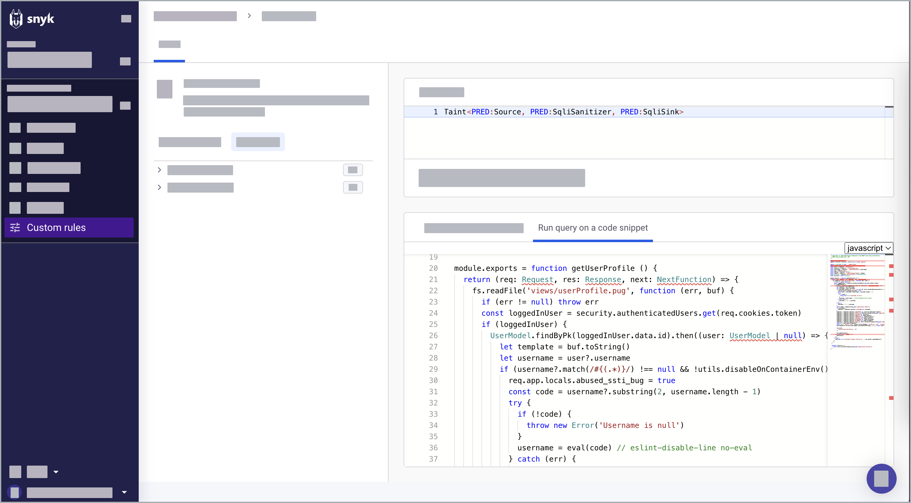

# 쿼리 실행

## 사용자 지정 규칙 쿼리를 실행하는 요구 사항

* {{snyk}}에서 프로젝트를 다시 가져온 경우, **사용자 정의 규칙**에서 **새 리포지토리 선택**을 해야 하거나 다음 자동 스캔 주기를 기다려야 합니다.\
  자세한 내용은 [Snyk 코드를 위한 기존 리포지토리 임포트](../import-project-with-snyk-code.md#re-import-repository-to-snyk)를 참조하십시오.
* 쿼리 언어는 대소문자를 구분합니다.

## 리포지토리에서 쿼리 실행

Snyk 프로젝트 목록에서 리포지토리에 대해 쿼리를 실행합니다. 이 목록에는 이전에 Snyk에 업로드한 리포지토리가 포함되어 있습니다.

1. Snyk 웹 UI에 로그인하고 그룹 및 조직으로 이동합니다.
2. **사용자 지정 규칙**으로 이동합니다.
3. (선택 사항) **시작하기** 패널에서 다음을 사용할 수 있습니다:
   * 쿼리 예제: 매우 요청된 쿼리의 예제.
   * [쿼리 템플릿](./#query-templates): 논리 연산자, 조건 및 기타 구성 요소의 사전 빌드된 템플릿.
   * [쿼리 예측](./#query-predicates): 결과에 포함해야 하는 사전 정의된 기준 및 조건.
4. **리포지토리에서 쿼리 실행** > **리포지토리**로 이동하여 쿼리를 실행할 리포지토리를 선택합니다.\
   리포지토리를 선택한 후에 임포트됩니다.&#x20;
5. (선택 사항) 이미 리포지토리가 선택된 경우, 쿼리를 실행하려면 **새 리포지토리 선택**을 클릭합니다.
6. **코드 쿼리** 패널에서 쿼리를 작성하십시오. [제안하는 AI 지원](./#suggestive-ai-support)과 함께& #x20.

    <figure><figcaption>
쿼리 작성
</figcaption></figure>
7. **쿼리 실행**.
8. [쿼리 결과 분석](run-query.md#analyze-query-results).
9. (선택 사항) [만든 사용자 정의 규칙 저장](run-query.md#save-custom-rule).

더 많은 정보는 [쿼리 예제](create-query.md)를 참조하십시오.

## 코드 스니펫에서 쿼리 실행

코드 스니펫에 대해 쿼리를 실행하여 취약점을 감지하고 코드를 검토하고 감사하며 규정 준수 및 규제 요구 사항을 평가합니다.

1. Snyk 웹 UI에 로그인하고 그룹 및 조직으로 이동합니다.
2. **사용자 지정 규칙**으로 이동합니다.
3. **코드 스니펫에서 쿼리 실행** 선택합니다.
4. 드롭다운 목록에서 프로그래밍 언어를 선택하고 코드 스니펫 영역에 코드를 붙여넣습니다.


코드 스니펫 영역에서는 특정 언어의 코드에 대해서만 쿼리를 실행할 수 있습니다. 사용 가능한 언어의 전체 목록은 드롭다운 메뉴를 참조하십시오.


<figure><figcaption>
코드 스니펫에서 쿼리 실행
</figcaption></figure>

5. [쿼리 결과 분석](run-query.md#analyze-query-results).
6. (선택 사항) [만든 사용자 정의 규칙 저장](run-query.md#save-custom-rule).

## 쿼리 결과 분석

쿼리를 실행하면 결과에서 테스트된 코드의 일치 부분을 보여줍니다. 코드의 어느 부분이 쿼리와 관련이 있는지 강조합니다. 각 일치 항목은 {{Snyk Code}}가 리포지토리를 테스트하면서 보여지며 발견에 따라 분류될 수 있습니다.