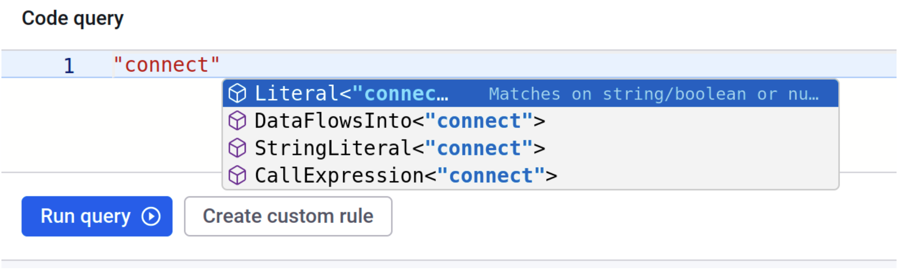
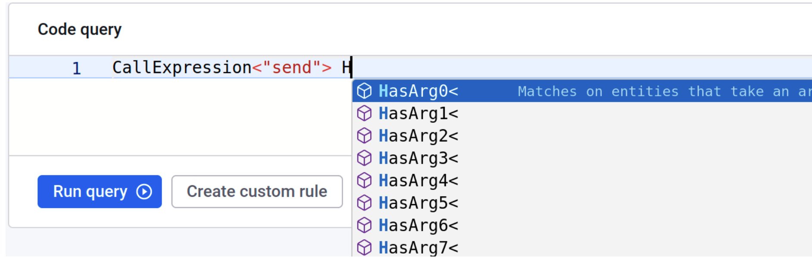
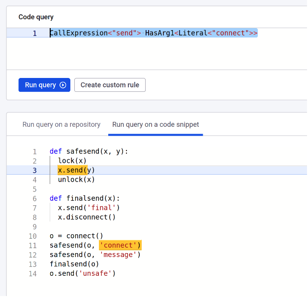

# 템플릿 및 predicates

이 섹션은 Query Language 표준 라이브러리의 템플릿과 predicates에 대한 소개를 제공하여 각 predicates와 템플릿에 대한 실용적인 예시를 제공합니다.

## 메소드, 리터럴, 및 인자

Snyk Code의 기본 기능은 메소드 호출을 찾고 해당 인자에 대해 추론하는 것입니다. 여기서의 목표는 특정한 메소드 호출과 그들의 인자에 대한 패턴을 찾아 해당 객체의 특정 속성이 성립하는지 확인하는 것입니다.

아래 Python 프로그램을 분석하고 검색할 것이라고 가정해봅시다. 유사한 프로그램이 제공된다면, 동일한 예시는 가 지원하는 다른 모든 언어에 대해서도 작동합니다. 코드는 쿼리를 수행하기 위해 컴파일되지 않아도 됩니다.

```python
def safesend(x, y):
 lock(x)
 x.send(y)
 unlock(x)


def finalsend(x):
 x.send('final')
 x.disconnect()


o = connect()
o1 = connect()
safesend(o, 'connect')
safesend(o, 'message')
finalsend(o)
o.send('unsafe')
```

첫 번째 쿼리는 `connect` 메소드를 찾습니다. 쿼리 `"connect"`는 이 값을 포함한 문자열과 해당 이름의 메소드 호출을 반환합니다. 이를 구분하기 위해 값은 템플릿에 넣을 수 있습니다. 이름 `connect`를 어떻게 포장할 수 있는지 찾기 위해 자동 완성을 사용할 수 있습니다. `Literal` 또는 `StringLiteral`은 문자열 \_`'connect'`\_으로 검색 결과를 제한하며, `CallExpression`은 함수 호출 `connect()`로 결과를 제한합니다.

<figure><figcaption><p>환경이 "connect"을 사용할 가능성을 제안</p></figcaption></figure>

함수 호출이 파일 스캔 중인 파일 외부의 함수에 대해서도 찾을 수 있는데, `CallExpression<"safesend">`를 찾으려고 시도하면 결과가 없을 것입니다. 이는 분석이 로컬 함수를 인라인하여 그들의 동작에 대해 추론하기 때문입니다.

파일에서 가장 많이 호출되는 메소드인 `send`를 살펴보세요. 이 메소드는 `connect`로부터 반환된 객체에서 호출되며 다양한 문자열을 인자로 받습니다. 인자를 보기 위해 해당 인자에 대한 일부 템플릿을 사용할 수 있습니다. 이들은 `HasArg0`, `HasArg1` 등입니다.

<figure><figcaption><p>환경이 HasArg을 제안합니다</p></figcaption></figure>

예를 들어, 다음 쿼리를 사용하여 `connect`에서 반환된 객체에서 `send` 호출을 모두 찾을 수 있습니다:

`CallExpression<"send"> HasArg0<CallExpression<"connect">>`\
이것들은 모두 위치입니다. 그러나 `connect` 값을 가진 첫 번째 인자로 `send`를 호출하는 위치들을 찾을 수 있습니다.

<figure><figcaption><p>첫 번째 인자가 'connect' 값을 취하는 send 호출</p></figcaption></figure>

이것은 다른 그림을 제공합니다. 분석을 통해 메시지 `connect`가 로컬 함수를 호출하는 위치에 보내졌음을 이해했습니다.

객체 `o`의 상태 주변의 다른 작업들을 살펴볼 수 있습니다. 예를 들어, _disconnect_ 이후 _send_ 모두를 찾고 싶다고 가정해봅시다. 이들은 연결이 나빠질 수 있는 프로그램의 궁극적인 경우여야 합니다. 이 쿼리를 수행하기 위해 다음과 같은 쿼리를 실행할 수 있습니다:\
`CallExpression<"send"> HasArg0<DataFlowAfter<Arg0In<CallExpression<"disconnect">>>>`

이 쿼리는 인자 `0`을 만족하는 _send_ 호출을 검색합니다. 데이터 플로우에서, `send`가 발생하는 위치는 `disconnect`을 호출하는 인자 `0` 이후여야 합니다. 이는 최종으로 안전하지 않은 `send` 호출에만 일치합니다.

부정을 위해, `connect`를 반환하지만 반환된 객체에 대해 \_disconnect\_를 호출하지 않는 객체를 찾을 수 있습니다.

`CallExpression<"connect"> Not<ForSameObject<Arg0In<CallExpression<"disconnect">>>>`

유사하게, `connect`와 함께 `send`를 호출하지만 `disconnect`를 호출하지 않을 수 있습니다. 다음 예시는 이전 코드 스니펫에서 일치하는 것이 없습니다:

`CallExpression<"send"> HasArg0<CallExpression<"connect">> Not<HasArg0<ForSameObject<Arg0In<CallExpression<"disconnect">>>>>`

모든 경우에 대해, 룰에 대한 자동 완성은 예시를 통해 쿼리 작성을 용이하게 만들기 위해 해당 예시를 보여줄 것입니다. 보다 복잡한 쿼리를 작성하는 것도 도움이 될 것입니다.

## 오염된 흐름과 데이터 소스

많은 경우, 특정 유형의 데이터가 프로그램의 특정 민감한 위치로 흐를 수 없도록 보장하고 싶을 것입니다. 이겢는 종종 보안상의 이유로, 준수 및 정확성을 보장하기 위해 수행됩니다.

쿼리할 중요한 요소는 민감한 데이터 소스입니다. Snyk는 쿼리할 수 있는 다음 세트의 계층적 데이터 소스를 내장하고 있습니다:

[AnySource](templates-and-predicates.md#anysource)

* [SourceServer](templates-and-predicates.md#sourceserver)
  * [SourceCookie](templates-and-predicates.md#sourcecookie)
  * [SourceHttpParam](templates-and-predicates.md#sourcehttpparam)
  * [SourceRequestUrl](templates-and-predicates.md#sourcerequesturl)
  * [SourceHttpHeader](templates-and-predicates.md#sourcehttpheader)
  * [SourceWebForm](templates-and-predicates.md#sourcewebform)
  * [SourceHttpBody](templates-and-predicates.md#sourcehttpbody)
  * [SourceHttpFileUpload](templates-and-predicates.md#sourcehttpbody)
  * [SourceRpcApiParam](templates-and-predicates.md#sourcerpcapiparam)
* [SourceNonServer](templates-and-predicates.md#sourcenonserver)
  * [SourceResourceAccess](templates-and-predicates.md#sourceresourceaccess)
    * [SourceDatabase](templates-and-predicates.md#sourcedatabase)
    * [SourceFile](templates-and-predicates.md#sourcefile)
    * [SourceArchive](templates-and-predicates.md#sourcearchive)
    * [SourceClientFramework](templates-and-predicates.md#sourceclientframework)
  * [SourceLocalEnv](templates-and-predicates.md#sourcelocalenv)
    * [SourceCLI](templates-and-predicates.md#sourcecli)
    * [SourceStdin](templates-and-predicates.md#sourcestdin)
    * [SourceEnvironmentVariable](templates-and-predicates.md#sourceenvironmentvariable)

첫 번째 소스 카테고리(SourceServer)는 서버를 구현하는 프로그램에 대해 정의됩니다. 이러한 소스들은 주로 완전히 사용자에 의해 제어 가능합니다. 이것은 악성 사용자가 응용 프로그램에 대한 공격을 수행할 수 있는 것을 의미하거나 이러한 데이터를 추가적인 주의를 기울여 처리해야 함을 나타냅니다. 예를 들어, 언제나 인증이 수행되었는지 확인하거나 다른 속성이 강제되었는지 확인할 수 있습니다.

비서버 predicates들도 서버 기능을 구현하지 않은 프로그램에 적용됩니다.

SourceServer 카테고리에서의 각 predicates는 _`PRED:SourceServer`_ 또는 \_`PRED:AnySource`\_를 쿼리하여 반환됩니다. 다음 TypeScript 코드 예제를 고려해보세요.

```javascript
import { Request, Response, NextFunction } from 'express';


module.exports = function productReviews () {
 return (req: Request, res: Response, next: NextFunction) => {
   let user = req.signedCookies;
   doSomething(user);
   console.log('Some message ' + user);
 }
}

```

이는 express 서버를 위한 요청 처리기를 구현한 것입니다. 이 경우, 코드는 사용자 쿠키를 읽고 콘솔에 로깅합니다. 이것은 많은 응용 프로그램에 대해 보안 취약점이며 준수 문제가 될 수 있습니다. 의 첫 번째 기능은 쿠키 위치를 확인할 수 있으며 많은 프로퍼티에 대해 검사할 수 있습니다. 이 경우, _`PRED:SourceCookie`_ 쿼리를 실행하여 요청 핸들러의 첫 번째 줄을 찾을 수 있습니다.

이제 코드가 쿠키를 올바르게 처리했는지 확인할 수 있습니다. 예를 들어, 쿠키가 어디에도 로그되지 않는지 확인할 수 있습니다. 데이터 플로우나 \_`ForSameObject`\_를 사용할 수 있습니다. 이 경우, 쿠키가 다른 객체 또는 문자열 결합과 같은 다른 개체의 일부로 로깅되는지 여부를 보고할 수 있습니다.

이렇게 함으로써, `source, sanitizer, sink`의 형태로 수행되는 오염분석이 수행됩니다. 이 곳에서, \_source\_는 민감한 데이터의 원천이며, \_sanitizer\_는 데이터를 민감하지 않게 변환할 코드 패턴을 제공하며, \_sink\_는 민감한 데이터가 해당 위치에 도달하여 보고해야 하는 위치입니다. 그런 다음 보고가 _sink_ 위치에서 수행됩니다.

이제 사용자가 로깅되는 위치를 찾기 원한다고 가정해보세요. 그런 다음 다음 쿼리를 사용할 수 있습니다:

`Taint<PRED:SourceCookie, PRED:None, CallExpression<"log">>`

물론, 쿠키가 `hash123` 함수를 사용하여 해싱된 경우에만 로깅하는 것으로 하려고 할 수 있습니다. 그러면 쿼리는 다음과 같아 보일 것입니다:\
\
`Taint<PRED:SourceCookie, CallExpression<"hash123">, CallExpression<"log">>`

## 미리 정의된 싱크와 살짝말제

앞서 소개한 오염된 템플릿을 사용하여 취약성 탐지기를 작성할 수 있습니다. 그러나 는 다양한 유형의 취약성을 위한 predicates를 제공합니다. 예를 들어, SQL Injection을 탐지하려면 다음 쿼리로 완전히 수행할 수 있습니다:

`Taint<PRED:AnySource, PRED:SqliSanitizer, PRED:SqliSink>`

물론, 이는 \_`AnySource`\_에서의 어떤 소스든 악의적인 사용자가 제어할 수 있는 것이라고 가정합니다. 예를 들어, 모든 응용프로그램이 환경변수나 명령줄 인수를 사용자가 제어할 수 있는 방식으로 구성되지는 않습니다. 만약 이를 확인하려면 다음과 같이 질의할 수 있습니다:\
\
`Taint<Or<PRED:AnySource, PRED:SourceResourceAccess>, PRED:SqliSanitizer, PRED:SqliSink>`

SQL Injection 이외에도 는 수십 개의 다른 취약성을 탐지할 수 있으며 검색 및 사용자 정의 규칙에서 액세스 가능한 해당 predicates를 가지고 있습니다. predicates의 수는 시간이 지남에 따라 증가하고 더 많은 규칙이 수정 가능해지고 있습니다.

## 미리 정의된 템플릿과 predicates

### predicates

#### Any

모든 것과 일치하는 "catchall" 규칙입니다.

#### AnySink

서버 응답, 파일 시스템, 데이터베이스 쓰기, 외부 API, 로깅 메커니즘 및 기타 형태의 데이터 내보내기 또는 표시 형식을 포함하여 여러 유형의 데이터 싱크에 대해 일치하는 규칙입니다.

#### AnySource

서버 (예: HTTP 매개 변수/헤더/바디, URL, 쿠키 등) 또는 간접적인 (예: 데이터베이스 필드, 로컬 파일, I/O 또는 환경 변수)와 같은 다양한 유형의 사용자 제어 가능한 데이터 소스에 대해 일치하는 규칙입니다.

상관관계

... (제한된 길이 - 반복으로 ... 추가)

#### SourceArchive

......### Templates

#### And

이진 연결. 두 인수가 모두 일치하는 경우에만 일치합니다.

템플릿 매개변수:

* First - 연결지시어
* Second - 연결지시어

#### AnyParamIn

제공된 메서드나 함수 선언의 모든 매개변수에 일치합니다.

템플릿 매개변수:

* Function

#### Arg0In

제공된 메서드나 함수의 0번째 인덱스 인수(즉, 메서드 호출 대상 객체)에 일치합니다.

템플릿 매개변수:

* Function

#### Arg1In

제공된 메서드나 함수의 1번째 인덱스 인수에 일치합니다.

템플릿 매개변수:

* Function

#### Arg2In

제공된 메서드나 함수의 2번째 인덱스 인수에 일치합니다.

템플릿 매개변수:

* Function

#### Arg3In

제공된 메서드나 함수의 3번째 인덱스 인수에 일치합니다.

템플릿 매개변수:

* Function

#### Arg4In

제공된 메서드나 함수의 4번째 인덱스 인수에 일치합니다.

템플릿 매개변수:

* Function

#### Arg5In

제공된 메서드나 함수의 5번째 인덱스 인수에 일치합니다.

템플릿 매개변수:

* Function

#### Arg6In

제공된 메서드나 함수의 6번째 인덱스 인수에 일치합니다.

템플릿 매개변수:

* Function

#### Arg7In

제공된 메서드나 함수의 7번째 인덱스 인수에 일치합니다.

템플릿 매개변수:

* Function

#### BooleanLiteral

boolean 유형 리터럴에 일치합니다.

템플릿 매개변수:

* Value

#### CallExpression

주어진 이름이 호출될 때 일치합니다.

템플릿 매개변수:

* Callee - 호출할 함수, 메서드 또는 생성자

#### DataFlowAfter

매개변수의 데이터 흐름에서 이후에 발생하는 항목에 일치합니다.

템플릿 매개변수:

* PrevAction - 실행된 이전 작업

<details>

<summary>예시</summary>

다음 코드 스니펫에서 `replaceAll`은 `scanner.nextLine()`에서 읽은 데이터에 대한 살균제로 사용됩니다.

```java
import java.util.Scanner;

public class RegexSanitize {
    public static void main(String[] args) {
        Scanner scanner = new Scanner(System.in);
        String input = scanner.nextLine();
        input = input.replaceAll("[^a-zA-Z0-9 ]", "");
        System.out.println(input);
    }
}
```

다음의 규칙을 사용하여 특정 매개변수로 `replaceAll`이 이 **호출 체인**의 일부인지 확인할 수 있습니다:

```starlang
And<CallExpression<"replaceAll">, HasArg1<"[^a-zA-Z0-9 ]">>
HasArg0<DataFlowAfter<
  And<
    CallExpression<"nextLine">, 
    And<
      HasArg0<"java.util.Scanner">, 
      HasArg0<HasArg1<"java.lang.System.in">>
    >
  >
>>
```

`HasArg0`를 사용하여 `DataFlowAfter`와의 관계를 설정하여, 이전에 정의된 `And` 템플릿과 일치하는 `replaceAll` 호출이 `scanner.nextLine()` 이후 데이터 흐름 경로상에 있는 것을 표현합니다.

***

참고: 이는 실제로 실행된 함수 호출에 매치되며, `input`이 살균된 값으로 재할당되었는지 여부와는 상관이 없습니다.

`System.out.println`으로 전송된 데이터에 대해서는 일치하지 않습니다. 이 기능을 확인하려면 해당 확인을 달성하기 위해 이 함수를 `Taint`와 결합하십시오.

```starlang
Taint<
  And<
    And<CallExpression<"replaceAll">, HasArg1<"[^a-zA-Z0-9 ]">>,
    HasArg0<DataFlowAfter<
      And<
        CallExpression<"nextLine">, 
        And<
          HasArg0<"java.util.Scanner">, 
          HasArg0<HasArg1<"java.lang.System.in">>
        >
      >
    >>
  >,
  PRED:None,
  "java.lang.System.out.println"
>
```

</details>

#### DataFlowsFrom

표식 데이터의 흐름이 시작하는 위치에 일치합니다.

템플릿 매개변수:

* Source

#### DataFlowsInto

표식 데이터가 흐를 수 있는 위치에 일치합니다.

템플릿 매개변수:

* Sink

#### ExplicitSelfParamIn

제공된 메서드나 함수 선언의 명시적 수신기 매개변수(예: Python 및 Rust의 self)에 일치합니다.

템플릿 매개변수:

* Function

#### ForSameObject

매개변수와 동일한 객체에서 발생한 항목에 일치합니다.

템플릿 매개변수:

* ObjectAction - 객체에서 발생한 작업

#### HasAnnotation

주어진 주석으로 주석이 달린 엔티티에 일치합니다.

템플릿 매개변수:

* Annotation - 엔티티에 달린 주석

<details>

<summary>예시</summary>

```java
package snippets.java.docs;

public class HasAnnotationDemo {
    public void oldMethod(@Deprecated String parameter1, String parameter2) {

    }
}
```

`parameter1`을 캡처하려면 다음 쿼리를 사용하세요:

```
HasAnnotation<"java.lang.Deprecated">
```

</details>

<details>

<summary>예시 (명명된 매개변수)</summary>

```java
package snippets.java.docs;

import java.lang.annotation.ElementType;
import java.lang.annotation.Retention;
import java.lang.annotation.RetentionPolicy;
import java.lang.annotation.Target;

@Target({ElementType.FIELD, ElementType.METHOD})
@Retention(RetentionPolicy.RUNTIME)
@interface Sensitive {
    String reason();
}


public class HasAnnotationWithArgsDemo {
    private String email = "support@snyk.io";

    @Sensitive(reason = "PII")
    public String getEmail() {
        return email;
    }
}
```

`getEmail` 메서드를 캡처하려면 다음 쿼리를 사용하세요:

```
HasAnnotation<And<"Sensitive", HasNamedArg<"reason", "PII">>>
```

</details>


`HasAnnotation`은 아직 `Taint` 작업에서 사용할 수 없습니다.


... (이하 생략)### 메소드 또는 함수 선언.

템플릿 매개변수:

* Function

#### Param5In

제공된 메소드 또는 함수 선언의 5번째 매개변수와 일치합니다.

템플릿 매개변수:

* Function

#### Param6In

제공된 메소드 또는 함수 선언의 6번째 매개변수와 일치합니다.

템플릿 매개변수:

* Function

#### Param7In

제공된 메소드 또는 함수 선언의 7번째 매개변수와 일치합니다.

템플릿 매개변수:

* Function

#### ReturnedBy

반환하는 엔티티와 일치합니다.

템플릿 매개변수:

* Function - 반환하는 엔티티.

#### Returns

값으로 제공된 엔티티(예: 함수 또는 메소드)와 일치합니다.

템플릿 매개변수:

* Value - 반환되는 값.

#### StringLiteral

문자열 형식 리터럴과 일치합니다.

템플릿 매개변수:

* Value

#### Taint

지정된 소스에서 시작되고 지정된 싱크(취약한 메소드와 같은)에 도달하는 데이터 전파 흐름을 식별하며 지정된 살균기를 통과하지 않습니다.

템플릿 매개변수:

* Source
* Sanitizer
* Sink
