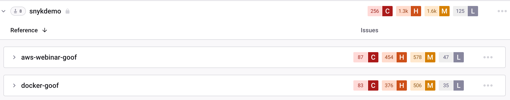

# Amazon Elastic 컨테이너 레지스트리(ECR) - Snyk에 이미지 추가하기

Snyk은 Amazon ECR 컨테이너 이미지를 검사하고 모니터링하여 ECR 저장소에 있는 태그를 평가합니다.

## **Snyk에 ECR로부터 이미지 추가하는 데 필요한 사전 조건**

* Snyk 계정이 있어야하며 관리자에 의해 조직에 가입되어 있어야 합니다.
* Snyk와 ECR 저장소 간의 통합이 구성되어 있어야 합니다.

## **ECR로부터 Snyk에 이미지 추가하는 방법**

계정에 로그인하고 관리하려는 관련 그룹 및 조직으로 이동합니다.

1. **프로젝트**로 이동하고 **프로젝트 추가**를 클릭합니다.\
   계정에 이미 구성된 통합 목록이 열립니다.
2. 통합 목록에서 **ECR**을 선택합니다. 연결한 레지스트리의 사용 가능한 이미지가 표시되는 **테스트할 ECR 이미지** 보기가 열립니다.
3. 다음 중 하나 이상의 방법을 사용하여 하나 이상의 이미지를 선택합니다:
   1. 특정 이미지를 가져오려면 **이미지 이름** 필드에 이름을 입력합니다.
   2. 관련 이미지를 모두 가져오려면 저장소 중 하나를 선택합니다.
   3. 여러 이미지를 선택하려면 저장소를 확장하고 축소합니다.
4. **선택한 이미지 추가**를 클릭합니다.\
   이미지가 가져오는 동안 페이지 상단에 상태 표시줄이 나타납니다. 이 과정 중에도 작업을 계속할 수 있습니다.
5. 가져오기가 완료되면 페이지 상단에 성공 또는 실패 알림이 표시됩니다. 새로 가져온 이미지가 포함된 **프로젝트** 페이지를 보려면 **페이지 새로 고침**을 클릭합니다.\
   이미지는 저장소별로 그룹화되며 개별적으로 자세한 **프로젝트** 페이지에 연결됩니다.
6. 이제 Git 리포지토리를 이 프로젝트에 연결하여 Dockerfile을 사용하여 보강된 수정 안내를 받을 수 있습니다.\
   자세한 정보는 [Dockerfile에서 취약한 베이스 이미지 감지](../../scan-your-dockerfile/detect-vulnerable-base-images-from-your-dockerfile.md)를 참조하십시오.

고유한 아이콘으로 표시된 ECR 프로젝트만 보려면 필터링할 수 있습니다.

<figure><figcaption>
Amazon ECR 프로젝트 예시
</figcaption></figure>

Amazon ECR 통합은 다른 Snyk 통합과 같이 작동합니다. 프로젝트를 계속 모니터링, 수정 및 관리하려면 Snyk 사용자 문서의 관련 페이지를 참조하십시오.


컨테이너 이미지 내의 애플리케이션 취약점의 경우, 애플리케이션에 대한 모든 변경 사항은 수동 또는 주기적인 재테스트로 반영되지 않습니다. 이미지의 재가져오가 필요합니다. 자세한 정보는 [컨테이너 이미지 내의 애플리케이션 취약점 감지](../../use-snyk-container/detect-application-vulnerabilities-in-container-images.md)를 참조하십시오.

