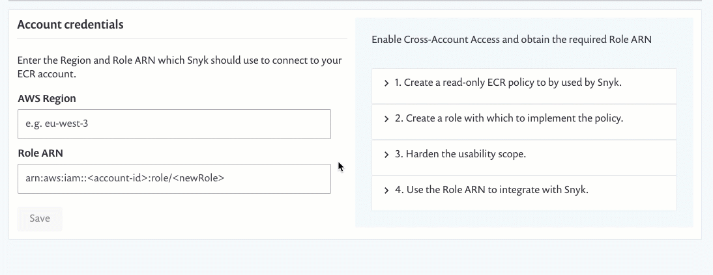

# Snyk 권한을 활성화하여 Amazon Elastic Container Registry (ECR)에 처음으로 액세스하는 방법


ECR 통합을 연결할 때 **us-east-2** 지역이 활성화된 것을 확인하십시오. 이것은 STS (보안 토큰 서비스)가 올바르게 작동하기 위해 필요합니다. 자세한 정보는 [관련 지원 문서](https://support.snyk.io/s/article/Connecting-to-ECR-Integration-gives-error-Could-not-connect-to-ECR-Please-ensure-your-credentials-are-correctly-configured)를 참조하십시오.


이 프로세스는 AWS에서 리소스 역할 및 필요한 정책을 설정하는 방법을 설명합니다. 더 많은 정보는 [Amazon ECR 문서](https://docs.aws.amazon.com/AmazonECR/latest/userguide/ecr_managed_policies.html)를 참조하십시오.

1. AWS 관리 콘솔에 [로그인](https://console.aws.amazon.com/iam/home?#/policies)합니다.
2. IAM 서비스로 이동합니다.
3. 정책 페이지로 이동하여 다음과 같이 관련 JSON 파일을 업데이트하여 역할에 대한 정책을 만듭니다:
   1. 새로운 정책을 만듭니다.
   2. **JSON** 탭으로 이동합니다.
   3. JSON 파일에서 모든 기본 텍스트를 선택하고 삭제합니다.
   4. UI에서 표시된대로 스크립트를 복사하고 Snyk 계정에서 JSON 파일 안에 붙여넣습니다.
   5. **Name**으로 **AmazonEC2ContainerRegistryReadOnlyForSnyk**를 설정합니다.
   6. **Description**으로 **Snyk에게 Amazon EC2 Container Registry 리포지토리에 대한 읽기 전용 액세스를 제공**합니다.
   7. **정책 생성**을 클릭합니다.
4. 정책을 구현하기 위한 역할을 만듭니다:
   1. [AWS 관리 콘솔](https://aws.amazon.com/console/)에서 **Roles** 페이지로 이동하여 새 역할을 만듭니다.
   2. **신뢰받는 엔티티**로 **AWS 서비스**를 선택하고 이 역할의 서비스로 **EC2**를 선택합니다.
   3. **다음: permissions**를 클릭합니다.
   4. 표시된 정책 목록에서 방금 생성한 **AmazonEC2ContainerRegistryReadOnlyForSnyk** 정책을 검색하고 선택합니다.
   5. 프로세스의 마지막 단계(**검토**)로 건너뜁니다.
   6. 역할의 이름을 **SnykServiceRole**로 지정합니다.
   7. **Description**으로 **EC2 인스턴스가 Snyk AWS 서비스를 호출할 수 있도록 허용**을 입력한 다음 역할을 생성합니다.
5. 역할의 사용 범위를 강화합니다:
   1. **Roles** 페이지에서 방금 만든 역할의 **link**를 찾아 클릭하여 구성을 업데이트하고 **Trust relationships** 탭으로 이동합니다.
   2. **Edit trust relationship**을 클릭합니다.
   3. **정책 문서**에서 전체 스크립트를 선택하고 삭제한 다음, Snyk 계정의 UI에서 표시된대로 다음 스크립트를 복사하여 붙여넣습니다. 계정 자격 증명의 **Harden usability scope** 필드에서 이렇게 수행합니다.

<figure>
  <figcaption>
Snyk 권한을 활성화하여 Amazon Elastic Container Registry (ECR)에 액세스하기
</figcaption>
</figure>