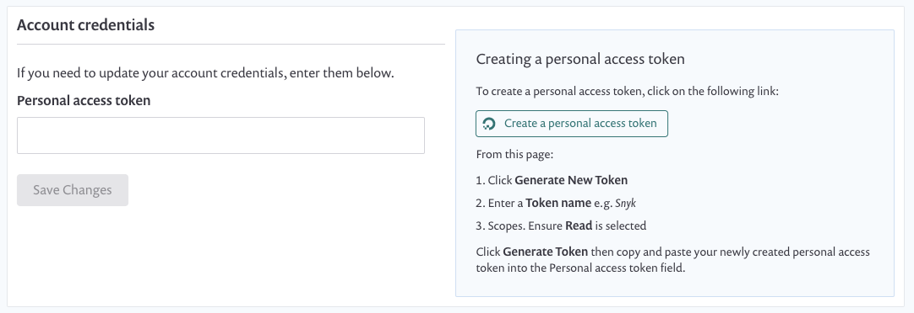
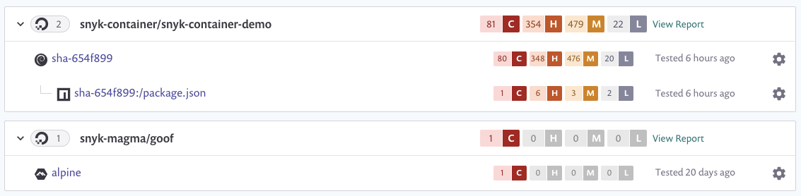

# DigitalOcean과 통합

Snyk은 DigitalOcean과 통합하여 컨테이너 이미지를 가져와 취약점을 모니터링할 수 있게 해줍니다.

Snyk은 가져온 이미지(프로젝트)를 알려진 보안 취약점에 대해 테스트하고, 사용자가 제어하는 빈도로 이러한 이미지를 테스트하며, 새로운 이슈가 감지되면 경고를 보냅니다.

DigitalOcean과의 통합은 모든 Snyk 사용자에게 제공됩니다.

이 페이지에서는 Snyk에서 DigitalOcean 통합을 설정하고 이미지 취약점을 관리하는 방법을 설명합니다.

## DigitalOcean과 통합

### DigitalOcean 통합을 위한 선행 조건

* Snyk에서 설정 중인 조직의 관리자이어야 합니다.
* Snyk은 DigitalOcean과 통합하기 위해 사용자 자격 증명이 필요하며, SSO에 구성된 DigitalOcean을 지원하지 않습니다.

### **DigitalOcean 통합 구성**

1. Snyk 계정에서 통합으로 이동합니다. 컨테이너 레지스트리 섹션에서 **DigitalOcean** 옵션을 찾아 클릭합니다.
2. **계정 자격 증명** 섹션에 DigitalOcean 개인 액세스 토큰을 로그인 자격 증명으로 입력합니다. 액세스 토큰 생성에 대한 상세한 지침은 통합 페이지에서 찾을 수 있습니다.
3. 완료하려면 **저장**을 클릭합니다.

<figure><figcaption>
DigitalOcean 계정 자격 증명
</figcaption></figure>

자체 호스팅된 DigitalOcean을 사용하는 경우 [Snyk 지원팀](https://support.snyk.io)에게 연락하여 토큰을 제공받으세요. 자세한 내용은 [자체 호스팅 컨테이너 레지스트리용 Snyk Container (Broker)](../../../enterprise-setup/snyk-broker/snyk-broker-container-registry-agent/integrate-with-self-hosted-container-registries-broker.md)를 참조하십시오.


성공적인 연결을 위해 DigitalOcean 레포지토리가 있어야 합니다.


Snyk은 연결 값을 테스트하고 페이지를 다시로드하여 DigitalOcean 통합 정보를 표시합니다. **DigitalOcean 이미지를 Snyk에 추가** 단추를 사용할 수 있습니다. DigitalOcean에 연결에 실패하면 **DigitalOcean에 연결됨** 섹션 아래에 알림이 나타납니다.

연결에 성공하면 Snyk을 사용하여 DigitalOcean의 이미지를 스캔할 수 있습니다.

## Snyk에서 DigitalOcean 컨테이너 이미지 스캔

Snyk은 귀하의 DigitalOcean 컨테이너 이미지를 검사하고 모니터링하여 저장소의 이미지 태그를 평가합니다. Snyk에 이미지를 가져온 후 이미지 취약점이 식별되어 손쉽게 처리될 수 있습니다.

DigitalOcean에서 Snyk로 이미지를 추가하는 방법이 나와 있습니다.

## **DigitalOcean 이미지 스캔을 위한 선행 조건**

* 관리자가 승인한 관련 조직에 액세스 권한이 있는 Snyk 계정.
* DigitalOcean 통합이 설정되어 있어야 합니다. 자세한 내용은 [DigitalOcean 통합을 통한 컨테이너 보안](integrate-with-digitalocean.md)을 참조하십시오.

## **DigitalOcean 이미지 스캔 단계**

1. 계정에 로그인하여 관리하려는 관련 그룹 및 조직으로 이동합니다.
2. **프로젝트** 탭에서 **프로젝트 추가**를 클릭합니다.\
   계정에서 이미 구성된 통합 목록이 열립니다.
3. **DigitalOcean** 옵션을 선택하거나 **DigitalOcean**이 표시되지 않으면 **기타**를 선택합니다.\
   연결된 레지스트리의 사용 가능한 이미지가 별도로 그룹화된 **어떤 이미지를 테스트하시겠습니까?** 가 열립니다.
4. Snyk에 가져올 이미지를 단일 또는 여러 개 선택합니다.\
   특정 이미지를 선택하거나 전체 저장소를 선택하여 찾고자 하는 특정 이미지를 찾을 수 있습니다.
5. 완료하려면 오른쪽 상단에 있는 **선택된 저장소 추가**를 클릭합니다.\
   이미지가 가져와지는 동안 페이지 상단에 상태 표시줄이 나타납니다. 그 동안 작업을 계속할 수 있습니다.
6. 가져오기가 끝나면:
   1. **프로젝트** 페이지에서 **NEW** 태그로 표시된 최신 가져온 이미지를 볼 수 있습니다. 이미지는 저장소별로 그룹화되어 있으며 각각은 자세한 **프로젝트** 페이지에 개별적으로 연결됩니다.
   2. **가져오기 로그**가 사용 가능해집니다. 이 로그는 프로젝트 목록 상단에서 확인할 수 있습니다.
   3. 데이터를 보완하고 기본 이미지에 대한 권장 사항을 얻으려면 **설정** 아래에서 Dockerfile을 이미지 프로젝트에 연결할 수 있습니다. 자세한 내용은 [Dockerfile 추가 및 기본 이미지 테스트](../scan-your-dockerfile/detect-vulnerable-base-images-from-your-dockerfile.md)을 참조하십시오.

DigitalOcean 가져오기는 고유한 아이콘으로 표시됩니다. **프로젝트** 보기에서 DigitalOcean 프로젝트만 볼 수 있도록 통합을 필터링할 수 있습니다:

<figure><figcaption>
프로젝트 목록의 DigitalOcean 프로젝트
</figcaption></figure>


컨테이너 이미지 내의 애플리케이션 취약성의 경우, 수동 또는 주기적 재테스트로 애플리케이션 변경이 반영되지 않습니다. 이미지를 다시 가져와야 합니다. 자세한 내용은 [컨테이너 이미지의 애플리케이션 취약성 감지](../use-snyk-container/detect-application-vulnerabilities-in-container-images.md)를 참조하십시오.

