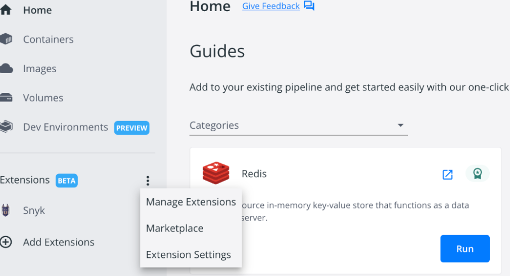
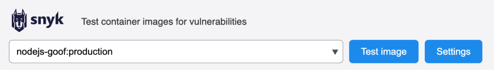
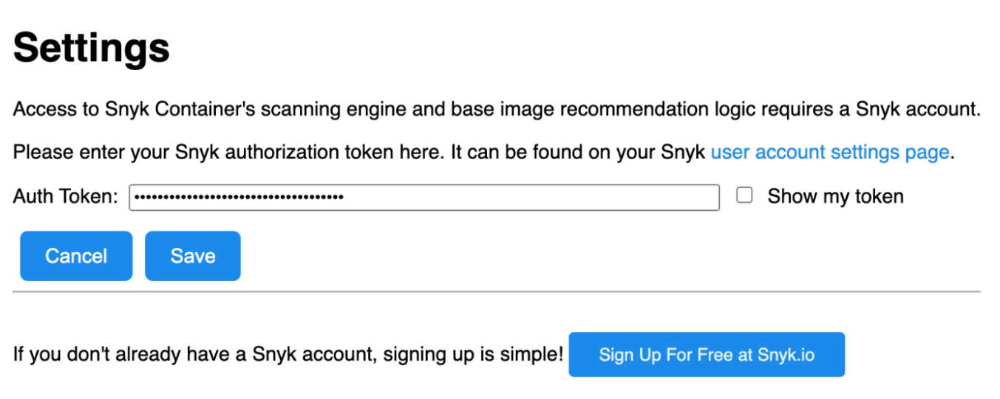
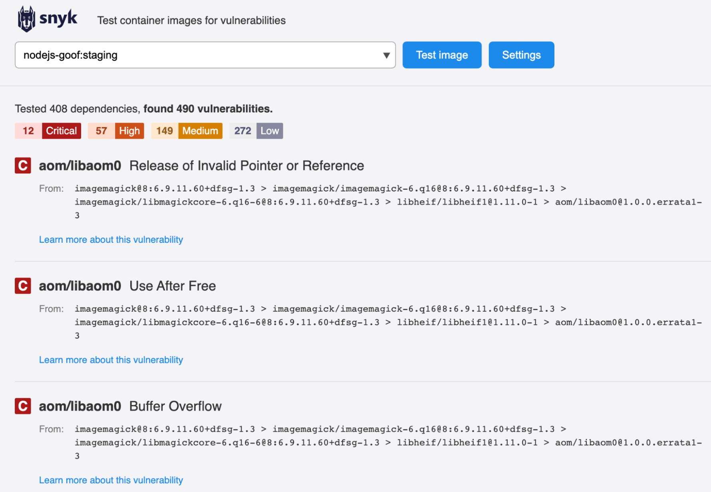

# Docker Desktop Extension과 통합


**Snyk Docker Desktop 확장 지원 종료**

2025년 6월 20일부터는 Docker Desktop과의 통합이 더 이상 지원되지 않습니다. 이 날짜 이후로는 해당 확장 프로그램이 더 이상 업데이트나 기술 지원을 받지 않을 것입니다. 2025년 6월 20일까지, 이 통합에 대한 업데이트는 알려진 높은 심각도의 보안 취약점만 처리합니다.

중단을 피하기 위해 Snyk는 컨테이너 이미지를 분석할 때 [Snyk CLI](../../../snyk-cli/)를 사용하도록 권장합니다. 이렇게 하면 기능, 유연성 및 성능이 향상됩니다.


Docker Desktop은 컨테이너 및 컨테이너화된 응용 프로그램의 관리를 단순화하는 GUI입니다. Mac, Windows 또는 Linux에서 사용할 수 있습니다.

Snyk는 Docker Desktop 확장 기능을 제공하여 Docker Desktop 인터페이스 내에서 개발자 및 플랫폼 팀이 컨테이너 이미지를 취약점으로 스캔할 수 있도록 합니다.

Snyk Docker Desktop 확장을 설치하고 실행하는 방법:

1. Docker Desktop 홈 화면에서 **확장** 옆의 세 개의 점을 클릭하고 **마켓플레이스**를 선택합니다.

    <figure><figcaption>
Docker Desktop의 마켓플레이스
</figcaption></figure>
2. **마켓플레이스** 창에서 Snyk 확장으로 이동하고 **설치**를 클릭합니다.

    <figure><figcaption>
Snyk Docker Desktop 확장 설치
</figcaption></figure>

&#x20;

3. 설치 후, Snyk 확장을 실행하고 **설정**을 클릭합니다.

    <figure><figcaption>
Docker Desktop에서의 Snyk 확장 페이지
</figcaption></figure>
4. **설정** 창에서 API 토큰 또는 서비스 계정 토큰을 추가하고 **저장**을 클릭합니다.

    <figure><figcaption>
설정 창에서 인증 토큰 추가
</figcaption></figure>

이제 Snyk를 사용하여 스캔할 로컬 이미지를 선택하려면 **이미지 테스트**를 클릭할 수 있습니다.

<figure><figcaption>
Snyk 확장 창의 이미지 목록
</figcaption></figure>