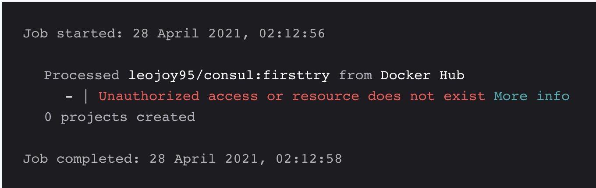

# Docker Hub과의 통합 설정

이 페이지는 Snyk와 Docker Hub 간 통합을 활성화하고 구성하는 방법에 대해 설명합니다. 통합이 완료되면 취약점을 관리할 수 있습니다.

## Docker Hub 통합 활성화

1. **통합**으로 이동합니다.
2. **Docker Hub**을 클릭합니다.
3. Docker Hub 사용자 이름과 액세스 토큰을 입력합니다. 자세한 내용은 [Docker Hub 액세스 토큰 생성](configure-the-integration-with-docker-hub.md#generate-docker-hub-access-token)을 참조하십시오.
4. **저장**을 클릭합니다.\
   페이지가 새로고침되며 **액세스 토큰** 필드가 비워집니다.\
   세부사항이 저장되었다는 확인 메시지가 화면 상단에 녹색으로 표시됩니다.

Docker Hub에 연결이 실패하면 오류 알림이 표시됩니다.

## Docker Hub 통합 문제 해결

프로젝트 가져오기 실패, 연결 실패, 오류가 표시되지 않는 등의 문제가 발생하면 먼저 새 액세스 토큰을 생성하고 Snyk 설정 페이지에서 Docker Hub 통합을 다시 저장해보세요.

### Docker Hub 액세스 토큰 생성

1. [https://hub.docker.com/settings/security](https://hub.docker.com/settings/security)으로 이동합니다.
2. **새 액세스 토큰**을 선택합니다.
3. 액세스 토큰 설명을 입력합니다.
4. 권한을 설정합니다 (읽기가 필요하며 충분함) 및 **생성**을 클릭합니다.
5. [Docker Hub 통합을 활성화](configure-the-integration-with-docker-hub.md#enable-integration-with-docker-hub)할 때 사용할 액세스 토큰을 사용자 이름과 함께 **액세스 토큰 복사**를 선택합니다.

[Docker Hub 액세스 토큰](https://docs.docker.com/docker-hub/access-tokens/)에 대한 자세한 정보는 Docker Hub 문서에서 확인할 수 있습니다.

### 무단 액세스 또는 리소스가 존재하지 않음

Docker Hub에서 이미지 가져오기에 실패하여 `Unauthorized access or Resource does not exist` 오류를 받았을 때 이 오류가 발생합니다.

이 오류는 Docker Hub 계정에서 이미지가 비공개로 설정되어 있기 때문에 발생합니다. 이를 해결하려면 Docker Hub의 **Settings > Visibility settings** 섹션으로 이동하여 이미지를 공개로 설정하세요.