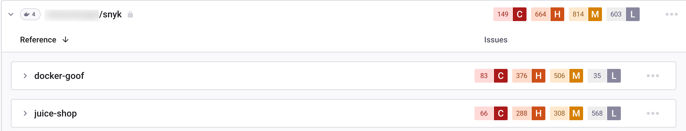

# Docker Hub - Snyk UI에 프로젝트와 이미지 추가

Snyk는 루트 폴더를 평가함으로써 Docker Hub 저장소와 이미지를 테스트하고 모니터링합니다. 이 페이지에서는 Snyk에 저장소를 추가하는 방법에 대해 설명합니다.

## **Snyk에 Docker Hub 이미지를 추가하는 데 필요한 사전 조건**

* Snyk 계정이 있어야 하며 관리자에 의해 조직에 온보딩되어 있어야 합니다.
* Docker Hub 및 Snyk 통합이 이미 구성되어 있어야 합니다.

## **Snyk에 Docker Hub 이미지를 추가하는 단계**

1. Snyk 계정에 로그인하고 관리하려는 관련 그룹 및 조직으로 이동합니다.
2. **Projects** 페이지로 이동하고 **Add Projects**를 클릭합니다.\
   계정에 이미 구성된 통합 목록이 열립니다.
3. **테스트할 이미지** 뷰가 열리며, 연결한 레지스트리에 대해 사용 가능한 모든 이미지가 각 저장소별로 그룹화되어 표시됩니다.
4. 다음 중 하나 이상의 방법을 사용하여 하나 이상의 이미지를 선택합니다:
   * **Image Name** 필드에 가져올 단일 이미지의 이름을 입력합니다.
   * 모든 관련 이미지를 가져오려면 저장소 중 하나를 선택합니다.
   * 여러 이미지를 선택하기 위해 저장소를 확장하거나 축소합니다.
5. **Add selected repositories**를 클릭합니다.

    이미지 가져오기 중에 **Projects** 페이지 상단에 상태 표시줄이 나타나며, 동시에 작업을 계속할 수 있습니다.
6. 가져오기가 종료되면 **Projects** 페이지 상단에 성공 또는 실패 알림이 표시됩니다.\
   **Refresh**를 클릭하여 새로 가져온 이미지가 포함된 **Projects** 페이지를 확인할 수 있습니다.\
   이미지는 각 저장소별로 그룹화되며 개별적으로 자세한 **Projects** 페이지에 링크됩니다.
7. 이제 Git 저장소를 이 프로젝트에 연결하여 Dockerfile을 사용하여 향상된 수정 자문을 받을 수 있습니다. 자세한 정보는 [Dockerfile에서 취약한 베이스 이미지 감지하기](../../scan-your-dockerfile/detect-vulnerable-base-images-from-your-dockerfile.md)를 참조하세요.

저장소와 이미지가 가져오기되면 화면 상단에 초록색으로 확인 메시지가 표시됩니다. Docker Hub 파일은 고유한 아이콘으로 표시됩니다.

Docker Hub 프로젝트만 보려면 필터링할 수도 있습니다.

<figure><figcaption>
Docker Hub 프로젝트 예시
</figcaption></figure>

Docker Hub 통합은 다른 Snyk 통합과 같이 작동합니다. 프로젝트를 계속해서 모니터링, 수정 및 관리하려면 Snyk 설명서의 관련 페이지를 참조하세요.


컨테이너 이미지 내의 애플리케이션 취약점에 대해, 애플리케이션에 대한 변경 사항은 수동이나 주기적인 다시 테스트로 반영되지 않습니다. 이미지의 재 가져오기가 필요합니다. 자세한 내용은 [컨테이너 이미지에서 애플리케이션 취약점 감지](../../use-snyk-container/detect-application-vulnerabilities-in-container-images.md)를 참조하세요.
