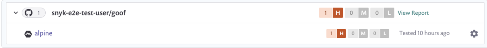

# GitHub 컨테이너 레지스트리와 통합

Snyk은 GitHub 컨테이너 레지스트리와 통합하여 컨테이너 이미지를 가져오고 취약점을 모니터링할 수 있도록 지원합니다.

Snyk은 가져온 이미지(프로젝트)를 미리 설정한 빈도로 테스트하여 알려진 보안 취약점을 확인하고 새로운 문제가 발견되면 경고를 표시합니다.

GitHub 컨테이너 레지스트리와의 통합은 모든 Snyk 사용자를 대상으로 사용할 수 있습니다.

이 페이지에서는 Snyk에서 GitHub 컨테이너 레지스트리 통합을 설정하고 이미지 취약점을 관리하는 방법을 설명합니다.

## GitHub 컨테이너 레지스트리와 통합

### **GitHub 컨테이너 레지스트리 통합 전제 조건**

* Snyk에서 구성 중인 조직의 관리자여야 합니다.
* Snyk은 GitHub 컨테이너 레지스트리와 통합하기 위해 사용자 자격 증명이 필요하며, 단일 사인온(SSO)을 구성한 경우 GitHub 컨테이너 레지스트리를 지원하지 않습니다. 그러나 `read:packages` 범위로 인증된 개인 액세스 토큰(PAT)을 사용할 수 있습니다.

### **GitHub 컨테이너 레지스트리 통합 구성**

1. Snyk 계정에서 **통합(Integrations)**으로 이동합니다. **컨테이너 레지스트리(Container registries)** 섹션에서 GitHub 컨테이너 레지스트리 옵션을 찾아 클릭합니다.
2. 계정 자격 증명 섹션에 GitHub 컨테이너 레지스트리 사용자 이름과 암호를 입력합니다.
3. **컨테이너 레지스트리 이름**에 통합하려는 레지스트리의 전체 URL을 입력합니다. 마무리하려면 **저장(Save)**을 클릭합니다.

자체 호스팅된 GitHub 컨테이너 레지스트리를 사용하는 경우에는 [Snyk 지원팀에 문의](https://support.snyk.io)하여 토큰을 제공받아야 합니다. 자세한 내용은 [자체 호스팅 컨테이너 레지스트리(Broker 포함)용 Snyk 컨테이너](../../../enterprise-setup/snyk-broker/snyk-broker-container-registry-agent/integrate-with-self-hosted-container-registries-broker.md)를 참조하십시오.

Snyk은 연결 값의 테스트를 수행하고 페이지를 다시 로드하여 GitHub 컨테이너 레지스트리 통합 정보를 표시합니다. **Snyk에 GitHub 컨테이너 레지스트리 이미지 추가** 버튼이 사용 가능해집니다.

GitHub 컨테이너 레지스트리와의 연결이 실패하면 **GitHub 컨테이너 레지스트리에 연결됨** 섹션 아래에 알림이 나타납니다.

연결이 성공하면 Snyk을 사용하여 GitHub 컨테이너 레지스트리에서 이미지를 스캔할 수 있습니다.

컨테이너 레지스트리의 보안과 컨테이너 레지스트리 사용 시 보안과 관련된 이슈에 대해 자세히 알아보려면 [Snyk 블로그](https://snyk.io/learn/container-security/container-registry-security/)를 참조하십시오.

## GitHub 컨테이너 레지스트리 이미지를 Snyk에서 스캔

Snyk은 귀하의 GitHub 컨테이너 이미지를 평가하여 리포지토리의 태그를 통해 테스트하고 모니터링합니다. 이미지를 Snyk에 가져온 후 이미지 취약점을 식별하고 효율적으로 처리할 수 있습니다.

GitHub 컨테이너 레지스트리 이미지를 Snyk에 추가하려면 다음 단계를 따르십시오.

## **GitHub 컨테이너 레지스트리 이미지 스캔 전제 조건**

* 조직의 관리자가 승인한 관련 조직에 엑세스 권한이 있는 Snyk 계정
* GitHub 컨테이너 레지스트리 통합 구성; [GitHub 컨테이너 레지스트리와 통합(Integrate with GitHub Container registry)](integrate-with-github-container-registry.md#integrate-with-github-container-registry) 를 참조하십시오.

## **GitHub 컨테이너 레지스트리 이미지 스캔 단계**

1. 계정에 로그인하고 관리하려는 해당 그룹 및 조직으로 이동합니다.
2. **프로젝트(Projects)** 탭에서 **프로젝트 추가(Add project)**를 클릭합니다.\
   계정에 이미 구성된 통합 목록이 표시됩니다.
3. **GitHub 컨테이너 레지스트리** 옵션을 선택하거나 나타나지 않을 경우 **기타(Other)**를 선택합니다.
4. **테스트할 이미지를 선택하십니김**이라는 제목의 화면이 열립니다. 연결된 레지스트리의 각 리포지토리마다 그룹화된 사용 가능한 이미지가 표시됩니다.\
   **참고**: GitHub 컨테이너 레지스트리는 Docker v2 API를 따르지 않습니다. 따라서 리포지토리의 이미지를 나열하는 것은 불가능하며, 원하는 이미지를 직접 지정해야 합니다.
5. Snyk에 가져올 이미지를 단일 또는 다중 선택합니다.\
   특정 이미지나 전체 리포지토리를 선택할 수 있습니다. 또한 이미지 이름으로 검색하여 가져올 특정 이미지를 찾을 수 있습니다.
6. 완료하려면 페이지 상단의 **선택한 리포지토리 추가(Add selected repositories)**를 클릭합니다.\
   가져오는 이미지에 대한 상태 표시줄이 페이지 상단에 나타나며, 동안 작업을 계속할 수 있습니다.
7. 가져오기가 완료되면:
   * **프로젝트** 페이지에서 **NEW** 태그가 표시된 새로 가져온 이미지를 확인할 수 있습니다. 이미지는 리포지토리별로 그룹화되며, 각 이미지는 상세한 **프로젝트** 페이지로 개별적으로 연결됩니다.
   * **가져오기 로그**가 사용 가능해지며, **프로젝트 목록** 상단에서 확인할 수 있습니다.
   * 데이터를 보강하고 기본 이미지에 대한 권장사항을 받으려면 **설정(Settings)**에서 Dockerfile을 이미지 프로젝트에 연결할 수 있습니다. 자세한 정보는 [Dockerfile 추가 및 기본 이미지 테스트하기(Adding your Dockerfile and testing your base image)](../scan-your-dockerfile/detect-vulnerable-base-images-from-your-dockerfile.md)를 참조하십시오.

GitHub 컨테이너 레지스트리 가져오기는 고유한 아이콘으로 표시됩니다. **프로젝트** 뷰에서 해당 통합을 필터링하여 GitHub 컨테이너 레지스트리 프로젝트만 볼 수 있습니다.

<figure><figcaption>
GitHub 프로젝트 예시
</figcaption></figure>


컨테이너 이미지 내의 애플리케이션 취약점의 경우 수동 또는 주기적인 재테스트로 앱 변경이 반영되지 않습니다. 이미지를 다시 가져와야 합니다. 자세한 정보는 [컨테이너 이미지에서 애플리케이션 취약점 검색(Detecting application vulnerabilities in container images)](../use-snyk-container/detect-application-vulnerabilities-in-container-images.md)를 참조하십시오.
