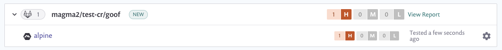

# GitLab 컨테이너 레지스트리와 통합

Snyk은 GitLab 컨테이너 레지스트리와 통합하여 컨테이너 이미지를 가져오고 취약점을 모니터링할 수 있도록 합니다.

Snyk은 가져온 이미지(프로젝트)를 알려진 보안 취약점에 대해 테스트하며, 사용자가 제어하는 빈도로 테스트하고 새로운 문제가 감지되면 알림을 제공합니다.

GitLab 컨테이너 레지스트리와의 통합은 모든 Snyk 사용자에게 제공됩니다.

이 페이지에서는 Snyk에서 GitLab 컨테이너 레지스트리 통합을 설정하고 이미지 취약점을 관리하는 방법을 설명합니다.

## GitLab 컨테이너 레지스트리와 통합하기

### **GitLab 컨테이너 레지스트리 통합 전 요구 사항**

* Snyk에서 구성 중인 조직의 관리자여야 합니다.
* Snyk은 GitLab 컨테이너 레지스트리와 통합하기 위해 [개인 액세스 토큰](https://docs.gitlab.com/ee/user/profile/personal_access_tokens.html)이 필요합니다. Snyk는 GitLab 컨테이너 레지스트리에 대한 액세스에 GitLab SSO를 사용할 때 통합을 지원하지 않습니다.

## **GitLab 컨테이너 레지스트리 통합 구성**

1. Snyk 계정에서 **통합**으로 이동합니다. 컨테이너 레지스트리 섹션에서 GitLab 컨테이너 레지스트리 옵션을 찾아 클릭합니다.
2. **계정 자격 증명** 섹션에 GitLab 컨테이너 레지스트리 사용자 이름 및 [개인 액세스 토큰](https://docs.gitlab.com/ee/user/profile/personal_access_tokens.html)을 입력합니다.
3. **컨테이너 레지스트리 이름**에 통합하려는 레지스트리의 전체 URL을 입력합니다.
4. 완료하려면 **저장**을 클릭합니다.

자체 호스팅된 GitLab 컨테이너 레지스트리를 사용하는 경우 [Snyk 지원팀에 문의](https://support.snyk.io/)하여 토큰을 받으십시오. 자세한 정보는 [자체 호스팅된 컨테이너 레지스트리용 Snyk 컨테이너 (브로커 포함)](../../../enterprise-setup/snyk-broker/snyk-broker-container-registry-agent/integrate-with-self-hosted-container-registries-broker.md)를 참조하십시오.

Snyk는 연결 값을 테스트하고 페이지를 다시로드하여 GitLab 컨테이너 레지스트리 통합 정보를 표시합니다. **Snyk에 GitLab 컨테이너 레지스트리 이미지 추가** 버튼을 사용할 수 있게 됩니다.

GitLab 컨테이너 레지스트리에 대한 연결이 실패하면 **GitLab 컨테이너 레지스트리에 연결됨** 섹션에 알림이 표시됩니다.

연결이 성공하면 Snyk을 사용하여 GitLab 컨테이너 레지스트리에서 이미지를 스캔할 수 있습니다.

## GitLab 컨테이너 레지스트리에서 이미지 스캔하기

Snyk은 귀하의 GitLab 컨테이너 이미지를 테스트하고 모니터링하여 리포지토리의 이미지 태그를 평가합니다. 이미지를 Snyk에 가져온 후 이미지의 취약점을 식별하고 쉽게 처리할 수 있습니다.

다음은 GitLab 컨테이너 레지스트리에서 이미지를 Snyk에 추가하는 단계입니다.

## **GitLab 컨테이너 이미지 스캔 전 요구 사항**

* 조직 관리자가 승인한 관련 조직에 액세스할 수 있는 Snyk 계정이 있어야 합니다.
* GitLab 컨테이너 레지스트리 통합이 구성되어 있어야 합니다. 자세한 정보는 [GitLab 컨테이너 레지스트리 통합을 통한 컨테이너 보안](https://docs.snyk.io/snyk-container/image-scanning-library/gitlab-container-registry-image-scanning/container-security-with-gitlab-container-registry-integration)을 참조하십시오.

## **GitLab 컨테이너 이미지 스캔 단계**

1. 계정에 로그인하고 관리하려는 해당 그룹과 조직으로 이동합니다.
2. **프로젝트** 탭에서 **프로젝트 추가**를 클릭합니다.\
   계정에 이미 구성된 통합 목록이 열립니다.
3. **GitLab 컨테이너 레지스트리** 옵션을 선택하거나 나타나지 않으면 **기타**를 선택합니다.
4. \*\*어떤 이미지를 테스트하고 싶으신가요?\*\*라는 타이틀의 뷰가 열리며 연결된 레지스트리의 각 리포지토리별로 그룹화된 모든 사용 가능한 이미지가 표시됩니다.\
   **참고**: GitLab 컨테이너 레지스트리는 Docker v2 API를 따르지 않습니다. 따라서 리포지토리의 이미지를 나열할 수 없으며 스캔할 이미지를 수동으로 지정해야 합니다.
5. Snyk로 가져오려는 단일 또는 다중 이미지를 선택합니다.\
   특정 이미지를 선택하거나 전체 리포지토리를 선택할 수 있습니다. 또한 이미지 이름으로 검색하여 가져올 특정 이미지를 찾을 수 있습니다.
6. 완료하려면 오른쪽 상단의 **선택한 리포지토리 추가**를 클릭합니다.\
   이미지가 가져와지는 동안 페이지 상단에 상태 표시줄이 나타나며 그 사이에 작업을 계속할 수 있습니다.
7. 가져오기가 완료되면:
   * **프로젝트** 페이지에서 **NEW** 태그가 붙은 새로 가져온 이미지를 볼 수 있습니다. 이미지는 리포지토리별로 그룹화되어 각각의 세부 **프로젝트** 페이지에 개별적으로 연결됩니다.
   * **가져오기 로그**가 사용 가능해지며 프로젝트 목록 상단에서 이에 액세스할 수 있습니다.
   * 데이터를 보강하고 베이스 이미지에 대한 권장 사항을 받으려면 **설정**에서 Dockerfile을 이미지 프로젝트에 연결할 수 있습니다. 자세한 정보는 [Dockerfile 추가 및 베이스 이미지 테스트](../scan-your-dockerfile/detect-vulnerable-base-images-from-your-dockerfile.md)를 참조하십시오.

GitLab 컨테이너 레지스트리 가져온 것은 고유한 아이콘으로 표시됩니다. **프로젝트** 보기에서 해당 통합만 볼 수 있도록 필터링할 수 있습니다.

<figure><figcaption>
GitLab 컨테이너 레지스트리 프로젝트 예시
</figcaption></figure>


컨테이너 이미지 내의 애플리케이션 취약점의 경우, 수동 또는 반복 재테스트로 애플리케이션의 변경 사항이 반영되지 않습니다. 이미지를 다시 가져와야 합니다. 자세한 정보는 [컨테이너 이미지 내의 애플리케이션 취약점 탐지](../use-snyk-container/detect-application-vulnerabilities-in-container-images.md)를 참조하십시오.

