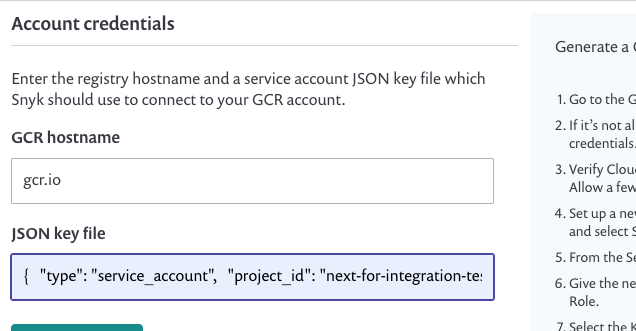

# GCR용 통합 구성

Snyk와 Google 컨테이너 레지스트리를 통합하여 취약점을 스캔하고 해당 보안 및 라이선스 문제를 해결하는 방법을 구성합니다.

## GCR 통합 구성을 위한 선행 조건

GCR 계정에서 새 서비스 계정 키를 설정하세요. [GCR 액세스 권한 부여](enable-permissions-to-access-gcr.md)를 참조하세요.

## GCR 통합 구성 단계

1. Snyk 조직으로 이동하고 **Integrations>GCR**로 이동합니다.
2. GCR 호스트 이름에서 이미지를 스캔하려는 레지스트리 저장 영역에 [레지스트리 저장 영역](https://cloud.google.com/container-registry/docs/pushing-and-pulling)을 region.gcr.io 형식으로 입력합니다. 예를 들어, gcr.io 또는 asia.gcr.io입니다.
3. Google에서 생성된 JSON 키 파일 전체 내용을 Snyk 계정의 JSON 키 파일 필드에 붙여넣습니다. 다음 스크린샷에 표시된 것처럼.
4. **저장**을 클릭합니다.

Snyk은 자격 증명을 확인하고 확인이 성공하면 연결이 성공했음을 알리는 알림이 포함된 페이지가 다시로드됩니다.

<figure><figcaption>
GCR 계정 자격 증명
</figcaption></figure>

이제 GCR에서 Snyk으로 이미지를 추가할 수 있습니다.
