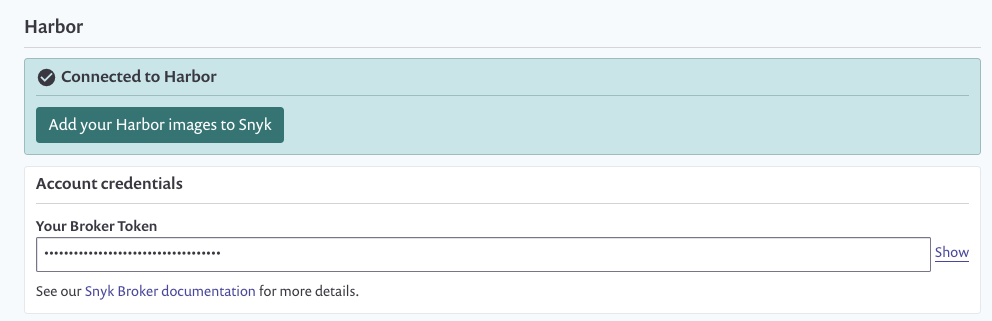
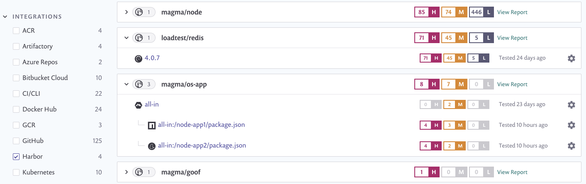

# Harbor 컨테이너 레지스트리와 통합


**기능 가용성**\
이 기능은 엔터프라이즈 요금제에서만 이용 가능합니다. 더 많은 정보는 [가격 요금제](https://snyk.io/plans/)를 참조하십시오.


Snyk은 Harbor 컨테이너 레지스트리와 통합하여 컨테이너 이미지를 가져오고 취약점을 모니터링할 수 있도록 지원합니다.

Snyk은 가져온 이미지(프로젝트로 지칭)를 알려진 보안 취약점을 검사하고 새로운 문제가 감지될 때 귀하에게 경고합니다.

다음 지침에 따라 Snyk에서 Harbor 통합을 설정하고 이미지 취약점을 관리를 시작하세요.

## Harbor 컨테이너 레지스트리 통합

### Harbor 통합을 위한 사전 요구 사항

* Snyk을 통해 구성 중인 조직의 관리자여야 합니다.
* Snyk은 Harbor와 통합하기 위해 사용자 자격 증명이 필요하며 싱글 사인온 (SSO)으로 구성된 Harbor를 지원하지 않습니다.

### **Harbor 통합 구성**

1. Snyk 계정에서 **통합**으로 이동하여 **컨테이너 레지스트리** 섹션에서 Harbor 옵션을 선택합니다.
2. **계정 자격 증명** 섹션에서 Harbor 사용자 이름과 암호 로그인 자격 증명을 입력합니다.
3. **컨테이너 레지스트리 이름**에 통합하려는 레지스트리의 전체 URL을 입력합니다.
4. 마지막으로 **저장**을 선택합니다.

자체 호스팅 Harbor 레지스트리를 사용하는 경우 Snyk에게 토큰을 제공하도록하십시오. 더 많은 정보는 [(Broker와 함께)의 자체 호스트된 컨테이너 레지스트리 통합](../../../enterprise-setup/snyk-broker/snyk-broker-container-registry-agent/integrate-with-self-hosted-container-registries-broker.md)를 참조하십시오.


통합을 설정하려면 Harbor 사용자는 관리자 사용자이어야 합니다. 통합은 레포지토리를 나열하기 위해 /v2/\_catalog 엔드포인트를 사용합니다.


<figure><figcaption>
Broker 토큰을 포함한 Harbor 계정 자격 증명
</figcaption></figure>

Snyk은 연결 값을 테스트하고 페이지가 다시로드되어 Harbor 통합 정보가 표시됩니다. **Snyk에 Harbor 이미지 추가** 버튼을 사용할 수 있습니다. Harbor와의 연결이 실패하면 **Harbor에 연결됨** 섹션 아래에 알림이 표시됩니다.

연결이 성공하면 Snyk를 사용하여 Harbor로부터 이미지를 스캔할 수 있습니다.

## Snyk에서 Harbor의 컨테이너 이미지 스캔

Snyk는 Harbor 컨테이너 이미지를 테스트하고 모니터링하여 여러분의 레포지토리의 이미지 태그를 평가합니다. Harbor에서 Snyk로 가져온 후 컨테이너 이미지 취약점이 식별되어 쉽게 분류됩니다.

Harbor에서 Snyk로 이미지를 추가하는 방법을 따르세요.

### **Harbor 이미지 스캔을 위한 사전 요구 사항**

* 관리자에 의해 승인된 관련 조직에 액세스 권한이 있는 Snyk 계정.
* Harbor 통합이 구성되어 있어야 합니다; Harbor 컨테이너 레지스트리와 통합을 참조하십시오.

### **Harbor 이미지 스캔 단계**

1. 계정에 로그인하고 관리하려는 관련 그룹 및 조직으로 이동합니다.
2. **프로젝트** 탭 아래에서 **프로젝트 추가**를 클릭합니다.\
   계정에서 이미 구성된 통합 목록이 열립니다.
3. **Harbor** 옵션 또는 Harbor가 나타나지 않는 경우 **기타**를 선택합니다.
4. **어떤 이미지를 테스트하고 싶습니까?** 를 보여주는 뷰가 열리며, 연결된 레지스트리의 사용 가능한 이미지가 각 레포지토리에 대해 그룹화되어 표시됩니다.
5. Snyk에 가져올 단일 또는 여러 이미지를 선택하려면 특정 이미지를 선택하거나 전체 레포지토리를 선택합니다. 특정 이미지를 가져오려면 이미지 이름으로 검색할 수도 있습니다.
6. 완료하려면 페이지 상단에서 **선택한 레포지토리 추가**를 클릭하십시오.\
   이미지가 가져와지는 동안 상태 표시줄이 페이지 상단에 나타납니다. 이와 동시에 작업을 계속할 수 있습니다.
7. 가져오기가 끝날 때:
   1. **프로젝트** 페이지에는 새로 가져온 이미지가 **NEW** 태그로 표시되어 그룹별로 이미지가 표시됩니다. 각 이미지는 상세 프로젝트 페이지로 개별적으로 링크됩니다.
   2. **가져오기 로그**가 사용 가능해집니다. 이를 프로젝트 목록 상단에서 확인할 수 있습니다.
   3. 데이터를 보강하고 기본 이미지에 대한 권장 사항을 받으려면 **설정** 하에서 Dockerfile을 이미지 프로젝트에 연결할 수 있습니다. 자세한 정보는 [Dockerfile 추가 및 기본 이미지 테스트](../scan-your-dockerfile/detect-vulnerable-base-images-from-your-dockerfile.md)를 참조하십시오.

Harbor 가져오기는 고유한 아이콘으로 표시됩니다. Harbor 프로젝트만 보려면 필터링할 수도 있습니다:

<figure><figcaption>
프로젝트 목록에서 Harbor 프로젝트
</figcaption></figure>


컨테이너 이미지 내의 애플리케이션 취약점의 경우 응용 프로그램에 대한 변경 사항이 수동 또는 주기적인 재검사로 반영되지 않습니다. 이미지를 다시 가져와야합니다. 자세한 정보는 [컨테이너 이미지 내의 응용 프로그램 취약점 감지](../use-snyk-container/detect-application-vulnerabilities-in-container-images.md)를 참조하십시오.

