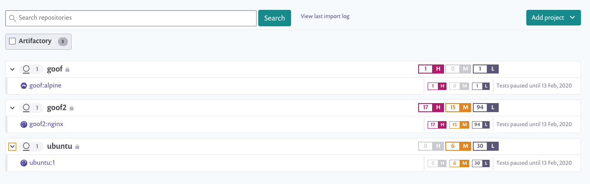

# Snyk에 Artifactory 이미지 추가하기

Snyk는 당신의 Artifactory 컨테이너 이미지를 평가하여 저장소의 태그를 모니터링하고 테스트합니다.

## **Artifactory 이미지를 추가하기 위한 선행 조건**

* Snyk 계정이 있어야 하며, 조직에 관리자가 되어야 합니다.
* Snyk와 Artifactory 환경 간에 통합이 설정되어 있어야 합니다.

## **Snyk에 Artifactory 이미지를 추가하는 단계**

* 계정에 로그인하고 관리하려는 관련 그룹과 조직으로 이동합니다.
* **프로젝트**로 이동하여 **프로젝트 추가**를 클릭합니다. 이미 계정에 구성된 통합 목록이 열립니다.
* **테스트하고자 하는 이미지는 무엇입니까?** 뷰가 열리며, 연결된 레지스트리에 대한 사용 가능한 이미지가 저장소별로 그룹화되어 표시됩니다.
* 다음 방법 중 하나 또는 모두를 사용하여 단일 또는 여러 이미지를 선택합니다.
  * Image Name 필드(위의 이미지에서 번호 1의 이미지 이름 필드)에 가져올 단일 이미지의 이름을 입력합니다.
  * 모든 관련 이미지를 가져오려면 연결된 모든 저장소 중 하나를 선택합니다(위의 이미지에서 번호 2에 나열된 두 번째 항목).
  * 여러 저장소를 확장하고 축소하여 여러 이미지를 선택합니다(위의 이미지에서 번호 3에 나열된 세 번째 이미지).
* **선택한 저장소 추가**를 클릭합니다.

    이미지가 가져오는 동안 페이지 상단에 상태 표시줄이 나타나며, 이 동안 작업을 계속할 수 있습니다.
* 가져오기가 완료되면 페이지 상단에 성공 또는 실패 알림이 표시됩니다. 새로 가져온 이미지가 포함된 프로젝트 페이지를 보려면 새로 고침을 클릭하십시오. 이미지는 저장소별로 그룹화되고 각각은 개별적으로 세부 프로젝트 페이지에 연결됩니다.
* 이제 Git 저장소를 이 프로젝트에 연결하여 Dockerfile을 사용하여 풍부한 수정 조언을 받을 수 있습니다. 자세한 내용은 [Dockerfile 추가 및 기본 이미지 테스트하기](../../scan-your-dockerfile/detect-vulnerable-base-images-from-your-dockerfile.md)를 참조하십시오.

이미지는 고유한 아이콘으로 표시됩니다. Artifactory 프로젝트만 보도록 필터를 적용할 수 있습니다.

<figure><figcaption>
Artifactory 프로젝트 목록
</figcaption></figure>

Artifactory 통합은 다른 Snyk 통합과 유사하게 작동합니다. 프로젝트를 계속 모니터링, 수정 및 관리하려면 Snyk 사용자 설명서의 해당 페이지를 참조하십시오.


컨테이너 이미지 내의 애플리케이션 취약점의 경우, 애플리케이션에 대한 모든 변경 사항은 수동 또는 반복적인 재테스트로 반영되지 않습니다. 이미지를 다시 가져와야 합니다. 자세한 내용은 [컨테이너 이미지에서 애플리케이션 취약점 감지하기](../../use-snyk-container/detect-application-vulnerabilities-in-container-images.md)를 참조하십시오.
