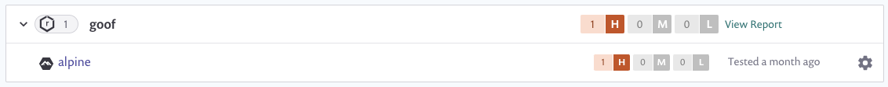

# Nexus 컨테이너 레지스트리와 통합


**기능 가용성**\
이 기능은 전문가용 요금제에서만 제공됩니다. 자세한 정보는 [가격제](https://snyk.io/plans/)를 참조하십시오.


Snyk은 Nexus 컨테이너 레지스트리와 통합하여 컨테이너 이미지를 가져와 취약점을 모니터링할 수 있게 해줍니다.

Snyk는 가져온 이미지(프로젝트)를 알려진 보안 취약점에 대해 테스트하며, 여러분이 제어하는 빈도로 테스트하고 새로운 문제가 발견되면 경고를 표시합니다.

이 페이지에서는 Snyk에서 Nexus 컨테이너 레지스트리 통합 설정 방법과 이미지 취약점 관리를 시작하는 방법을 설명합니다.

## Nexus 컨테이너 레지스트리와 통합

### Nexus 통합을 위한 사전 준비 사항

* Snyk 구성 중인 조직의 관리자이어야 합니다.
* Snyk은 Nexus와 통합하기 위해 사용자 자격 증명이 필요하며, 단일 로그인(SSO) 구성일 때 Nexus를 지원하지 않습니다.

### **Nexus 통합 구성**

* Snyk 계정에서 상단 메뉴 모음에서 **Integrations**로 이동합니다. **Container registries** 섹션 아래에서 **Nexus** 옵션을 찾아 클릭합니다.
* **계정 자격 증명** 섹션에 Nexus 사용자명 및 암호 로그인 자격 증명을 입력합니다. **컨테이너 레지스트리 이름** 필드에 통합하려는 레지스트리의 전체 URL을 입력합니다.
* 완료하려면 **Save**를 클릭합니다.

자체 호스팅된 Nexus 레지스트리를 사용 중인 경우 [Snyk 지원팀에 문의](https://support.snyk.io)하여 토큰을 제공받으십시오. 자세한 정보는 [자체 호스팅된 컨테이너 레지스트리에 대한 Snyk(브로커와 함께)](../../../enterprise-setup/snyk-broker/snyk-broker-container-registry-agent/integrate-with-self-hosted-container-registries-broker.md)를 참조하십시오.

Snyk는 연결 값을 테스트하고, 페이지가 다시로드되면 Nexus 통합 정보가 표시됩니다. **Snyk에 Nexus 이미지 추가** 버튼이 사용 가능해집니다.

Nexus 연결에 실패하면 **Nexus에 연결됨** 섹션 아래에 알림이 표시됩니다.

## Snyk에서 Nexus의 컨테이너 이미지 스캔

연결이 성공하면 Snyk를 사용하여 Nexus의 이미지를 스캔할 수 있습니다.

Snyk는 Nexus 컨테이너 이미지를 테스트하고 모니터링하여 여러분의 저장소에 있는 이미지 태그를 평가합니다. Snyk에 이미지를 가져온 후 이미지 취약점이 식별되어 간편하게 처리할 수 있습니다.

Nexus 이미지를 Snyk에 추가하려면 다음 단계를 따르십시오.

### **Nexus 이미지 스캔을 위한 사전 준비 사항**

* 관리자에 의해 승인된 적절한 조직에 접근 권한이 있는 Snyk 계정
* Nexus 통합이 구성되어 있어야 함; [Nexus 컨테이너 레지스트리와 통합](integrate-with-nexus-container-registry.md#integrate-with-nexus-container-registry)을 참조하십시오.

### **Nexus 이미지 스캔 절차**

1. 계정에 로그인하고 관리하려는 그룹과 조직으로 이동합니다.
2. **프로젝트** 탭에서 **프로젝트 추가**를 클릭합니다.\
   계정에 이미 구성된 통합 목록이 열립니다.
3. **Nexus** 옵션을 선택하거나 Nexus가 표시되지 않은 경우 **Other**를 선택합니다.\
   **어떤 이미지를 테스트하려고 합니까?** 뷰가 열려 처음엔 각 저장소별로 그룹화된 연결된 레지스트리의 사용 가능한 이미지를 표시합니다.
4. Snyk에 가져올 이미지를 단일 또는 다중으로 선택합니다.\
   특정 이미지를 선택하거나 전체 저장소를 선택할 수 있습니다. 이미지 이름으로 검색하여 가져올 특정 이미지를 찾을 수도 있습니다.
5. 완료하려면 페이지 상단의 **선택한 저장소 추가**를 클릭합니다.\
   이미지가 가져와지는 동안 페이지 상단에 상태 표시줄이 나타나며, 중간에 작업을 계속할 수 있습니다.
6. 가져오기가 끝나면:
   1. **프로젝트** 페이지에서 **NEW** 태그로 표시된 새로 가져온 이미지를 볼 수 있습니다. 이미지는 저장소별로 그룹화되어 각각의 자세한 **프로젝트** 페이지에 개별적으로 연결됩니다.
   2. **가져오기 로그**가 이용 가능해집니다. 프로젝트 목록 상단에서 확인할 수 있습니다.
   3. 데이터를 보강하고 기본 이미지에 대한 권장 사항을 받으려면 **설정** 아래에서 Dockerfile을 이미지 프로젝트에 연결할 수 있습니다. 자세한 내용은 [Dockerfile 추가 및 기본 이미지 테스트](../scan-your-dockerfile/detect-vulnerable-base-images-from-your-dockerfile.md)를 참조하십시오.

Nexus 가져오기는 고유한 아이콘으로 표시됩니다. Nexus 프로젝트만 보고 싶을 경우에 필터링할 수도 있습니다.

<figure><figcaption>
프로젝트 목록에 있는 Nexus 프로젝트
</figcaption></figure>


컨테이너 이미지 내의 애플리케이션 취약점의 경우 수동 또는 주기적인 재테스트로 적용된 변경 사항이 반영되지 않습니다. 이미지를 다시 가져와야 합니다. 자세한 정보는 [컨테이너 이미지 내의 애플리케이션 취약점 감지](../use-snyk-container/detect-application-vulnerabilities-in-container-images.md)를 참조하십시오.
