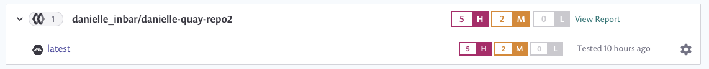

# Quay 컨테이너 레지스트리와 통합

Snyk은 Quay Container Registry와 통합하여 컨테이너 이미지를 가져오고 취약점을 모니터링할 수 있도록 지원합니다.

Snyk은 가져온 이미지(프로젝트)를 알려진 보안 취약점에 대해 테스트하여 취약점을 자주 확인하고 새 문제가 감지될 때 알림을 제공합니다.

Quay와의 통합은 모든 Snyk 사용자에게 제공됩니다.

## Quay Container Registry와 통합

### Quay 통합 전 요구 사항

* Snyk에서 구성 중인 조직의 관리자여야 합니다.
* Snyk은 Quay와 통합하기 위해 사용자 자격 증명을 필요로 하며 SSO(단일 로그인)로 구성된 Quay를 지원하지 않습니다.

### **Quay 통합 구성**

1. Snyk 계정에서 **Integrations**으로 이동합니다. **Container Registries** 섹션에서 **Quay** 옵션을 찾아 클릭합니다.
2. **Account credentials** 섹션에서 Quay 사용자명과 암호 로그인 자격 증명을 입력합니다. **Container registry name**에는 통합하려는 레지스트리의 전체 URL을 입력합니다. 클라우드 기반 또는 개인 호스트가 될 수 있습니다. 완료하려면 **Save**를 클릭합니다.

자체 호스트된 Quay 레지스트리를 사용 중이라면 [Snyk 지원팀에 문의](https://support.snyk.io)하여 토큰을 제공 받아야 합니다. 자세한 정보는 [자체 호스트된 컨테이너 레지스트리용 Snyk Container (Broker와 함께)](../../../enterprise-setup/snyk-broker/snyk-broker-container-registry-agent/integrate-with-self-hosted-container-registries-broker.md)를 참조하십시오.


[Quay.io](https://quay.io/)는 2021년 6월에 Quay 로그인 사용을 중단했습니다. 자격 증명은 더 이상 Quay 사용자명과 암호가 아니라 최소 '읽기' 권한을 가진 Quay 로봇 계정 자격 증명(사용자명 및 토큰)이어야 합니다.


Snyk은 연결 값들을 테스트하고 페이지가 새로 고침되어 Quay 통합 정보를 표시하며 **Add your Quay images to Snyk** 버튼이 사용 가능해집니다. Quay와의 연결에 실패하면 **Connected to Quay** 섹션 아래에 알림이 나타납니다.

연결에 성공하면 Snyk을 사용하여 Quay의 이미지를 스캔할 수 있습니다.

Snyk은 Quay 컨테이너 이미지를 확인하기 위해 리포지토리의 태그를 평가하여 테스트하고 모니터링합니다. Snyk로 가져온 후에 이미지의 취약점을 식별하고 쉽게 분류할 수 있습니다.

## Snyk에서 Quay의 컨테이너 이미지 스캔

### Quay 이미지 스캔 전 요구 사항

* 관리자가 지정한 관련 조직에 액세스 권한이 있는 Snyk 계정이 있어야 합니다.
* Quay 통합이 구성되어 있어야 합니다. 자세한 내용은 [Quay Container Registry와의 통합](integrate-with-quay-container-registry.md#integrate-with-quay-container-registry)을 참조하십시오.

### Quay 이미지 스캔 단계

1. 계정에 로그인한 후 관리하려는 관련 그룹과 조직으로 이동합니다.
2. **Projects** 탭에서 **Add project**를 클릭합니다.\
   계정에 이미 구성된 통합 목록이 열립니다.
3. **Quay** 옵션을 선택하거나 **Quay**가 표시되지 않는 경우 **Other**를 선택합니다.
4. **테스트할 이미지 선택**이라는 데스크톱이 열립니다. 연결된 레지스트리에서 각 리포지토리별로 그룹화된 사용 가능한 모든 이미지가 표시됩니다.
5. Snyk로 가져올 이미지를 선택합니다.\
   특정 이미지를 선택하거나 전체 리포지토리를 선택하여 선택할 수 있습니다.\
   이미지 이름으로 검색하여 가져올 특정 이미지를 찾을 수도 있습니다.
6. 완료하려면 우측 상단에 **Add selected repositories**를 클릭합니다.\
   이미지가 가져오는 동안 페이지 상단에 상태 표시 줄이 나타납니다. 이 동안에도 작업을 계속할 수 있습니다.
7. 가져오기가 완료되면:
   1. **Projects** 페이지에서 **NEW** 태그로 표시된 새로 가져온 이미지가 표시됩니다. 이미지는 리포지토리별로 그룹화되며 개별적으로 자세한 **프로젝트** 페이지로 연결됩니다.\
      **가져오기 로그**가 사용 가능해집니다. Projects 목록 상단에서 이에 액세스할 수 있습니다.
   2. 데이터를 보강하고 기본 이미지에 대한 권장 사항을 받으려면, **Settings**에서 Dockerfile을 이미지 프로젝트에 연결할 수 있습니다. 자세한 내용은 [Dockerfile 추가 및 기본 이미지 테스트](../scan-your-dockerfile/detect-vulnerable-base-images-from-your-dockerfile.md)을 참조하십시오.

Quay 가져온 것은 고유한 아이콘으로 표시됩니다. 오직 Quay 프로젝트만 보기 위해 필터링할 수 있습니다.

<figure><figcaption>
Projects 목록의 Quay Project
</figcaption></figure>


컨테이너 이미지 내 애플리케이션 취약점의 경우, 수동 또는 반복 재테스트로 응용프로그램의 변경 사항이 반영되지 않습니다. 이미지를 다시 가져와야 합니다. 자세한 내용은 [컨테이너 이미지 내 애플리케이션 취약점 감지](../use-snyk-container/detect-application-vulnerabilities-in-container-images.md)를 참조하십시오.

