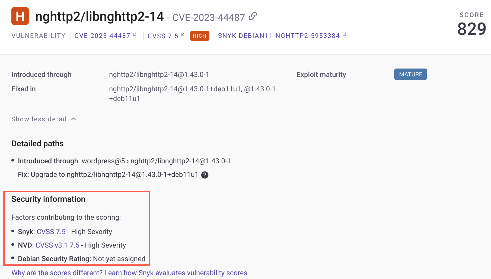
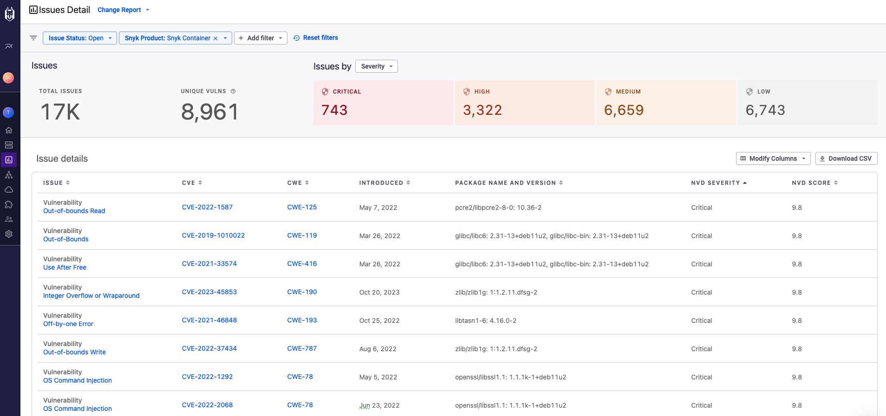

# Linux 취약점의 심각도 수준

Linux 취약점의 [심각도 수준](../../../manage-risk/prioritize-issues-for-fixing/severity-levels.md) (낮음, 중간, 높음, 심각)을 결정할 때, 은 다음과 같은 여러 요소를 고려합니다:

- Snyk 내부 분석
- Linux 배포 보안 유지자가 제공한 심각도 평가
- 국가 취약성 데이터베이스 (NVD)에서 평가한 취약성의 심각도

특정 경우에는 NVD가 특정 Linux 배포판의 보안 유지자와 다른 CVSS 벡터 및 심각도 점수를 할당할 수 있습니다. 이때 Snyk는 상대적 중요도 기능에 의해 Linux 배포유지자가 결정한 CVSS 및 심각도를 우선시하고 사용합니다.

## 상대적 중요도 기능

상대적 중요도는 취약점에 대한 공통 심각도를 주장하며, 다수의 소스를 기반으로 한 해당 심각도에 기반한 기본 세부 정보를 표시합니다. 이는 개발자 및 분석가가 공통 중요 수준을 보고 주장된 심각도에 기여한 기본 정보를 노출시킴으로써 자세한 정보를 보여줍니다.

Snyk는 Ubuntu, Debian, Red Hat Enterprise Linux (RHEL), CentOS, Amazon Linux, Oracle Linux 및 SUSE Linux Enterprise Server (SLES)에서 상대적 중요도를 지원합니다.

## 상대적 중요도 보기

각 이슈에 대한 정보는 **보안 정보** 아래의 프로젝트 페이지에서 표시됩니다.

<figure><figcaption>
프로젝트 페이지의 보안 정보
</figcaption></figure>

## 상대적 중요도를 위한 외부 정보 소스

Snyk는 배포 정보를 제공하기 위해 다음 외부 소스를 사용합니다:

- [NVD 심각도](https://nvd.nist.gov/vuln)
- [Debian 심각도 수준](https://security-team.debian.org/security_tracker.html#severity-levels) 및 [no-dsa](https://security-team.debian.org/security_tracker.html#issues-not-warranting-a-security-advisory) 이슈
- [Ubuntu CVE 우선 순위](https://people.canonical.com/~ubuntu-security/priority.html)
- [Red Hat Enterprise Linux 심각도 등급](https://access.redhat.com/security/updates/classification)
- [SUSE Linux Enterprise 보안 등급 개요](https://www.suse.com/support/security/rating/)
- [Amazon Linux](https://alas.aws.amazon.com/alas2.html)

## Linux 취약점을 위한 NVD 점수 및 심각도 보기

Linux 유지자 평가 없이 NVD 점수 및 심각도만 표시하는 보고서를 생성하려면 이슈 상세 보고서에 NVD 점수 및 NVD 심각도 열을 추가하십시오.

<figure><figcaption>
NVD 점수 및 심각도가 포함된 보고서 예시
</figcaption></figure>