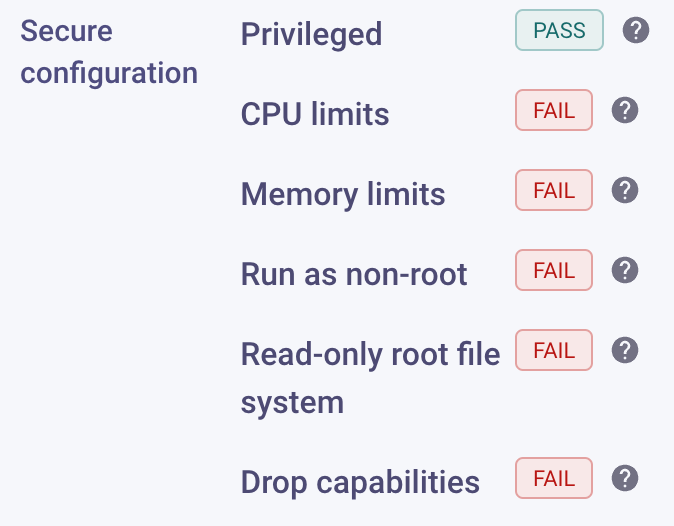
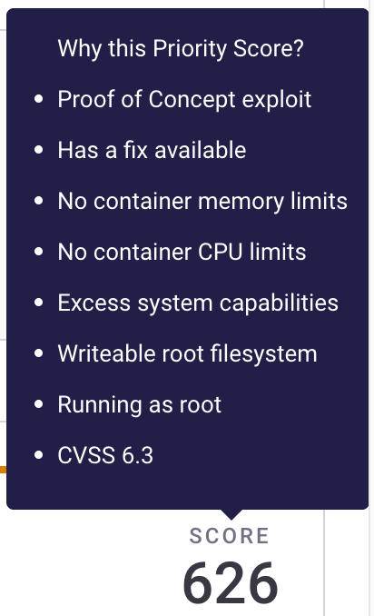

# Kubernetes 및 Snyk 우선 순위 스코어


이 능력은 쿠버네티스 통합을 사용하는 모든 고객에 대해 자동으로 활성화되며 추가 구성이 필요하지 않습니다.


모든 Snyk 이슈에는 [우선 순위 스코어](../../../../manage-risk/prioritize-issues-for-fixing/priority-score.md)가 있습니다. 이는 문제의 심각성과 다양한 맥락 요소를 고려하여 취약성의 상대적 중요성을 결정하는 데 도움이 됩니다.

우선 순위 스코어에 기여하는 요인과 유사하게, Kubernetes 통합에서 가져온 이미지도 여러 추가 요인을 갖고 있습니다.

## 워크로드가 얼마나 잘 구성되어 있는가?

Kubernetes 통합은 워크로드가 어떻게 구성되어 있는지에 대한 정보를 수집하며, 보안 문제로 이어질 수 있는 옵션에 초점을 맞춥니다. Snyk는 프로젝트 페이지에서 이 요약을 표시합니다:

각 취약성의 우선 순위 스코어를 고려하는 요소를 확인하려면 스코어 위로 마우스를 올려보세요.

이 근거는 잘 구성된 워크로드에서 찾은 동일한 취약성보다 잘못 구성된 워크로드에 있는 취약성이 더 높은 점수를 받는다는 사실에 기초합니다.

Snyk는 취약점의 성격과 구성에 의해 제기된 구체적 문제를 모두 고려합니다. Snyk는 다음 요인을 고려합니다:&#x20;

| **구성**                                                                                           | **취약점 속성**                                                                                                              |
| -------------------------------------------------------------------------------------------------- | ---------------------------------------------------------------------------------------------------------------------------- |
| 권한 문제, 예를 들어 특권 실행, root로 실행 가능, 기능을 낮추지 않음.                              | 취약성에 존재하는 CVSSv3 Privileges (PR) 벡터. 영향에 따라 가중치를 매김.                                                   |
| 메모리 및/또는 CPU 제한 설정이 없음.                                                              | 취약성에 존재하는 CVSSv3 Availability (A) 벡터 또는 CWE가 서비스 거부를 포함함. 영향에 따라 가중치를 매김.            |
| 읽기 전용 루트 파일 시스템 설정이 없음.                                                           | CWE가 파일 시스템 액세스를 필요로한다는 내용.                                                                              |

이 점수 시스템은 이진적으로 의도된 것이 아닙니다. 오히려 노력을 우선 순위를 정하는 데 도움이 되는 위험 계산입니다.&#x20;