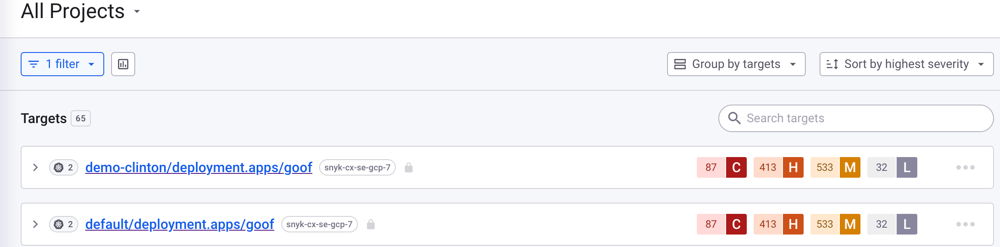
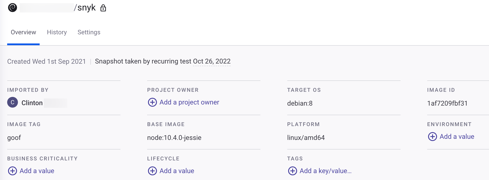
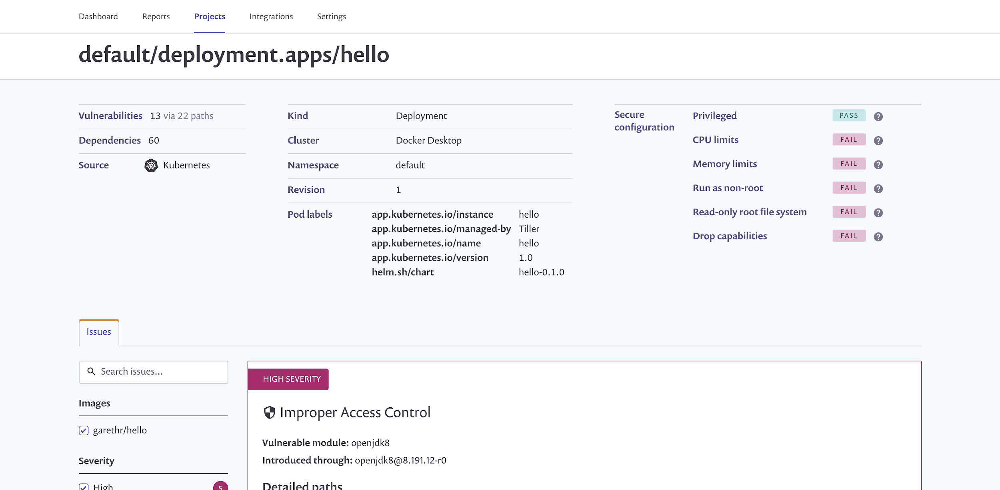

# 프로젝트 세부 정보 및 스캔 결과 보기

모니터링을 위해 가져온 모든 워크로드는 **프로젝트** 페이지에 나타나며 고유한 Kubernetes 아이콘으로 표시됩니다.

워크로드 스캔 결과를 보고 관리하려면 **프로젝트** 페이지로 이동하고 Kubernetes 프로젝트를 필터링하세요.

<figure><figcaption>
Kubernetes 프로젝트
</figcaption></figure>

프로젝트를 확장하여 다음을 볼 수 있습니다:

* 해당 워크로드에 사용된 개별 이미지 목록
* 각 이미지에 있는 취약점 수에 대한 요약

이미지의 자세한 취약점을 보려면 이미지 이름을 클릭하십시오. 선택한 이미지에 대한 프로젝트 세부 정보 페이지가 로드됩니다:

워크로드에 있는 모든 이미지의 취약점 목록을 종합적으로 보려면 해당 워크로드를 클릭하여 워크로드 구성의 보안 상태에 대한 세부 정보를 포함한 이미지의 모든 취약점에 대한 종합 목록을 확인하십시오.

선택된 이미지에 대한 프로젝트 세부 정보 페이지가 로드됩니다.

Snyk은 워크로드 구성에서 다음 속성을 스캔합니다:

| **Snyk 매개변수**          | **관련 Kubernetes 매개변수**                       | **설명**                                                                                                                                        |
| ---------------------- | -------------------------------------------- | --------------------------------------------------------------------------------------------------------------------------------------------- |
| CPU 및 Memory 제한        | Resources.limits.memory resources.limits.cpu | 컨테이너에 사용 가능한 CPU 및 Memory를 제한하는 것은 운영 및 보안적 이점이 있습니다. 보안 측면에서는 잠재적인 서비스 거부 공격의 영향을 앱에만 제한함으로써 노드 및 전체 클러스터까지 영향을 받지 않도록 제한하는 것입니다.            |
| runAsNonRoot           | securityContext.runAsNonRoot                 | 기본적으로 컨테이너는 루트 사용자로 실행될 수 있습니다. 이 속성은 이를 방지하여 컨테이너 실행 시 루트 권한으로 실행되지 않도록 합니다. 즉, 공격자가 컨테이너 컨텍스트의 일부로 명령을 실행하는 데 있는 권한이 제한됩니다.                 |
| readOnlyRootFilesystem | securityContext. readOnlyFilesystem          | 기본적으로 컨테이너에 마운트된 파일 시스템은 쓰기 가능합니다. 이것은 컨테이너를 손상시키는 공격자가 디스크에도 쓸 수 있게 되어 일부 공격을 더 쉽게 만듭니다. 컨테이너가 상태를 가지고 있지 않다면 쓰기 가능한 파일 시스템이 필요하지 않습니다.      |
| Capabilities           | securityContext.capabilities                 | Linux capabilities은 컨테이너 내의 다양한 프로세스가 디스크에 쓰거나 네트워크를 통신하는 등의 활동을 제어합니다. 모든 capabilities를 삭제하고 필요한 것만 추가할 수 있지만, 먼저 capabilities 목록을 이해해야 합니다. |
