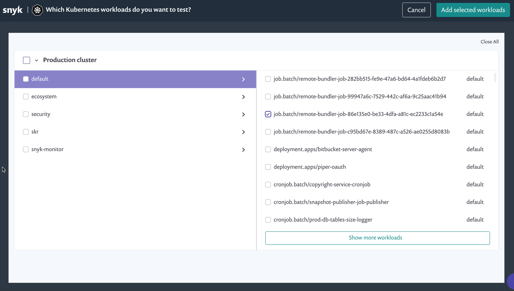
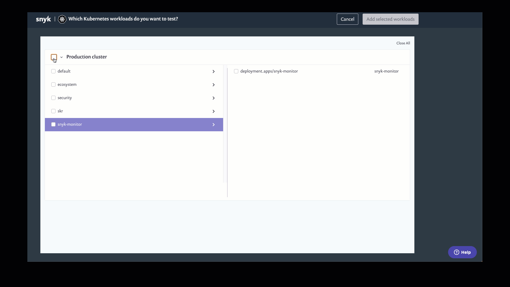

# Kubernetes Workload 프로젝트 수동으로 가져오기

동일한 통합 ID를 사용하여 클러스터에 고유한 클러스터 이름을 제공하여 설치 중에 여러 클러스터를 한 개의 Snyk 조직으로 가져올 수 있습니다.

수동 가져오기에서는 [Snyk 조직 간에 통합을 복제](../../../enterprise-setup/snyk-broker/clone-an-integration-across-your-snyk-organizations.md)하여 동일한 통합 ID가 있는 통합을 사용하여 하나의 클러스터를 여러 Snyk 조직에 가져올 수 있습니다.

하나의 Snyk 조직에는 25,000개의 프로젝트 제한이 있습니다. 자세한 정보는 Snyk 관리자에게 문의하세요.

## **수동으로 Kubernetes Workload 프로젝트를 가져오기 위한 전제 조건**

먼저 Snyk 계정을 소유하고 관리자에 의해 조직에 등록되어 있어야 합니다.

또한 Snyk와 Kubernetes 환경 간의 통합을 각 조직별로 구성해야 합니다. 통합이 구성되었는지 확인하려면 Integration ID가 있는지 확인하세요. 자세한 정보는 [Kubernetes 통합 활성화](overview-of-kubernetes-integration/enable-the-kubernetes-integration.md)를 참조하세요.

다음 단계:

1. Kubernetes 클러스터에 Snyk Controller를 배포합니다.
2. Kubernetes 클러스터로 가져오고자 하는 Kubernetes 워크로드를 배포합니다.

## 수동으로 Kubernetes 워크로드 추가하기

Snyk 웹 UI에서 **프로젝트** 페이지로 이동하고 페이지 상단의 **프로젝트 추가**를 클릭합니다. 프로젝트 목록에서 **Kubernetes**를 선택합니다.

나타나는 가져오기 화면에서 Kubernetes 환경의 모든 네임스페이스가 왼쪽에 표시되고 해당 네임스페이스 워크로드가 오른쪽에 표시됩니다.

<figure><figcaption><p>Kubernetes 워크로드 import 화면</p></figcaption></figure>

Snyk는 의도적으로 Kubernetes 내부로 간주하는 특정 네임스페이스를 무시합니다 (kube-\*로 시작하는 모든 네임스페이스). 따라서 해당 네임스페이스는 목록에 표시되지 않으며 해당 네임스페이스에 포함된 워크로드도 표시되지 않습니다. 무시된 네임스페이스의 전체 목록은 [kubernetes-monitor internal-workspaces 파일](https://github.com/snyk/kubernetes-monitor/blob/master/src/supervisor/watchers/internal-namespaces.ts)에서 확인할 수 있습니다.

snyk-monitor를 설정할 때 다음 코드를 Helm에 추가하여 목록을 구성할 수 있습니다:

```
      --set excludedNamespaces={kube-node-lease,local-path-storage,some_namespace}
```

화면 왼쪽에서 하나 이상의 네임스페이스를 선택하고, 각 네임스페이스에 대해 화면 오른쪽에서 가져올 하나 이상의 워크로드를 선택하세요.

<figure><figcaption><p>Kubernetes 워크로드 import 화면에서 네임스페이스 선택</p></figcaption></figure>

그런 다음 화면 우측 상단의 **선택한 워크로드 추가**를 클릭합니다. 가져오기가 완료되면 **프로젝트** 페이지가로드되고 가져온 모든 워크로드가 고유한 Kubernetes 아이콘과 함께 표시됩니다.

각 항목은 Kubernetes 메타데이터에 따라 명명됩니다:

\<namespace>/\<kind>/\<name>

**프로젝트** 목록에서 Kubernetes 프로젝트를 필터링할 수 있습니다.

