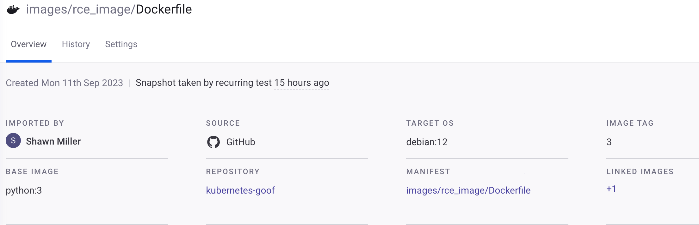
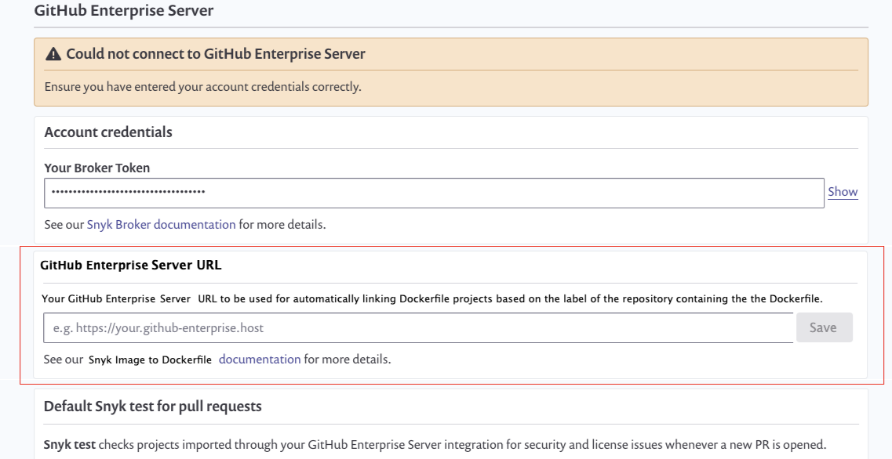

# Dockerfile과 컨테이너 이미지 간의 링크를 자동으로 생성하기

Snyk를 사용하면 Dockerfile에서 빌드된 모든 컨테이너 이미지로 수동 또는 자동으로 링크를 설정할 수 있습니다. 이를 사용하여 실행 중인 애플리케이션에 대한 보안 영향을 이해하고, 어떤 이미지가 더 잘 보호되어야 하거나 Dockerfile의 기본 이미지를 업데이트할 때 다시 빌드해야 하는지 파악할 수 있습니다.

## 링크된 이미지 작동 방식

이미지가 가져오거나 다시 스캔되면 해당 이미지는 취약점을 분석하고 스캔합니다. 또한 이미지 레이블은 이미지 매니페스트에서 검색됩니다. 그런 다음 Snyk는 다음을 확인합니다:

* Dockerfile 위치를 정의하는 이미지 레이블이 존재하는지:
  * `org.opencontainers.image.source` – 프로젝트 저장소의 URL (필수)
  * `io.snyk.containers.image.dockerfile` – Dockerfile의 경로, 예를 들어 "/Dockerfile-prod" (옵션)
* 이미지 레이블에서 동일한 조직의 Dockerfile 프로젝트가 존재하는지, 레포지토리와 일치하는지 (그리고 경로 또는 "/Dockerfile"을 가지고 있는지).

이러한 조건이 해당되면, Snyk는 이미지와 Dockerfile 프로젝트 사이에 자동 링크를 생성합니다.

## 링크된 이미지 보기

프로젝트 페이지에서 **LINKED IMAGES** 아래에 링크된 이미지를 볼 수 있습니다. 

<figure><figcaption>
링크된 이미지를 보여주는 프로젝트
</figcaption></figure>

컨테이너 레지스트리 통합을 사용하면 가져온 이미지와 기존 Dockerfile 프로젝트 간의 자동 링크를 생성할 수 있습니다. 이를 위해 이미지의 OCI 레이블이 Snyk 내의 조직에 있는 Dockerfile 경로와 일치해야 합니다.

## 링크를 자동으로 업데이트하고 제거하기

링크는 Dockerfile 레이블이 업데이트되고 새 위치를 지정하는 경우 자동으로 업데이트됩니다. 이는 다시 스캔 중이나 주기적으로 스캔 중에 발생할 수 있습니다.

링크는 다음과 같은 경우에 제거됩니다:

* 이미지 프로젝트 또는 Dockerfile 프로젝트가 삭제된 경우.
* Dockerfile 레이블이 업데이트되어 Snyk에 있는 기존 프로젝트를 타게팅하지 않는 경우 또는
* Dockerfile 레이블이 제거된 경우.

## 중개된 SCM 통합으로 자동 링크 생성하기

링크를 만들려면 Snyk가 Dockerfile 저장소 URL을 올바른 SCM 조직 소스에 매핑할 수 있어야 합니다. 중개된 통합의 경우, URL은 기본적으로 사용할 수 없기 때문에 프로세스가 더 복잡합니다.

브로커된 SCM에 저장된 Dockerfile과 컨테이너 이미지 간의 자동 링크를 생성하려면 통합 설정 페이지에서 URL을 입력하세요.

<figure><figcaption>
통합 설정 페이지 및 통합 URL
</figcaption></figure>

URL이 제공되면, Snyk는 해당 URL을 사용하여 링크를 생성할 수 있습니다.