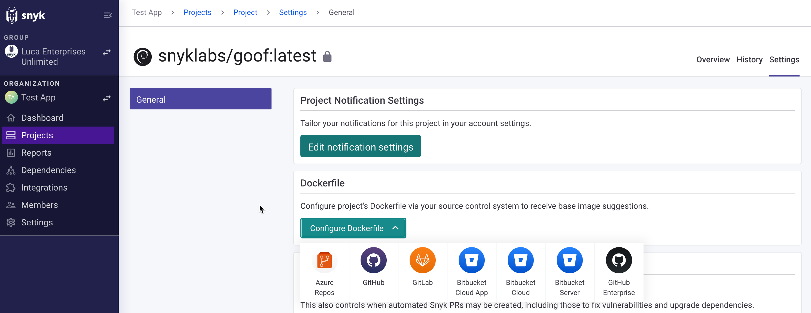
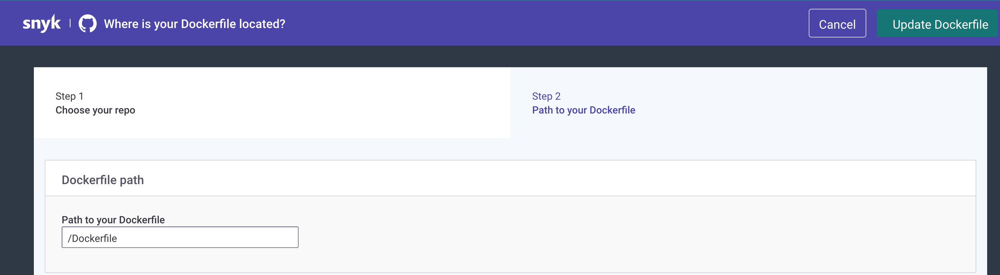
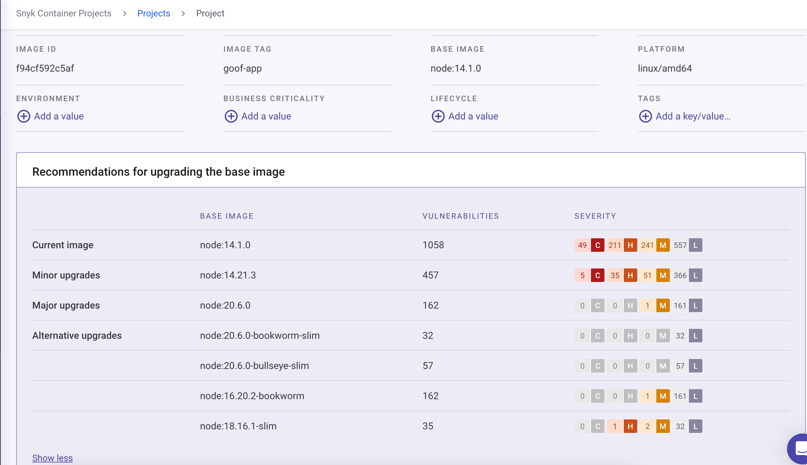
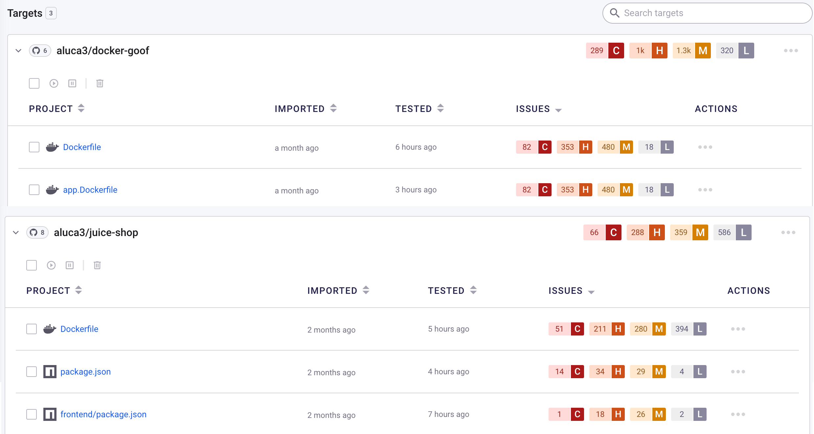

# Dockerfile에서 취약한 베이스 이미지 감지


각 가져온 이미지에 단일 Dockerfile을 추가할 수 있습니다.


## **Dockerfile을 추가하기 위한 전제 조건**

베이스 이미지 수정 조언 및 주 버전, 부 버전 및 대안 업그레이드, 이미지를 다시 빌드해야 할 때 수정 조언을 받으려면 다음 사항을 확인하세요:

* 선호하는 Git 저장소를 설정하였는지
* 관련 Dockerfile을 포함한 저장소를 가져왔는지

## **Dockerfile 추가하기**

추가 수정 조언을 위해 Dockerfile을 추가하려면 다음 단계를 따르세요:

1. **프로젝트** 탭에서 필터를 사용하여 프로젝트를 찾고 프로젝트 페이지로 이동합니다.
2. 프로젝트 페이지에서 **설정**으로 이동합니다.
3. **설정** 페이지에서 **Dockerfile** 아래 **Dockerfile 구성**을 클릭하고 드롭다운에서 해당 Git 저장소를 선택합니다.

<figure><figcaption>
Dockerfile 구성
</figcaption></figure>

4. 사용 가능한 저장소 목록이 표시된 페이지에서 Dockerfile을 포함한 관련 저장소를 선택합니다.
5. **Dockerfile 경로** 아래 Dockerfile의 상대 경로를 다음 형식으로 추가합니다: /path/dockerfile.

<figure><figcaption>
Dockerfile 경로 추가
</figcaption></figure>

6. **Dockerfile 업데이트**를 클릭합니다.

Snyk는 프로젝트를 다시 스캔하고 관련 베이스 이미지 수정 조언을 제공합니다. 베이스 이미지 업그레이드에 대한 수정 조언은 프로젝트 페이지의 **베이스 이미지 업그레이드 권장사항** 아래에 표시됩니다.

다음 정보가 표시됩니다: **현재 이미지**, **부 업그레이드**, **주요 업그레이드**, **대체 업그레이드**, 각각의 취약성 수 및 심각도 순위.

<figure><figcaption>
베이스 이미지를 업그레이드하는 권장사항
</figcaption></figure>

## Dockerfile로부터 베이스 이미지 스캔하기

Snyk는 Git 저장소를 가져올 때 Dockerfile을 스캔하여 취약한 베이스 이미지를 감지합니다. 이를 통해 이미지를 빌드하기 전에 보안 문제를 조사할 수 있어 레지스트리나 프로덕션에 문제가 발생하기 전에 잠재적인 문제를 해결할 수 있습니다.


Dockerfile을 스캔할 때 Snyk는 지원되는 베이스 이미지에 대한 취약성 정보 및 베이스 이미지 권장 사항을 제공할 수 있습니다. 도움이 필요한 경우, [Snyk 지원팀](https://support.snyk.io)에 문의하십시오.


Git 저장소를 [Snyk와 통합한 후](../../../scm-ide-and-ci-cd-integrations/snyk-scm-integrations/), 해당 저장소에 있는 모든 Dockerfile은 자동으로 식별되어 웹 UI에서 프로젝트로 표시됩니다.

<figure><figcaption>
프로젝트 목록에 표시된 Dockerfile
</figcaption></figure>

컨테이너 내에서 취약한 베이스 이미지를 감지하고 수정 권고사항을 자세히 알아보려면 [컨테이너 베이스 이미지 감지](../use-snyk-container/detect-the-container-base-image.md)를 참조하십시오.