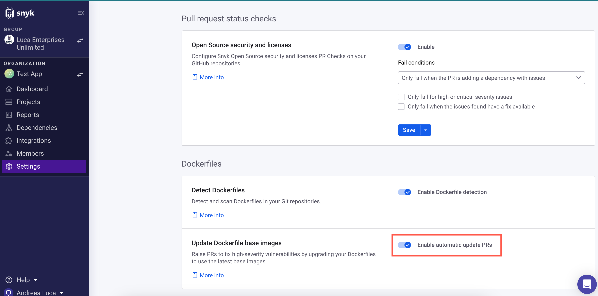

# Dockerfile에서 취약한 기본 이미지 수정

## 자동 Pull Request(PR)

Snyk는 Git 저장소를 가져올 때 Dockerfile을 스캔하여 취약한 기본 이미지를 감지하고 자동 Pull Request를 사용하여 이를 수정하는 데 도움을 줍니다. 이를 통해 이미지를 빌드하기 전에 보안 문제를 검토하고 레지스트리나 프로덕션 환경에 미리 수정할 수 있습니다.

Dockerfile 수정용 PR을 지원하는 Git 기반 저장소 관리자는 다음과 같습니다:

* GitHub
* GitLab
* Bitbucket Server
* Bitbucket Cloud
* GitHub Enterprise Server
* Azure Repos

Snyk에서 생성된 모든 Dockerfile 프로젝트의 기본 이미지가 [도커 공식 이미지](https://docs.docker.com/docker-hub/official\_images/)인 경우, 결과에는 기존보다 취약한 것 대신 사용할 수 있는 적절한 기본 이미지 목록이 포함됩니다. 자세한 내용은 [컨테이너 이미지 분석 및 수정](../use-snyk-container/analyze-and-fix-container-images.md)을 참조하십시오.

그런 다음, Snyk는 최신 소수 버전으로 업그레이드하기 위해 Dockerfile에 대한 수정 Pull Request를 자동으로 생성합니다.

Snyk는 Dockerfile의 변경이 발생하거나 초기 스캔 후 더 나은 기본 이미지를 식별할 때 자동으로 수정 PR을 엽니다.

### Dockerfile 기본 이미지의 자동 업데이트 활성화

이 기능은 모든 Snyk 사용자에게 제공됩니다. 무료 계정을 사용하는 모든 사용자에게는 기본적으로 활성화되어 있고, 기존 Snyk 고객의 통합에 대해서는 기본적으로 비활성화되어 있습니다.

자동 업데이트 PR을 활성화하려면 **설정 > 통합**으로 이동하여 연결된 소스 코드 관리자를 선택하십시오. 설정 구성 페이지에서 **Dockerfiles** 아래 **자동 업데이트 PR 활성화**를 토글합니다.

<figure><figcaption>
자동 업데이트 PR 활성화
</figcaption></figure>

## 수동으로 수정 PR 열기

수동으로 수정 PR을 열려면 프로젝트 페이지에서 업그레이드하고 싶은 기본 이미지 버전의 **수정 PR 열기**를 클릭할 수 있습니다.

<figure><figcaption>
수정 PR 열기
</figcaption></figure>

수정 PR이 열리면 Git 저장소에서 이를 확인하고 변경 사항 및 발생 위치를 확인할 수 있습니다. Dockerfile의 `FROM` 라인이 새로운 개선된 버전으로 업데이트됩니다.


변경 사항을 병합하기 전에 응용 프로그램이 제대로 작동하는지 확인하십시오.


PR이 열리고 사용 준비가 되면 안전하게 병합하여 즉시 컨테이너 이미지의 취약점 수를 줄일 수 있습니다.