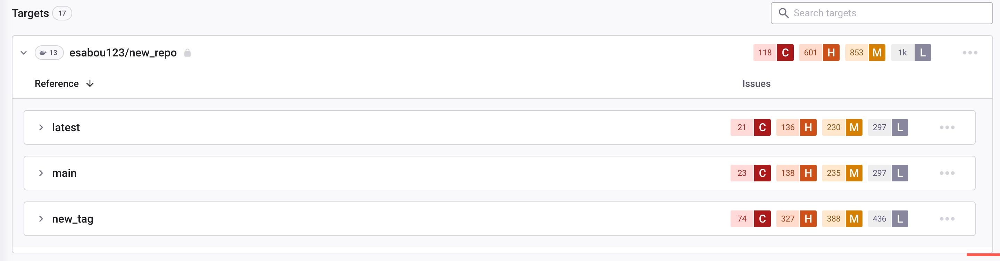
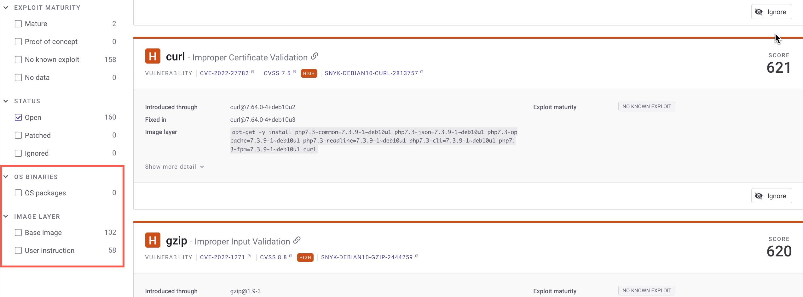

# 컨테이너 이미지 분석 및 수정

Snyk을 사용하여 CLI 명령 [`snyk container monitor`](../../../snyk-cli/commands/container-monitor.md)를 통해 컨테이너 프로젝트를 가져올 수 있습니다. 또는 지원되는 컨테이너 레지스트리에서 직접 프로젝트를 가져올 수도 있습니다.

Snyk은 컨테이너 이미지의 스냅샷을 가져와 취약점을 스캔합니다. 구성에 따라 Snyk은 해당 초기 가져오기에서 스냅샷된 의존성을 매일 또는 주간으로 정기적으로 스캔하며, 이는 다시 해당 태그로 참조합니다. 구성에 따라 새로운 취약점이 식별되면 Snyk이 이메일 또는 Slack을 통해 업데이트를 보냅니다.

이미지의 태그가 변경되고 원래 태그가 다른 이미지에 사용된 경우, 재스캔(매일 또는 주간) 시 Snyk은 Linux 패키지 의존성에 대한 변경을 감지하고 해당 프로젝트의 새로운 스냅샷을 생성하지만 응용 프로그램 의존성의 변경을 감지하지 않으므로 응용 프로그램 취약점에 대한 스냅샷을 업데이트하지 않습니다.

따라서 태그를 자주 재사용하여 다른 이미지를 참조하는 경우, Snyk이 응용 프로그램 의존성을 업데이트할 수 있도록 다른 이미지를 다시 가져와야 합니다.

## 컨테이너 프로젝트 그루핑

이미지를 가져오는 방법에 따라( Snyk CLI, 컨테이너 레지스트리 통합 또는 Kubernetes 통합), **프로젝트** 탭에서 프로젝트는 다르게 그룹화됩니다.

### Snyk CLI로 이미지를 가져올 때 프로젝트 그룹화

Snyk은 이미지와 이미지에서 찾은 응용 프로그램을 그룹화합니다. 그러나 Snyk CLI는 이미지 태그를 그룹화에 사용하지 않기 때문에 다른 이미지 태그를 가진 동일한 리포지토리의 이미지가 모두 그룹화됩니다.

<figure><figcaption>
서로 다른 이미지 태그가 하나의 그룹으로 그룹화된 이미지들
</figcaption></figure>

### 컨테이너 레지스트리 통합으로 이미지를 가져올 때 프로젝트 그룹화

컨테이너 레지스트리 통합을 사용하여 이미지를 가져오면 **프로젝트** 목록에 임의 이름의 이미지 태그 당 별도의 하위 그룹화가 수행됩니다.

<figure><figcaption>
서로 다른 이미지 태그가 하위 그룹으로 그룹화된 이미지들
</figcaption></figure>

### Kubernetes 통합으로 프로젝트 가져올 때 프로젝트 그룹화

Kubernetes 통합을 사용하여 이미지를 가져오면 상단에서 클릭 가능한 항목이 클러스터에서의 워크로드를 나타냅니다. Snyk은 이미지를 기준으로 그룹화를 수행하며 이미지 태그 당 별도의 하위 그룹화를 수행하지 않습니다.

<figure><figcaption>
워크로드 내 이미지를 기준으로 하는 그룹화
</figcaption></figure>

## 이미지 취약점 보기

레지스트리 통합에서 프로젝트를 가져온 경우, **프로젝트** 페이지에서 관련 레지스트리 아이콘으로 표시됩니다. CLI에서 가져온 프로젝트는 CLI 아이콘으로 표시됩니다. 또한 모든 컨테이너 프로젝트를 표시하도록 필터링할 수 있습니다.

컨테이너 프로젝트를 열면 해당 프로젝트에 대한 분석 및 수정 권고 사항이 표시됩니다.

<figure><figcaption>
컨테이너 프로젝트에 대한 분석과 수정 권고 사항
</figcaption></figure>

다음 정보가 표시됩니다:

* 프로젝트 요약: 고유한 세부 정보를 포함한 일반 프로젝트 세부 정보:
  * **이미지 ID** - 컨테이너 이미지 다이제스트에서 파생됨
  * **이미지 태그**
  * **베이스 이미지**
  * 알려진 취약점을 가진 총 종속성 및 전체 취약점 수
* 수정 권고: 모니터링을 위해 Dockerfile을 포함한 경우 사용 가능하고 실행 가능한 수정 권고가 표시됩니다. 모든 수정 궜고를 보려면 **Show more upgrade types**를 클릭하세요.

**Issues** 탭에는 취약점 목록과 원본 및 경로, 그리고 취약점 개요가 표시됩니다.

문제 목록에서는 지원되는 모든 프로젝트 유형에 대해 사용 가능한 필터 및 다음 필터를 사용할 수 있습니다:

* **OS BINARIES** - 특정 바이너리 또는 이슈가 있는 OS 패키지를 볼 수 있습니다.
* **IMAGE LAYER** - Dockerfile 지침을 볼 수 있습니다. Dockerfile을 첨부하면 기본 이미지와 관련된 이슈만 볼 수 있도록 필터링하거나 Dockerfile 관련 권고사항(사용자 지침)을 볼 수 있습니다.

<figure><figcaption>
OS 바이너리 및 이미지 레이어를 위한 필터
</figcaption></figure>


컨테이너에 단일 카테고리의 이슈만 있는 경우(예: Node 바이너리 취약점 또는 OS 패키지)에는 **OS BINARIES** 필터가 표시되지 않습니다.

Dockerfile이 첨부되지 않은 경우 **IMAGE LAYER** 필터가 표시되지 않습니다.


**Dependencies** 탭은 이미지 내의 패키지 계층 구조를 트리 뷰로 제공합니다.

## 이미지 취약점 수정

공개 베이스 이미지 권장 사항을 제공할 때, Snyk은 해당 베이스 이미지의 출처 리포지토리, 플레이버, 버전에 따라 로직을 기반으로 합니다.

베이스 이미지를 업그레이드 하는 Snyk 권장 사항은 다음과 같습니다:

* **작은 업그레이드**: 가장 안전하고 최상의 작은 업그레이드
* **큰 업그레이드**: 더 많은 취약점을 줄이는 큰 업그레이드 옵션(위험 증가)
* **대체 업그레이드**: 현재 기본 이미지를 다른 기본 이미지로 대체할 수 있는 요소 이미지 옵션
* 만료된 경우 기본 이미지를 다시 빌드하는 권장 사항

베이스 이미지를 업그레이드하기 위한 권장 사항에는 다음이 포함됩니다:

* 권장 베이스 이미지 버전의 이름
* 권장 업그레이드에서 존재하는 취약점 수
* 취약점 심각도에 대한 요약

<figure><figcaption>
베이스 이미지 업그레이드를 위한 권장 사항
</figcaption></figure>
