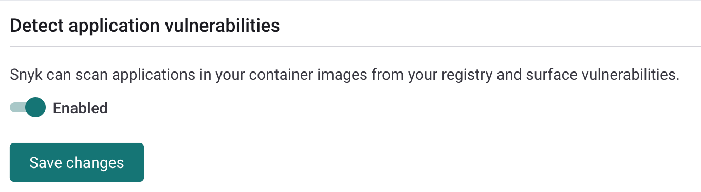
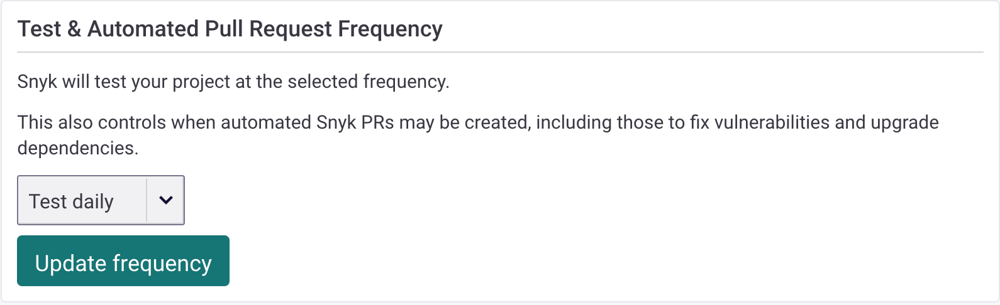

# 컨테이너 이미지에서 응용 프로그램 취약점 탐지

Snyk는 한 번의 스캔으로 컨테이너 이미지의 응용 프로그램 종속성 및 운영 체제에서의 취약점을 감지할 수 있습니다.

응용 프로그램 취약점을 감지하는 것은 타사 이미지의 스캔을 목적으로 합니다. 이 기능은 내부에서 개발된 코드의 문제를 감지하기 위해 설계되지 않았습니다. 사용자는 소스 코드에 액세스하여 Snyk Code 및 Snyk Open Source를 사용하여 SDLC 초기에 문제를 감지할 수 있습니다.

컨테이너 레지스트리 통합을 위한 컨테이너 이미지에서의 응용 프로그램 취약점 탐지는 Node, Ruby, PHP, Python, Go binaries 및 Java를 지원합니다. CLI 및 Kubernetes에서는 Node, PHP, Python, Go binaries 및 Java를 지원합니다.

컨테이너 레지스트리와 통합한 후 프로젝트를 가져오면, Snyk는 이미지를 취약점에 대해 스캔합니다.

컨테이너 레지스트리 통합에서 가져온 이미지로 생성된 응용 프로그램 프로젝트의 경우, 재발 스캔이나 수동 다시 스캔 중에 응용 프로그램이 다시 가져와지지 않습니다.

대신, 초기 이미지 가져오기 중 발견된 응용 프로그램 종속성은 새로운 취약점을 위해 스캔됩니다.

이미지 내의 응용 프로그램에서 새로운 종속성이 도입되면 재발 스캔이나 수동 다시 스캔에서 감지되지 않습니다. 컨테이너 레지스트리의 이미지 내에서 새로운 또는 업데이트된 응용 프로그램을 감지하려면 이미지를 Snyk로 다시 가져와야 합니다.

Kubernetes 통합에서 가져온 이미지에서 발견된 응용 프로그램의 경우, 기존 응용 프로그램은 다시 가져오지만 이미지에 추가된 새로운 앱은 재발 스캔 중에 가져와지지 않습니다. Kubernetes의 이미지에서 새로운 응용 프로그램을 감지하려면 이미지를 Snyk로 다시 가져와야 합니다.

## 컨테이너 레지스트리 취약점 스캔 활성화

컨테이너 레지스트리에서 응용 프로그램 취약점 스캔을 활성화하려면 다음을 수행합니다:

1. **통합**으로 이동한 다음 컨테이너 레지스트리 통합 설정으로 이동합니다.
2. **응용 프로그램 취약점 감지**를 활성화하고 변경 사항을 저장합니다.

<figure><figcaption>
응용 프로그램 취약점 감지 활성화
</figcaption></figure>

컨테이너 레지스트리 또는 Kubernetes 통합을 사용하여 이미지를 스캔할 때, 스캔은 기본적으로 `--app-vulns` 플래그를 사용합니다. 컨테이너 레지스트리에서만 플래그에서 제외하려면 **응용 프로그램 취약점 감지** 기능을 비활성화하세요.


* Java의 경우, 플래그를 사용하면 Snyk가 기본적으로 한 수준만의 중첩된 jar를 스캔합니다.
* Python의 경우, Snyk는 모든 통합 지점에서 Poetry 및 Pip을 지원합니다.
* Go binaries의 경우, Snyk는 Go 모듈 지원으로 빌드된 모든 유형의 Go binary를 지원합니다.


## 취약점을 감지하기 위한  CLI 옵션

### App vulns 옵션

CLI 버전 1.1090.0 (2023-01-24) 이상에서는 Snyk는 기본적으로 이미지의 응용 프로그램 종속성을 스캔합니다. `--app-vulns` 옵션을 지정할 필요가 없습니다.

응용 프로그램 취약점 스캔을 제외하려면 `--exclude-app-vulns` 옵션을 지정할 수 있습니다. 이렇게 하면 이전 동작을 모방하여 결과에서 응용 프로그램 취약점 섹션을 제외합니다. `--exclude-app-vulns` 옵션은 CLI 버전 1.1021.0 이상에서 사용할 수 있습니다.

### Java 응용 프로그램

 CLI는 JAR 또는 uber-jars 형식으로 이미지에 포함된 Java 응용 프로그램을 스캔할 수 있습니다. uber-jars 또는 shaded jars의 경우, Snyk는 패키지 버전 및 종속성을 해결하기 위해 `pom.properties` 매니페스트 파일을 사용합니다. JAR 파일에 `pom.properties` 파일이 포함되는지는 JAR 빌드 프로세스 중에 사용된 도구 및 구성에 따라 다릅니다. Maven 및 Maven Shade Plugin으로 빌드된 JAR는 기본적으로 `pom.properties` 매니페스트 파일이 포함됩니다.

### 중첩된 jar 깊이 옵션

`--app-vulns`가 활성화된 경우, `--nested-jars-depth=n` 옵션을 사용하여 Snyk가 얼마나 많은 수준의 중첩된 jar를 풀어낼지 설정할 수 있습니다. 암묵적인 기본값은 1입니다. 2를 지정하면 Snyk는 jar 안의 jar를 풀어낸다는 것을 의미하며, 3은 jar 안의 jar 안의 jar를 풀어낸다는 것을 의미합니다.

불필요한 스캔을 제외하려면 `--nested-jar-depth=0`를 사용하세요.

### 알 수 없는 버전으로 끝나는 Maven 패키지

 CLI는 스캔된 JAR에 `pom.properties` 매니페스트 파일이 포함되지 않은 경우 Maven 패키지가 @unknown 버전으로 끝나는 것으로 보일 수 있습니다. 패키지 버전이 @unknown으로 표시되는 다른 이유에 대한 자세한 내용은 [Why-does-my-Maven-package-show-Unknown-through-the-SCM](https://support.snyk.io/s/article/Why-does-my-Maven-package-show-unknown)를 참조하세요.

## 응용 프로그램 취약점과 라이선스 문제 보기

**응용 프로그램 취약점 감지** 기능이 활성화되면 다음을 볼 수 있습니다:

* 컨테이너 이미지에서 감지된 매니페스트 파일의 종속성 취약점 및 라이선스 문제
* 운영 체제 패키지에서 감지된 취약점

이미지가 Snyk로 가져오면 **프로젝트** 뷰에서 해당 레지스트리 기록 아래에 나타나며 이미지에서 발견된 운영 체제 취약점이 표시됩니다.

이 기능이 활성화된 경우, 이미지에서 감지된 중첩 매니페스트 파일과 해당 취약점 및 라이선스 문제를 볼 수 있습니다.

<figure><figcaption>
프로젝트 뷰에 나열된 이미지
</figcaption></figure>

## 자동 스캔 설정

프로젝트 설정에 따라 Snyk는 이미지를 정기적으로 스캔합니다. 구성에 따라 새로운 취약점이 운영 체제 및 응용 프로그램 종속성에서 식별될 때마다 Snyk가 이메일이나 Slack으로 업데이트합니다.

각 프로젝트의 스캔 빈도를 설정할 수 있습니다. 기본값은 매일 테스트입니다. 스캔 빈도를 업데이트하려면 프로젝트 페이지의 **설정** 탭으로 이동하고 드롭다운에서 빈도를 선택하세요. 옵션은 **never**, **daily**, 또는 **weekly**입니다.

<figure><figcaption>
스캔 빈도 업데이트
</figcaption></figure>

## 지원되는 컨테이너 레지스트리

다음 컨테이너 레지스트리가 지원됩니다:&#x20;

* Docker Hub
* GCR
* ACR
* Amazon ECR
* JFrog Artifactory
* Harbor
* Quay
* GitHub
* Nexus
* DigitalOcean
* GitLab

## 지원되는 통합

지원되는 언어는 다음과 같은 통합과 작동합니다:

<table data-header-hidden><thead><tr><th width="133"></th><th width="165"></th><th width="157"></th><th></th></tr></thead><tbody><tr><td><strong>언어</strong></td><td><strong>컨테이너 레지스트리</strong></td><td><strong>CLI</strong></td><td><strong>Kubernetes</strong></td></tr><tr><td>Node</td><td>예</td><td>예</td><td>예</td></tr><tr><td>Ruby</td><td>예</td><td></td><td></td></tr><tr><td>PHP</td><td>예</td><td>예</td><td>예</td></tr><tr><td>Python</td><td>예</td><td>예</td><td>예</td></tr><tr><td>Go Binaries</td><td>예</td><td>예</td><td>예</td></tr><tr><td>Java</td><td>예</td><td>예</td><td>예</td></tr></tbody></table>