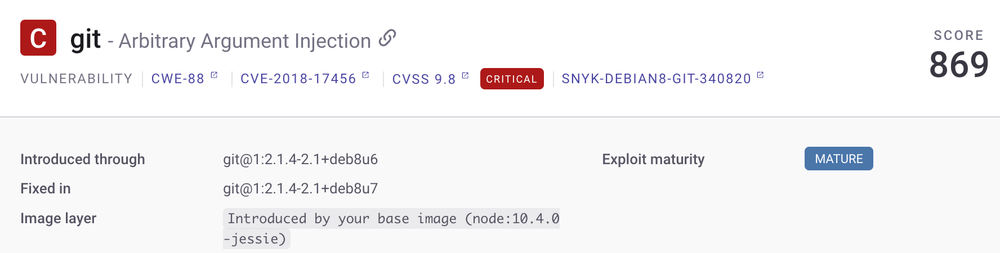
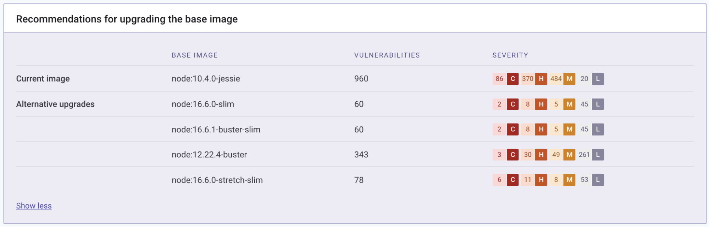

# 컨테이너 기본 이미지 감지

취약한 베이스 이미지를 탐지하면 취약점의 원인을 식별하고, 권장사항에 따라 베이스 이미지를 업데이트하여 해결할 수 있습니다.

[컨테이너 통합](https://docs.snyk.io/snyk-container) (예: CLI 또는 컨테이너 레지스트리 통합)을 구성한 후에 base 이미지를 탐지할 수 있습니다.


지원되는 컨테이너 레지스트리에 대한 세부 정보는 [컨테이너 보안 통합](../container-registry-integrations/)을 참조하십시오.


## Snyk Container이 base 이미지를 식별하는 방법

취약한 base 이미지를 식별하기 위해 다음 중 하나의 방법을 사용할 수 있습니다.

* 자동 탐지 - Snyk이 컨테이너 이미지를 분석할 때 이미지 manifest로부터 관련 메타데이터를 추출하고, base 이미지를 탐지합니다. 이 방법은 이미지 manifest의 `rootfs` 레이어를 분석하며, 이는 DockerHub의 하나 이상의 이미지 또는 이미지 태그와 동등할 수 있습니다.
* Dockerfile - Snyk은 Dockerfile을 사용하여 취약한 base 이미지를 감지할 수도 있습니다. `--file` 플래그를 클라이언트 `snyk container test` 스캔에 첨부하거나, 프로젝트 설정을 통해 SCM에서 링크하거나, Git 리포지토리를 가져올 때 탐지 및 스캔할 수 있습니다. 자동 탐지와 비교하여 Dockerfile을 사용하는 것이 더 정확하지만 추가 단계가 필요합니다.\
  \
  멀티 스테이지 Dockerfile의 경우, Snyk은 최종 `FROM` 라인에 포함된 이미지에서 base 이미지를 감지합니다. [Docker의 멀티 스테이지 빌드 문서](https://docs.docker.com/develop/develop-images/multistage-build/#use-multi-stage-builds)에 따르면, 여러 `FROM` 문을 사용하면 "한 단계에서 다른 단계로 아티팩트를 선택적으로 복사하여 최종 이미지에 포함시키고 싶지 않은 모든 것을 제외시킬 수 있게 합니다."

어느 방법이든, Snyk UI의 프로젝트가 생성됩니다.


Snyk은 공식 Docker 이미지의 일부만 지원합니다. 도움이 필요한 경우 [Snyk 지원팀](https://support.snyk.io)에 문의하십시오.


## 이미지 레이어

Snyk에서 Docker 이미지를 스캔할 때 이미지 레이어에서 취약점을 도입하는 명령어를 볼 수 있습니다. 이 시점에서는 어떠한 조치도 취할 필요가 없습니다.

<figure><figcaption>
Docker 이미지의 이미지 레이어에 대한 정보
</figcaption></figure>

## Snyk Container 베이스 이미지 업그레이드 권장사항

베이스 이미지가 Snyk에서 지원하는 이미지인 경우, 결과에는 발견된 취약점 중 일부를 해결하기 위한 업그레이드에 대한 권장사항이 포함됩니다.

이를 통해 발견된 취약점을 해결하기 위한 마이너 및 메이저 업그레이드 및 취약점이 적은 대체베이스 이미지의 취약점 수를 볼 수 있습니다. 이 정보를 기반으로 base 이미지를 업그레이드할지 여부와 가장 적합한 이미지를 결정할 수 있습니다.

프로젝트에서 발견된 취약점은 우선순위 점수 순으로 정렬된 지침에 의한 취약점들 사이에 base 이미지 취약점을 볼 수 있습니다.

<figure><figcaption>
베이스 이미지를 업그레이드하기 위한 권장사항
</figcaption></figure>

**이미지 레이어** 필터 아래의 **베이스 이미지** 옵션을 사용하여 베이스 이미지 취약점만 필터링할 수도 있습니다.

자세한 내용은 [컨테이너 이미지 분석 및 수정](analyze-and-fix-container-images.md)을 참조하십시오.
