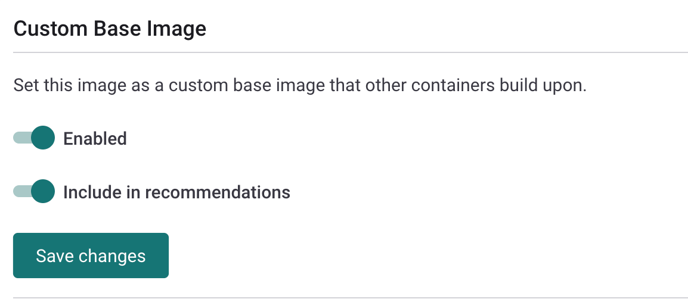

# 커스텀 베이스 이미지 권장 사항 사용


**기능 가용성**\
커스텀 베이스 이미지 권장 사항 기능은 엔터프라이즈 플랜에서만 사용할 수 있습니다.\
더 많은 정보는 [요금제 및 가격](https://snyk.io/plans/)를 참조하십시오.


## **커스텀 베이스 이미지 권장 사항(CBIR) 개요**

컨테이너 이미지를 스캔할 때, Snyk은 감지된 베이스 이미지를 기반으로 권장 사항을 제공합니다. Snyk은 Docker 공식 이미지에 대해서만 미리 계산된 권장 사항을 제공하므로, 이러한 권장 사항은 이미지 하위 집합에만 적용됩니다.

고객은 주로 Docker 공식 이미지나 다른 상위 이미지 위에 구축된 내부 베이스 이미지를 유지합니다. 이러한 이미지들은 더 많은 개발 팀에게 서비스로 제공됩니다. 예를 들어: `somecompany/base-python:3.12.1`.

커스텀 베이스 이미지 권장 사항 기능(CBIR)을 사용하면 Snyk이 내부 이미지 풀에서 이미지 업그레이드를 권장할 수 있습니다. 이를 통해 팀은 내부 베이스 이미지의 새로운 보안 강화된 버전을 알릴 수 있습니다.

## CBIR 작동 방식

커스텀 베이스 이미지 권장 사항 기능을 사용하려면 베이스 이미지 및 베이스 이미지 위에 구축된 애플리케이션 이미지를 Snyk로 프로젝트로 가져와야 합니다. 이러한 프로젝트는 다른 조직에 있을 수 있지만, 이러한 조직들은 동일한 그룹에 속해야 합니다.

애플리케이션 이미지에 대해 커스텀 베이스 이미지 권장 사항을 받으려면 프로젝트에서 Dockerfile을 지정해야 합니다.


공개 Docker 공식 이미지와 달리, Snyk은 Dockerfile이 애플리케이션 이미지 프로젝트에 연결된 경우에만 커스텀 베이스 이미지를 감지할 수 있습니다.


모든 커스텀 베이스 이미지 권장 사항은 이미지 태그와 관계없이 소규모 업그레이드로 간주됩니다.

동일 저장소로 가져온 프로젝트들을 대상으로 베이스 이미지의 최신 버전을 결정하려면, Snyk은 [버전 스키마](versioning-schema-for-custom-base-images.md)를 구성할 수 있습니다.

커스텀 베이스 이미지 권장 사항 기능은 자동 수정 PR을 지원합니다. 베이스 이미지의 최신 버전을 사용하지 않으면, 이미지 가져오기 직후 Snyk은 Dockerfile을 업그레이드하여 최신 사용 가능한 커스텀 베이스 이미지 버전으로 수정 pull request를 자동으로 발행합니다.

## **CBIR 활성화:** 이미지를 커스텀 베이스 이미지로 구성

다음 단계에서는 커스텀 베이스 이미지를 구성하는 방법을 설명합니다. 조직에서 내부 베이스 이미지를 생성하고 유지하는 팀이 이러한 단계를 수행합니다.

### 베이스 이미지 빌드 및 가져오기

1. 커스텀 베이스 이미지를 빌드합니다.
2. 다음 중 하나의 옵션을 사용하여 이미지를 Snyk 프로젝트로 가져옵니다:
   * Snyk 웹 UI: 컨테이너 레지스트리를 사용하여 이미지를 Snyk에 가져옵니다.
   * CLI: `snyk container monitor` 명령어를 사용합니다.
     * 프로젝트에 고유한 이름을 제공하기 위해 `--project-name` 플래그를 설정합니다(필수). Snyk은 저장소 없이 이미지 이름과 태그를 사용하는 것을 권장합니다. 예: `base-python:3.9.2_2021110408`.
     * Snyk CLI 명령어 예시:\
       `snyk container monitor somecompany/base-python:3.9.2_2021110408 --project-name=base-python:3.9.2_2021110408 --org=ORGANIZATION_ID/ORGANIZATION_NAME`

### 생성한 프로젝트를 커스텀 베이스 이미지로 표시

1. 웹 UI에서 가져온 베이스 이미지가 포함된 프로젝트를 엽니다.
2. 프로젝트 페이지에서 **설정**으로 이동합니다.
3. **커스텀 베이스 이미지**를 활성화합니다. 이는 Snyk이 다른 프로젝트에서 이 이미지를 베이스 이미지로 인식하게 합니다.
4. Snyk이 이 이미지를 최상의 업그레이드 경로를 결정하는 데 사용하도록 하려면 **권장 사항에 포함**를 활성화합니다.


API 엔드포인트를 사용하여 [기존 컨테이너 프로젝트에서 커스텀 베이스 이미지 생성](../../../../snyk-api/reference/custom-base-images.md#custom_base_images)도 수행할 수 있습니다.


<figure><figcaption>
커스텀 베이스 이미지 활성화
</figcaption></figure>

5. **변경 사항 저장**을 클릭합니다.

이것이 저장소에서 커스텀 베이스 이미지로 표시한 첫 번째 프로젝트인 경우, 버전 스키마를 설정해야 합니다. 자세한 정보는 [커스텀 베이스 이미지의 버전 스키마](versioning-schema-for-custom-base-images.md)를 참조하십시오. 이미지 저장소에 스키마가 이미 있는 경우, 변경 사항을 저장한 후에 표시됩니다.


버전 스키마를 변경하면 저장소의 모든 커스텀 베이스 이미지에 적용됩니다.


이미 커스텀 베이스 이미지로 표시된 프로젝트의 **커스텀 베이스 이미지 설정**을 편집할 수도 있습니다.

## 커스텀 베이스 이미지 권장 사항 받기

사전 빌드된 커스텀 베이스 이미지를 사용하고 애플리케이션에 추가 레이어를 덧붙이는 애플리케이션 팀이 이 단계를 수행합니다.

먼저 이미지를 새 Snyk 프로젝트로 가져옵니다. 프로젝트가 커스텀 이미지와 동일한 그룹에 있는지 확인하십시오. CLI 또는 웹 UI를 사용하여 이미지를 가져올 수 있습니다.


CLI와 웹 UI에서 동일한 이미지를 스캔하면, Snyk은 두 프로젝트를 만들고 모니터링합니다.


### CLI를 통해 새 이미지 가져오고 Dockerfile 설정하기

CLI를 통해 이미지를 가져오는 예시 명령어는 다음과 같습니다:

`snyk container monitor somecompany/app-python:2021110408 --file=path/to/Dockerfile`

`--file`(필수)을 사용하여 Dockerfile의 경로를 지정하세요.

### 이전에 가져온 이미지를 사용하고 Dockerfile 설정하기

Dockerfile을 첨부하기 위해 이전에 가져온 컨테이너 프로젝트를 수정할 수 있습니다.

애플리케이션 이미지에 대한 프로젝트 페이지에서 **설정**으로 이동하여 드롭다운에서 소스 제어 시스템을 선택하여 Dockerfile을 구성합니다.

<figure><figcaption>
프로젝트 Dockerfile 구성
</figcaption></figure>

Dockerfile 저장소를 선택하고 Dockerfile의 경로를 추가합니다. **Dockerfile 업데이트**를 클릭합니다.

<figure><figcaption>
Dockerfile의 경로를 구성합니다.
</figcaption></figure>

### 커스텀 베이스 이미지 권장 사항 보기

이제 **프로젝트** 페이지로 이동하여 이미지에 대한 권장 사항을 확인할 수 있습니다.


기존 프로젝트에 Dockerfile을 설정할 때에는 프로젝트를 다시 테스트해야 할 수 있습니다.


<figure><figcaption>
커스텀 베이스 이미지 권장 사항 예시
</figcaption></figure>

## CBIR의 알려진 제한 사항

* 애플리케이션 이미지를 스캔할 때, 커스텀 베이스 이미지 권장 사항은 스캔된 프로젝트에 Dockerfile을 연결하지 않는 한 표시되지 않습니다.
* 커스텀 베이스 이미지에 대한 권장 사항은 이미지 레지스트리를 무시합니다. Snyk이 권장 사항 및 수정 PR을 표시할 때, 저장소는 동일하지만 레지스트리가 다른 이미지는 동일한 레지스트리에서 가져온 것으로 처리됩니다(현재 베이스 이미지의 레지스트리).