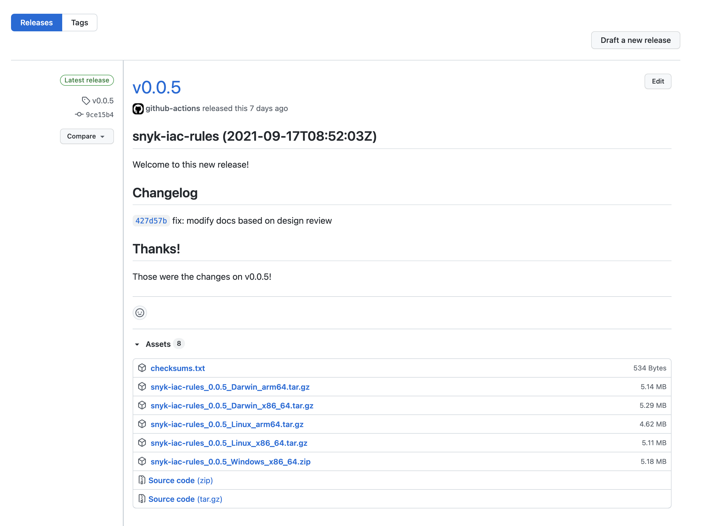

# SDK 설치

SDK를 아래의 옵션 중 하나로 설치하세요:

- [npm을 사용하여 SDK 설치](install-the-sdk.md#install-the-sdk-with-npm)
- [빌드된 이진 파일을 사용하여 SDK 설치](install-the-sdk.md#install-the-sdk-using-the-prebuilt-binaries)
- [Homebrew를 사용하여 SDK 설치](install-the-sdk.md#install-the-sdk-with-homebrew)
- [Windows Scoop 패키지 관리자를 사용하여 SDK 설치](install-the-sdk.md#install-the-sdk-with-the-windows-scoop-package-manager)
- [Docker를 사용하여 SDK 설치](install-the-sdk.md#install-the-sdk-with-docker)

설치 후, 규칙 작성을 시작할 수 있습니다. 자세한 내용은 [SDK를 사용하여 규칙 작성](writing-rules-using-the-sdk/)을 참조하세요.


설치 후 Apple M1 사용자는 `Architecture not supported: ${process.arch}` 오류를 만날 수 있습니다. 이를 해결하기 위해 먼저 `softwareupdate --install-rosetta` 명령을 실행하여 Rosetta 2 소프트웨어를 설치하세요.


## npm을 사용하여 SDK 설치

npm을 사용하여 SDK를 설치하세요.

### **npm을 사용하여 SDK 설치에 필요한 사전 준비 작업**

로컬 환경에 Node 버전 10 이상을 사용하여 최신 버전의 npm이 설치되어 있는지 확인하세요.

### **npm을 사용하여 SDK 설치하는 단계**

다음 명령을 실행하여 로컬 사용을 위해 SDK를 설치하세요:

```bash
npm install -g snyk-iac-rules
```

설치 후, SDK가 작동하는지 확인하려면 다음 명령을 실행하세요:

```bash
snyk-iac-rules --help
```

## 빌드된 이진 파일을 사용하여 SDK 설치

SDK의 미리 빌드된 이진 파일을 다운로드하여 사용할 수 있습니다. 미리 빌드된 이진 파일을 다운로드하려면 GitHub의 SDK 저장소 페이지에서 [**릴리스 탭**](https://github.com/snyk/snyk-iac-rules/releases)를 방문하세요:

<figure><figcaption><p>SDK 저장소 페이지의 릴리스 탭</p></figcaption></figure>

원하는 이진 아카이브를 다운로드한 후, 터미널을 열고 다음 명령을 실행하세요. 이 명령들은 Intel 기반 macOS에서 실행되고 SDK의 버전 `0.0.5`를 다운로드하는 것을 가정합니다.

```bash
$ tar xzf snyk-iac-rules_0.0.5_Darwin_x86_64.tar.gz 
$ sudo mv snyk-iac-rules /usr/local/bin
```

SDK를 사용할 수 있는지 확인하려면 다음을 실행하세요:

```bash
snyk-iac-rules --help
```

## Homebrew를 사용하여 SDK 설치

macOS 및 Linux 환경에서는 Homebrew를 사용하여 Snyk SDK를 설치할 수 있습니다. 설치를 위한 저장소는 [Snyk GitHub](https://github.com/snyk/homebrew-tap)에 저장되어 있습니다.

### **Homebrew를 사용하여 SDK 설치에 필요한 사전 준비 작업**

* macOS 또는 Linux 환경이어야 합니다.
* [Homebrew](https://brew.sh/index_he)가 이미 설치되어 있는지 확인하세요:

    ```bash
    brew tap snyk/tap
    ```

### **Homebrew를 사용하여 SDK 설치하는 단계**

다음과 같이 SDK를 설치하세요:

```bash
brew install snyk-iac-rules
```

## Windows Scoop 패키지 관리자를 사용하여 SDK 설치

Windows 환경에서는 Windows Scoop를 사용하여 `snyk-iac-rules` SDK를 설치할 수 있습니다. 설치를 위한 저장소는 [Snyk GitHub](https://github.com/snyk/scoop-snyk)에 저장되어 있습니다.

### **Windows Scoop 패키지 관리자를 사용하여 SDK 설치에 필요한 사전 준비 작업**

* Windows 환경이어야 합니다.
* [Scoop](https://scoop.sh)가 이미 설치되어 있는지 확인하세요:

    ```bash
    scoop bucket add snyk https://github.com/snyk/scoop-snyk
    ```

### **Windows Scoop 패키지 관리자를 사용하여 SDK 설치하는 단계**

다음과 같이 SDK를 설치하세요:

```bash
scoop install snyk-iac-rules
```

## Docker를 사용하여 SDK 설치

로컬 디렉터리에서 사용자 정의 규칙을 작성하면서 `snyk-iac-rules` SDK를 설치하고 실행하는 데 Docker를 사용할 수 있습니다. 이미지는 [Snyk Docker Hub repo](https://hub.docker.com/r/snyk/snyk-iac-rules)에 저장되어 있습니다.

### **Docker를 사용하여 SDK 설치에 필요한 사전 준비 작업**

* [Docker](https://docs.docker.com/get-docker/)가 이미 설치되어 있는지 확인하세요.
* Linux 컨테이너를 실행할 방법이 있어야 합니다.

### **Docker를 사용하여 SDK 설치하는 단계**

다음을 실행하여 Docker 이미지를 가져오세요:

```bash
docker pull snyk/snyk-iac-rules
```

다음 명령을 사용하여 SDK를 실행하세요:

```bash
docker run --rm -v $(pwd):/app snyk/snyk-iac-rules {SDK 명령어}
```

예를 들어, 사용자 정의 규칙 템플릿을 생성하려면 다음을 실행할 수 있습니다:

```bash
docker run --rm -v $(pwd):/app snyk/snyk-iac-rules template -r {규칙 이름}
```

## SDK에 대한 더 많은 정보

- [SDK로 시작하기](writing-rules-using-the-sdk/)
- [SDK 참조](sdk-reference.md)