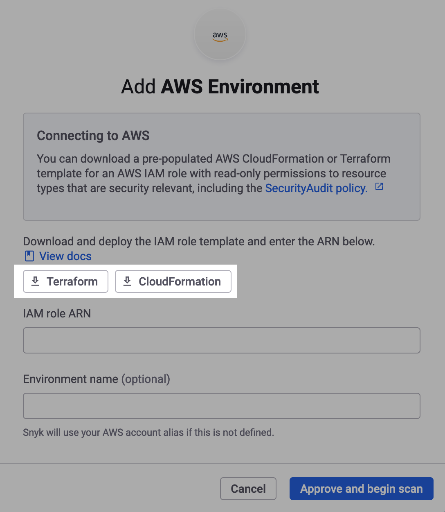

# 단계 1: IAM 역할 IaC 템플릿 다운로드 (웹 UI)

클라우드 환경을 만들기 전에, Infrastructure as Code (IaC) 템플릿을 다운로드해야 합니다. 이 템플릿은 읽기 전용 **Identity and Access Management** (IAM) 역할을 선언하며, Snyk은 이 역할을 가정하여 Amazon Web Services (AWS) 계정 내 자원 구성을 스캔할 수 있습니다.

이 IaC 템플릿을 사용하여 [단계 2: Snyk IAM 역할 생성](step-2-create-the-snyk-iam-role.md)에서 역할을 프로비저닝할 수 있습니다.

템플릿 형식을 선택할 수 있습니다. [Terraform HCL](https://www.terraform.io/language/syntax/configuration) 또는 [AWS CloudFormation](https://docs.aws.amazon.com/AWSCloudFormation/latest/UserGuide/Welcome.html) 중 하나를 선택해야 합니다. IAM 권한은 두 형식에서 동일하므로, 작업에 가장 편안한 형식을 선택하십시오.

아래는 **IaC 템플릿 다운로드** 단계입니다.

1. [Snyk 웹 UI](https://app.snyk.io)에서 **Integrations > Cloud platforms**로 이동합니다.
2. **AWS**를 선택합니다.
3. **Add AWS Environment** 모달에서 `snyk-permissions-aws.tf` 파일을 다운로드할 Terraform 버튼 또는 `snyk-permissions-aws.yml` 파일을 다운로드할 CloudFormation 버튼을 클릭합니다:

<figure><figcaption>
Add AWS Environment 모달
</figcaption></figure>


**Organization Settings (톱니바퀴 아이콘) > Cloud environments**에서도 Cloud Environment를 추가할 수 있습니다. [환경 보기](../../../../../scan-with-snyk/snyk-iac/getting-started-with-iac+-and-cloud-scans/snyk-environments/view-add-and-remove-environments.md#add-an-environment)를 참조하십시오.


이제 [단계 2: Snyk IAM 역할 생성 (웹 UI)](step-2-create-the-snyk-iam-role.md)로 이동할 수 있습니다.