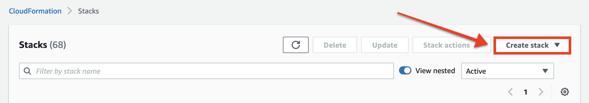
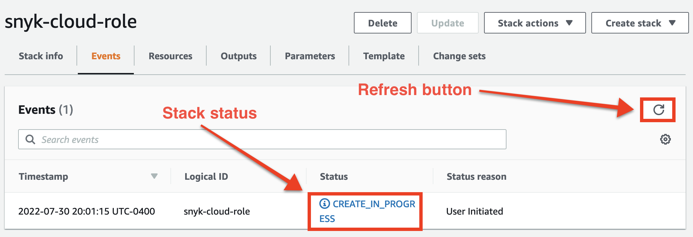

# 2단계: Snyk IAM 역할 만들기


**요약**\
Snyk을 위해 AWS 계정을 가져오기 위해 신원 및 액세스 관리 (IAM) 역할을 선언하는 Terraform 또는 Amazon Web Services (AWS) CloudFormation 템플릿을 다운로드했습니다. 이제 인프라를 프로비저닝해야 합니다.


Snyk을 사용하여 AWS 계정을 가져오기 위해 [Snyk 웹 UI](step-1-download-iam-role-iac-template-web-ui.md) 또는 [Snyk API](../aws-integration-api/step-1-download-iam-role-iac-template.md)를 사용하든, Snyk IAM 역할을 생성하는 과정은 동일합니다.

생성할 IAM 역할에는 다음 정책이 첨부됩니다:

* AWS 관리형 [SecurityAudit](https://docs.aws.amazon.com/IAM/latest/UserGuide/access_policies_job-functions.html#jf_security-auditor) 읽기 전용 정책.
* SecurityAudit로 처리되지 않는 필수 읽기 권한을 부여하는 보조 인라인 정책.

또한 역할에는 [외부 ID](https://docs.aws.amazon.com/IAM/latest/UserGuide/id_roles_create_for-user_externalid.html)를 지정하는 신뢰 정책이 있습니다. Snyk이 이 고유 ID를 조직을 위해 생성하여 다른 당사자가 ID 없이도 역할을 가정하는 것을 방지합니다. 심지어 그들이 귀하의 역할 Amazon 리소스 이름 (ARN)을 가지고 있더라도요.

## Terraform 또는 CloudFormation으로 IAM 역할 생성

Snyk에서 다운로드 한 템플릿의 유형에 따라 다음 도구 중 하나를 사용하여 IAM 역할을 만들 수 있습니다:

* **Terraform:** [Terraform CLI](step-2-create-the-snyk-iam-role.md#create-the-iam-role-with-terraform)
* **AWS CloudFormation:** [AWS CLI](step-2-create-the-snyk-iam-role.md#create-the-iam-role-with-aws-cli) 또는 [AWS Management Console](step-2-create-the-snyk-iam-role.md#create-the-iam-role-using-the-aws-management-console)

### Terraform으로 IAM 역할 생성


[Terraform CLI](https://www.terraform.io/downloads)를 사용하기 전에 [AWS 자격 증명을 설정](https://registry.terraform.io/providers/hashicorp/aws/latest/docs#authentication-and-configuration)해야 합니다.


1. 터미널에서 Snyk IAM 역할 Terraform 파일을 포함하는 디렉토리로 이동합니다 (Snyk 웹 UI에서 다운로드된 경우 `snyk-permissions-aws.tf`로 명명됨).
2. Terraform CLI를 사용하여 Terraform 프로젝트를 초기화합니다:

```
terraform init
```

3\. Terraform 계획을 검토하고 적용합니다:

```
terraform apply
```

4\. Terraform이 수행할 작업에 대해 물었을 때 `yes`를 입력하십시오.

그러면 Terraform이 IAM 역할을 만듭니다. 역할이 생성되면 다음 출력이 표시됩니다:

```
Apply complete! Resources: 1 added, 0 changed, 0 destroyed.
```

### AWS CLI로 IAM 역할 생성


[AWS CLI](https://aws.amazon.com/cli/)를 사용하기 전에 [AWS 자격 증명을 설정](https://docs.aws.amazon.com/cli/latest/userguide/cli-configure-quickstart.html)해야 합니다.


1. 터미널에서 Snyk IAM 역할 CloudFormation 파일을 포함하는 디렉토리로 이동합니다 (Snyk 웹 UI에서 다운로드된 경우 `snyk-permissions-aws.yml`로 명명됨).
2. AWS CLI를 사용하여 CloudFormation 스택을 시작하고 이름을 변경한 경우 `snyk-cloud-role`로 IAM 역할 이름을, 파일 이름을 변경한 경우 `snyk-permissions-aws.yml`을 대체해야 합니다:

```
aws cloudformation create-stack \
  --stack-name snyk-cloud-role \
  --capabilities CAPABILITY_NAMED_IAM \
  --template-body file://snyk-permissions-aws.yml
```

3\. AWS가 IAM 역할을 만듭니다. 일반적으로 약 1분이 소요됩니다. 완료되었는지 확인하려면 IAM 역할 이름을 자신의 IAM 역할 이름으로 변경하여 스택 상태를 가져옵니다:

```
aws cloudformation describe-stacks \
  --stack-name snyk-cloud-role \
  --query 'Stacks[0].StackStatus'
```

출력이 `"CREATE_COMPLETE"`인 경우 AWS가 역할 생성을 완료했습니다.

### AWS Management Console을 사용하여 IAM 역할 생성

1. [AWS Management Console](https://console.aws.amazon.com)에 로그인합니다.
2. [CloudFormation](https://console.aws.amazon.com/cloudformation)으로 이동합니다.
3. **스택 생성** 버튼을 선택합니다:

<figure><figcaption><p>AWS Management Console에서 스택 생성 버튼 선택</p></figcaption></figure>

4\. 드롭다운 메뉴에서 **새 리소스로(표준)**&#xB97C; 선택합니다.

5\. **스택 생성** 페이지에서 **템플릿 지정** 섹션으로 이동하고 **템플릿 파일 업로드**를 선택합니다.

6\. 나타나는 **파일 선택** 버튼을 클릭하고 Snyk IAM 역할이 포함된 CloudFormation 파일을 선택합니다.

7\. **다음**을 선택합니다.

8\. **스택 세부 정보 지정** 페이지에서 **스택 이름** 섹션에 `snyk-cloud-role`과 같은 스택 이름을 입력합니다.

9\. **다음**을 선택합니다.

10\. **스택 구성 옵션** 페이지에서 원하는 경우 태그를 입력하고 나머지 기본값을 유지합니다.

11\. **다음**을 선택합니다.

12\. **검토** 페이지에서 가장 아래 **기능** 섹션에서 **AWS CloudFormation이 IAM 리소스를 사용자 지정 이름으로 생성할 수 있음을 인정합니다.** 상자를 확인합니다.

13\. **스택 생성**을 선택합니다.

14\. AWS가 스택을 시작하고 상세 정보 페이지가 표시됩니다. 상태를 새로 고치려면 **새로 고침** 버튼을 선택할 수 있습니다:

<figure><figcaption><p>AWS Management Console에서 스택 상태 새로 고치기 버튼 선택</p></figcaption></figure>

**상태** 열이 `CREATE_COMPLETE`인 경우 AWS가 IAM 역할 생성을 완료했습니다.

## 다음 단계는?

다음 단계는 클라우드 환경을 생성하고 검사하는 것입니다. [단계 3: 클라우드 환경 생성 및 검사 (웹 UI)](step-3-create-and-scan-a-snyk-cloud-environment-web-ui.md)를 참조하세요.
