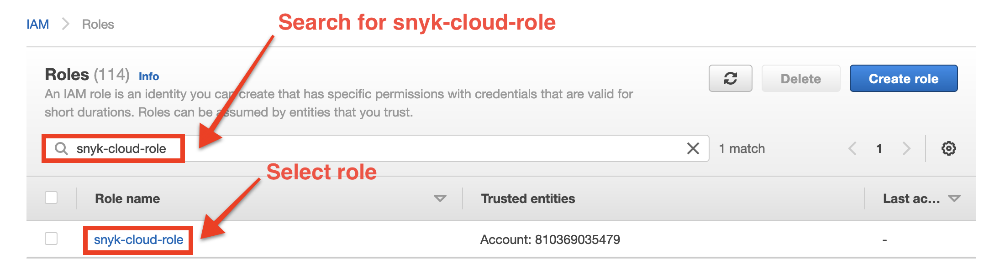
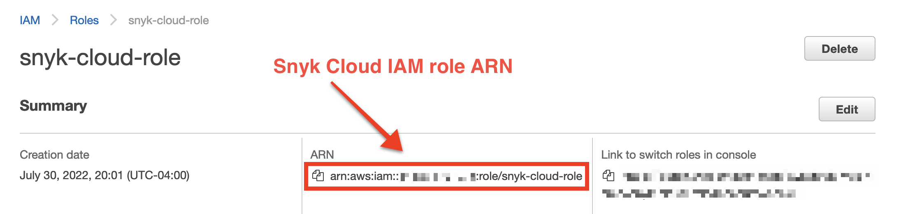
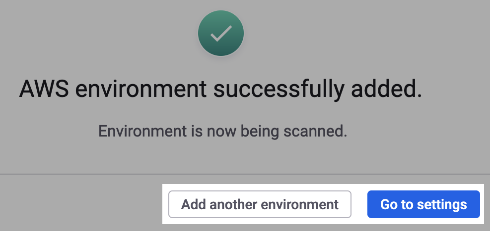

# 3단계: 클라우드 환경 생성 및 스캔(웹 UI)


**요약**\
Snyk IAM 역할을 생성했습니다. 이제 클라우드 환경을 생성하고 스캔할 수 있습니다.


클라우드 환경을 생성하고 스캔하려면 역할의 Amazon 리소스 이름 (ARN)을 제공해야 합니다. 그런 다음 환경 등록을 마칠 수 있습니다.

## 역할 ARN 찾기

역할 ARN은 다음 형식을 따라야 합니다. 단, [Terraform 또는 CloudFormation 템플릿에서 역할 이름을 변경](../aws-integration-api/step-1-download-iam-role-iac-template.md#optional-change-iam-role-name)한 경우:

```
arn:aws:iam::YOUR-ACCOUNT-ID:role/snyk-cloud-role
```

Amazon Web Services (AWS) 계정 ID를 모르거나 Terraform 또는 CloudFormation 템플릿에서 IAM 역할의 이름을 변경했거나 할 경우 [AWS CLI](step-3-create-and-scan-a-snyk-cloud-environment-web-ui.md#find-the-role-arn-using-the-aws-cli) 또는 [AWS 관리 콘솔](step-3-create-and-scan-a-snyk-cloud-environment-web-ui.md#find-the-role-arn-using-the-aws-management-console)을 사용하여 역할 ARN을 찾을 수 있습니다.

### AWS CLI를 사용하여 역할 ARN 찾기

AWS CLI를 사용하여 Snyk 클라우드 IAM 역할의 ARN을 찾으려면 역할 세부 정보를 검색하고, 역할 이름을 변경한 경우 해당 역할명(`snyk-cloud-role` 대신)을 지정하여 다음 명령을 실행합니다:

```
aws iam get-role \
  --role-name snyk-cloud-role \
  --query 'Role.Arn' --output text
```

다음과 같은 출력이 나타납니다:

```
arn:aws:iam::123412341234:role/snyk-cloud-role
```

### AWS 관리 콘솔을 사용하여 역할 ARN 찾기

1. [AWS 관리 콘솔](https://console.aws.amazon.com)에 로그인합니다.
2. [Identity and Access Management](https://console.aws.amazon.com/iamv2/home#/home)으로 이동합니다.
3. 왼쪽 사이드바에서 **Roles**를 선택합니다.
4. **Roles** 페이지에서 `snyk-cloud-role`을 검색하거나 역할 이름을 변경한 경우 해당 역할명을 대체합니다:

<figure><figcaption><p>AWS 관리 콘솔에서 역할 이름 검색</p></figcaption></figure>

5. 역할을 선택합니다.
6. 역할 세부 정보 페이지에서 **요약** 섹션에서 ARN을 찾아 복사합니다:

<figure><figcaption><p>AWS 관리 콘솔에서 역할 ARN 복사</p></figcaption></figure>

## AWS 환경 생성 및 스캔

1. Snyk Web UI에서 IAM 역할 템플릿을 다운로드한 **Add AWS Environment** 모달에서 **IAM 역할 ARN** 필드에 역할 ARN을 입력합니다.
2. 선택적으로 환경 이름을 입력합니다. 제공되지 않은 경우 Snyk은 AWS 계정 별칭을 사용합니다.
3. **승인 및 스캔 시작**을 선택합니다.
4. "AWS 환경이 성공적으로 추가되었습니다."라는 확인 메시지가 표시됩니다. 새로운 계정을 등록하려면 **다른 환경 추가**를 선택하거나 완료했다면 **설정으로 이동**을 선택합니다:

<figure><figcaption><p>Snyk 웹 UI에서 AWS 환경을 추가한 후 성공 메시지</p></figcaption></figure>

## 다음 단계

이제 다음을 수행할 수 있습니다:

* Snyk이 발견한 클라우드 구성 문제를 확인합니다. [클라우드 및 IaC+ 문제](../../../getting-started-with-iac+-and-cloud-scans/manage-iac+-and-cloud-issues/) 참조
* 클라우드 컨텍스트로 취약점을 우선순위로 정하는 방법.
