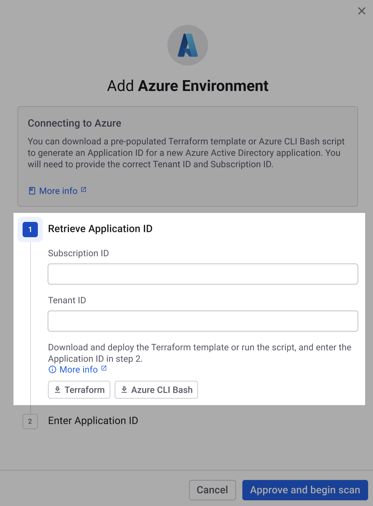

# 단계 1: Azure 앱 등록 IaC 템플릿 또는 스크립트 다운로드(Web UI)

Azure 구독에 대한 클라우드 환경을 생성하기 전에 아래 자원을 선언하는 Terraform 인프라 구조 코드(IaC) 템플릿이나 Azure CLI Bash 스크립트를 **다운로드**해야 합니다:

* [액티브 디렉터리(AD) 애플리케이션 등록](https://learn.microsoft.com/en-us/azure/active-directory/develop/app-objects-and-service-principals#application-registration)
* [페더레이션 ID 자격 증명](https://learn.microsoft.com/en-us/azure/active-directory/develop/workload-identity-federation)
* [서비스 주체](https://learn.microsoft.com/en-us/azure/active-directory/develop/app-objects-and-service-principals#service-principal-object)

이 인프라는 구독의 리소스 구성을 스캔하는 데 Snyk에게 읽기 전용 권한을 부여합니다.

다운로드한 IaC 템플릿 또는 Bash 스크립트를 사용하여 [단계 2: Entra ID 애플리케이션 생성](step-2-create-the-azure-ad-app-registration.md)에서 인프라를 **프로비저닝** 할 것입니다.

두 방법 모두 동일한 인프라를 생성하므로 작업하기 가장 편한 방법을 선택하십시오.

## IaC 템플릿 또는 Bash 스크립트 다운로드

1. [Snyk 웹 UI](https://app.snyk.io/)에서 **Integrations > Cloud platforms**로 이동합니다.
2. **Azure**를 선택합니다.
3. **Add Azure Environment** 모달에서 **Retrieve Application ID** 섹션에서 온보드하려는 구독의 구독 ID 및 테넌트 ID를 입력합니다. ID는 [Azure 문서에서 설명된 방법](https://learn.microsoft.com/en-us/azure/azure-portal/get-subscription-tenant-id)을 사용하여 찾을 수 있습니다.
4. `snyk-permissions-azure.tf` 파일을 다운로드하기 위해 **Terraform** 버튼 또는 `snyk-permissions-azure.sh` 파일을 다운로드하기 위해 **Azure CLI Bash**를 선택합니다:\
   

이제 [단계 2: Entra ID 앱 등록 생성](step-2-create-the-azure-ad-app-registration.md)로 진행할 수 있습니다.


**조직 설정 (톱니바퀴 아이콘) > 클라우드 환경**에서 Cloud 환경을 추가할 수도 있습니다. [환경 보기](../../../../../scan-with-snyk/snyk-iac/getting-started-with-iac+-and-cloud-scans/snyk-environments/view-add-and-remove-environments.md)를 참조하십시오.


## 다음 단계는?

이제 [단계 2: Entra ID 앱 등록 생성](step-2-create-the-azure-ad-app-registration.md)으로 진행할 수 있습니다.