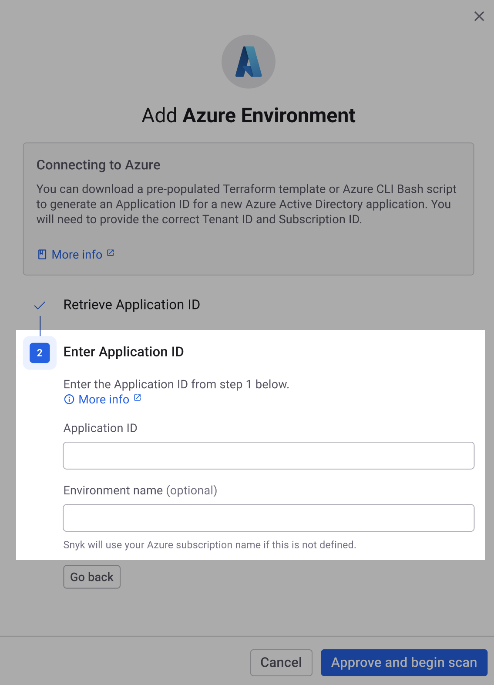

# 3단계: Azure용 클라우드 환경 만들기 및 스캔(웹 UI)


**요약**\
Azure 앱 등록, 연합 ID 자격 증명, 그리고 Snyk을 위한 서비스 주체를 만들었습니다. 이제 클라우드 환경을 생성하고 스캔할 수 있습니다.


다음은 웹 UI를 사용하여 Azure를 위한 클라우드 환경을 생성하고 스캔하는 단계입니다.

1. Snyk 웹 UI에서 **Azure 환경 추가** 모달에서 Terraform 템플릿 또는 Bash 스크립트를 다운로드한 위치에서 **Application ID** 필드에 앱 ID를 입력합니다.
2. 선택 사항으로 환경 이름을 입력합니다. 제공된 것이 없는 경우 Snyk은 구독 이름을 사용합니다.\
   
3. **승인 및 스캔 시작**을 선택합니다.
4. "Azure 환경이 성공적으로 추가되었습니다" 확인 메시지가 표시됩니다. 새 구독을 추가하기 위해 **다른 환경 추가**를 선택하거나 완료했다면 **설정으로 이동**을 선택합니다.

이제 다음을 수행할 수 있습니다:

* Snyk이발견한 클라우드 구성 문제를 볼 수 있습니다. [Cloud와 IaC+ 문제](../../../getting-started-with-iac+-and-cloud-scans/manage-iac+-and-cloud-issues/) 참조.
* 클라우드 컨텍스트를 사용하여 취약점을 우선 순위로 정할 수 있습니다.
