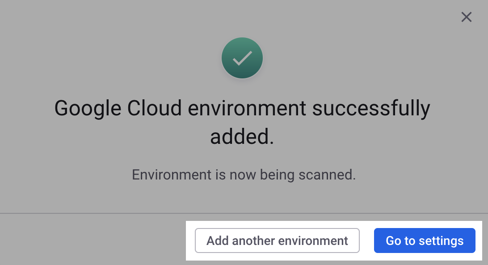

# 3단계: Google용 클라우드 환경 만들기 및 스캔(웹 UI)


**요약**\
Snyk을 위한 Google 서비스 계정을 만들었습니다. 이제 클라우드 환경을 생성하고 스캔할 수 있습니다.


Google용 클라우드 환경을 만들고 스캔하려면 **Google 서비스 계정 이메일 주소**와 **프로젝트 ID**를 제공해야 합니다.

1. Snyk 웹 UI **Google Cloud Environment 추가** 모달에서 서비스 계정 템플릿을 다운로드한 곳에, **Service account email** 필드에 서비스 계정 이메일을 입력합니다.\
   예를 들어, `"`[`snyk-cloud-mt-us-abcd1234@my-project.iam.gserviceaccount.com`](mailto:snyk-cloud-mt-us-abcd1234@my-project.iam.gserviceaccount.com)`"`을 입력합니다.
2. **Identity provider** 필드에 [신원 제공자](https://docs.snyk.io/integrate-with-snyk/cloud-platforms-integrations/google-cloud-integration/google-cloud-integration-web-ui/step-2-create-the-google-service-account-web-ui#apply-terraform)를 입력합니다. 이는 workload 신원 풀 ID, 신원 제공자 ID 및 프로젝트 ID를 포함한 완전한 URL이어야 합니다.\
   예를 들어, `"`[`https://iam.googleapis.com/projects/12345567/locations/global/workloadIdentityPools/workload-identity-123456/providers/identity-provider-123456`](https://iam.googleapis.com/projects/12345567/locations/global/workloadIdentityPools/workload-identity-123456/providers/identity-provider-123456)`"`을 입력합니다.
3. 선택 사항으로 환경 이름을 입력합니다. 제공되지 않을 경우 Snyk가 Google 프로젝트 이름을 사용합니다.
4. **승인 및 스캔 시작**을 선택합니다.
5. **Google Cloud 환경이 성공적으로 추가**되었음을 알리는 확인 메시지가 표시됩니다.\
   **다른 환경 추가**를 선택하여 **Google Cloud 환경 추가** 모달로 돌아가 다른 계정을 등록하거나, 완료했다면 **설정으로 이동**을 선택합니다.

<figure><figcaption>
Snyk 웹 UI에 Google 클라우드 환경 추가 후 성공 메시지
</figcaption></figure>


Google이 서비스 계정을 만드는 데 60초 이상이 걸릴 수 있습니다. 서비스 계정을 만든 후 즉시 환경을 생성하려고 하면 **자격 증명을 확인할 수 없음** 오류가 발생하므로, 적어도 60초를 기다린 후 다시 시도하십시오.


**다음 단계는?**

다음을 수행할 수 있습니다:

* Snyk이 발견한 클라우드 구성 문제를 확인합니다. [클라우드 및 IaC+ 문제](../../../getting-started-with-iac+-and-cloud-scans/manage-iac+-and-cloud-issues/) 참조.
* 클라우드 컨텍스트로 취약점 우선순위를 지정합니다.
