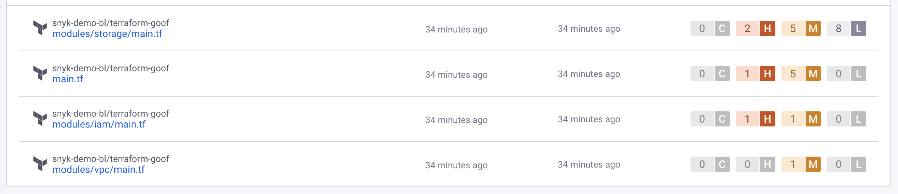
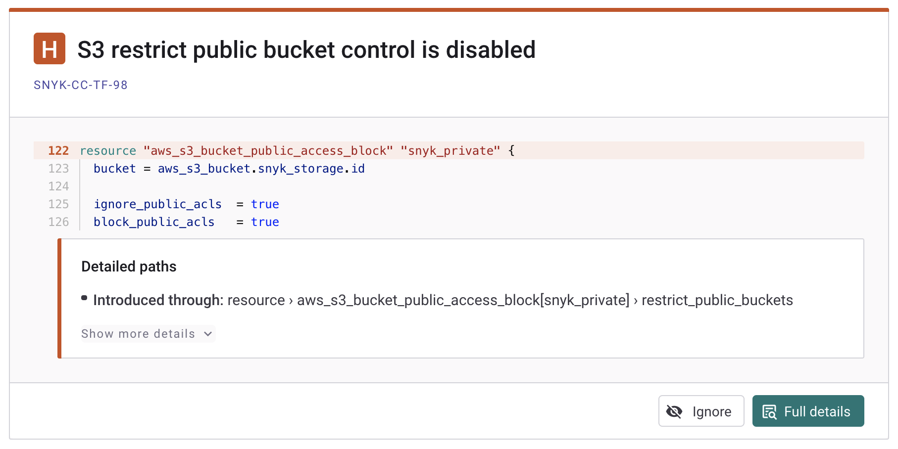

# 현재 IaC 시작하기


이 페이지의 정보는 현재 IaC에 적용됩니다. IaC+를 사용 중이라면 [IaC+ 및 클라우드 스캔 시작하기](getting-started-with-iac+-and-cloud-scans/)을 참조하십시오.


Snyk 웹 UI에서 Infrastructure as Code(Snyk IaC)를 사용하여 구성 파일에서 문제를 찾아보고 수정할 수 있습니다. 또한 Snyk CLI에서도 Snyk IaC를 사용할 수 있습니다. 자세한 내용은 [Infrastructure as Code용 Snyk CLI](../../snyk-cli/scan-and-maintain-projects-using-the-cli/snyk-cli-for-iac/)를 참조하십시오.

이 페이지에서는 지원되는 환경( [Terraform](scan-your-iac-source-code/scan-terraform-files/), [AWS CloudFormation](scan-your-iac-source-code/scan-cloudformation-files/), [Kubernetes](scan-your-iac-source-code/scan-kubernetes-configuration-files/)(포함 Helm), 그리고 [Azure Resource Manager (ARM)](scan-your-iac-source-code/scan-arm-configuration-files.md))에 대한 구성 파일에서 문제를 찾아보고 수정하는 단계를 찾을 수 있습니다. 이러한 단계는 현재 IaC에 특화되어 있습니다. 또한 [IaC 및 클라우드 스캔 시작하기](getting-started-with-iac+-and-cloud-scans/)도 참조하십시오.

## **Snyk IaC을 위한 전제 조건**

Snyk IaC을 사용하기 전에 다음 전제 조건이 충족되어 있는지 확인하십시오:

* Snyk 계정. 자세한 내용은 [시작하기](../../getting-started/)를 참조하십시오.
* 작업할 Terraform, CloudFormation, Kubernetes 또는 ARM 환경.
* Snyk와 동일한 방식으로 통합된 Git 저장소. 자세한 내용은 [Git 저장소(SCM)](../../scm-ide-and-ci-cd-integrations/snyk-scm-integrations/)를 참조하십시오.

IaC와 지원되는 환경에 대한 자세한 내용은 다음 페이지를 참조하십시오:

* [Terraform 파일에서 보안 문제를 찾기 위한 통합 구성](scan-your-iac-source-code/scan-terraform-files/configure-your-integration-to-find-security-issues-in-your-terraform-files-current-iac.md)
* [CloudFormation 파일에서 보안 문제를 찾기 위한 통합 구성](scan-your-iac-source-code/scan-cloudformation-files/configure-your-integration-to-find-security-issues-in-your-cloudformation-files-current-iac.md)
* [Kubernetes 구성 파일에서 보안 문제를 찾기 위한 통합 구성](scan-your-iac-source-code/scan-kubernetes-configuration-files/configure-integration-to-find-security-issues-in-kubernetes-configuration-files-current-iac.md)


ARM 구성 파일을 스캔하려면 Snyk CLI를 사용해야 합니다. [ARM 구성 파일 스캔](scan-your-iac-source-code/scan-arm-configuration-files.md)를 참조하십시오.


## IaC 프로젝트 가져오기

Snyk에서 스캔하려는 [프로젝트](../../snyk-admin/snyk-projects/)를 가져오기 시작합니다. 이러한 단계에서 Snyk이 시험하고 재시험할 저장소를 선택합니다:

1. Snyk에 로그인하고 대시보드에서 **프로젝트**를 네비게이션에서 선택합니다.
2. 프로젝트 페이지에서 **프로젝트 추가** 드롭다운에서 스캔할 저장소 및 프로젝트가 있는 SCM을 선택하십시오. 예를 들어 GitHub을 선택합니다.
3. **개인 및 조직 저장소** 목록에서 스캔하고자 하는 Git 저장소 및 프로젝트를 선택합니다.\
   하나 이상의 저장소 또는 저장소 내 프로젝트를 선택할 수 있습니다.
4. 선택한 SCM 프로젝트 및 저장소를 Snyk로 가져오려면 **선택된 저장소 추가**를 클릭합니다.
5. 결과를 보려면 **가져오기 로그 보기**를 선택합니다.\
   여러 유형의 구성 파일을 동시에 스캔할 수 있습니다.\
   가져오기가 완료되면 프로젝트 페이지에 Snyk 프로젝트가 표시됩니다.


IaC 프로젝트를 가져온 후, Snyk는 기본적으로 매주 한 번 프로젝트를 재시험합니다. 프로젝트 페이지의 **설정** 탭에서 재발견 테스트를 비활성화할 수 있습니다. **테스트 및 자동화된 풀 리퀘스트 주기**를 **테스트 안 함**으로 설정하십시오.


## IaC에서 구성 파일 문제 보기

프로젝트 페이지에서 가져온 프로젝트의 구성 파일에 대한 결과를 볼 수 있습니다.

* **대상별 그룹화**가 선택된 경우, [대상](../../snyk-admin/snyk-projects/#target) 목록이 표시됩니다. 이는 가져온 프로젝트가 있는 저장소입니다. 대상을 선택하여 해당 프로젝트 목록을 확장할 수 있습니다.
* **그룹화 없음**이 선택된 경우: 모든 [프로젝트](../../snyk-admin/snyk-projects/#project) 목록이 표시됩니다.

**프로젝트** 목록에서 해당 프로젝트를 선택하여 해당 프로젝트에 대한 자세한 정보를 확인할 수 있습니다.

<figure><figcaption>
Snyk 프로젝트 목록
</figcaption></figure>

각 프로젝트 상세 페이지에는 프로젝트의 마지막 테스트 날짜, 프로젝트를 가져온 사용자의 이름, **이슈** 탭에서 발견된 중요, 높음, 중간 및 낮은 심각도의 문제 수 및 각 스캔된 구성 파일에 대한 이슈 카드가 표시됩니다. 또한 **개요**, **이력**, **설정** 옵션을 선택할 수 있습니다. **이력**을 선택하여 프로젝트의 이전 스냅샷을 확인할 수 있습니다.

<figure><figcaption>
Snyk 프로젝트 이슈 카드
</figcaption></figure>

## Snyk IaC용 이슈 카드 세부사항

각 이슈 카드에는 리소스 및 도입된 경로에 대한 정보가 표시됩니다.

<figure><figcaption>
이슈 카드 세부사항
</figcaption></figure>

이슈 카드에는 다음 내용이 포함됩니다:

* 심각도 수준, 예를 들어 높음을 나타내는 **H**, 그리고 이슈 이름, 예를 들어 **암호화되지 않은 S3 버킷**
* 보안 규칙의 **ID**, 예를 들어 [SNYK-CC-00172](https://security.snyk.io/rules/cloud/SNYK-CC-00172).\
  링크를 클릭하여 [Snyk 보안 규칙](https://security.snyk.io/rules/cloud/)에서 자세한 정보를 확인할 수 있습니다.
* 취약한 영역을 정확히 보여주는 코드의 **조각**
* 문제의 정확한 **경로**
* 문제에 대한 자세한 정보:
  * 문제의 간단한 **설명**
  * 문제의 **영향**
  * 문제를 해결하기 위한 **수정 방법**

**전체 세부사항**을 클릭하여 전체 코드 미리보기를 볼 수 있습니다:

<figure><figcaption>
전체 코드 미리보기
</figcaption></figure>

이 취약점을 무시하려면 **무시**를 클릭하십시오. 자세한 내용은 [이슈 무시하기](../../manage-risk/prioritize-issues-for-fixing/ignore-issues/)를 참조하십시오.

## IaC에서 구성 파일 수정

Snyk IaC에서 제안된 권장 사항에 따라 조치하는 단계는 다음과 같습니다.

1. 프로젝트 상세 페이지에서 문제를 선택하여 해당 문제에 대한 세부 정보 및 Snyk IaC의 구체적인 권장 사항을 확인합니다.
2. 권장 사항에 따라 식별된 문제를 수정하기 위해 구성 파일을 편집하고 변경 내용을 커밋합니다.\
   Snyk은 변경된 파일을 자동으로 다시 스캔합니다.
3. 문제 디스플레이에 반영된 변경 사항을 확인합니다.

<figure><figcaption>
수정된 IaC 문제 예시
</figcaption></figure>

## IaC 결과 예시

현재 IaC에 대한 표시된 결과의 예시가 이어집니다.

### Terraform Cloud 및 Helm 예시

Terraform Cloud 및 Helm은 코드 조각이 아닌 경로 세부사항만 표시됩니다. 전체 코드 미리보기를 표시하는 **전체 세부사항** 버튼이 없습니다.

<figure><figcaption>
Helm에 대한 세부사항
</figcaption></figure>

<figure><figcaption>
Terraform Cloud에 대한 세부사항
</figcaption></figure>

### 코드 미리보기가 불가능한 예시

Snyk이 파일에서 취약한 경로의 정확한 줄을 식별할 수 없을 경우, Snyk은 코드 조각 대신 메시지와 경로 세부사항만 표시합니다. 가능한 경우 **전체 세부사항** 버튼을 표시하여 전체 코드 미리보기를 볼 수 있습니다.

<figure><figcaption>
코드 조각 없는 이슈 카드
</figcaption></figure>

<figure><figcaption>
전체 코드 표시
</figcaption></figure>
