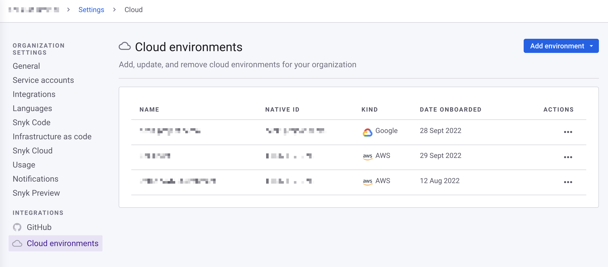
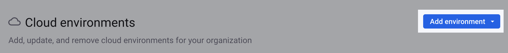

# IaC+ 및 클라우드 스캔 시작하기


**릴리스 상태** \
{{Snyk IaC}}+는 현재 클로즈 베타 상태이며 새로운 참여 고객을 더 이상 받지 않습니다.\
사용 가능한 기능에 대한 자세한 내용은 [현재 IaC 시작](https://docs.snyk.io/scan-using-snyk/snyk-iac/getting-started-with-current-iac)을 참조하십시오.


IaC+를 사용하여 Terraform, Kubernetes(헬름 제외, 곧 제공 예정), AWS CloudFormation 및 Azure Resource Manager(ARM)의 클라우드 구성 파일에서 문제를 찾고 보고 수정할 수 있습니다.

{Snyk IaC 클라우드 스캔을 사용하여 AWS, Azure 및 Google Cloud의 배포된 클라우드 리소스 구성에서 문제를 찾고 보고 수정할 수 있습니다.

이 페이지에서는 Snyk 웹 UI에서 IaC+ 및 클라우드 스캔을 사용하는 방법에 대해 설명합니다. Snyk CLI와 함께 IaC+를 사용하는 방법에 대한 정보는 [IaC 파일 테스트](../../../snyk-cli/scan-and-maintain-projects-using-the-cli/snyk-cli-for-iac/test-your-iac-files/)를 참조하십시오.

## IaC+ 및 클라우드 스캔 사전 요구 사항

IaC+를 사용하려면 다음이 필요합니다:

* Snyk 계정. 자세한 내용은 [시작하기](../../../getting-started/)를 참조하십시오.
* 엔터프라이즈 플랜의 {{Snyk IaC}}.
* 작업할 Terraform, CloudFormation 또는 Azure Resource Manager 환경이 있거나 배포된 AWS, Azure 또는 Google Cloud 계정이 있어야 합니다.
* Git 저장소와의 통합. 자세한 내용은 [Git 저장소 (SCM)](../../../scm-ide-and-ci-cd-integrations/snyk-scm-integrations/)를 참조하십시오.

## IaC+ SCM 저장소 가져오기


IaC+ SCM 통합은 [Snyk Workspaces](../../../scm-ide-and-ci-cd-integrations/snyk-scm-integrations/introduction-to-git-repository-integrations/workspaces-for-scm-integrations.md) 기능을 사용하여 다중 파일 분석을 지원합니다. Snyk Workspaces를 사용하려면 **그룹** 및 **조직**의 **통합 설정**을 설정하십시오.

새로운 SCM 저장소를 IaC+로 스캔하려면 이미 해당 저장소를 가져왔으면 저장소를 다시 가져와야 합니다. 이는 기존 프로젝트에는 영향을 미치지 않습니다.


먼저 Snyk에서 스캔할 [프로젝트](../../../snyk-admin/snyk-projects/)로 SCM 저장소를 가져옵니다. 다음 단계에서는 Snyk에서 테스트하고 재테스트할 저장소를 선택합니다.

1. Snyk에 로그인하고 대시보드에서 네비게이션에서 **프로젝트**를 선택합니다.
2. 프로젝트 페이지에서 **프로젝트 추가** 드롭다운 메뉴에서 추가할 프로젝트로부터 SCM을 선택합니다. 예를 들어, GitHub을 선택합니다.
3. **개인 및 조직 저장소** 목록에서 사용할 Git 저장소를 선택합니다.
4. 선택한 저장소를 추가하려면 **선택한 저장소 추가**를 클릭합니다.\
   가져오기가 완료되고 프로젝트 페이지에 추가된 Snyk 프로젝트가 표시됩니다.

## IaC+ SCM 프로젝트 보기

[프로젝트](../../../snyk-admin/snyk-projects/) 페이지에서 **대상별 그룹화**가 선택되어 있는지 확인하여 IaC+가 테스트할 파일을 포함하는 대상(깃 저장소)으로 이동합니다.

**{{인프라스트럭처와 동일한 코드}} 이슈** 프로젝트가 표시됩니다. IaC+는 각 저장소에 하나의 프로젝트만 생성하며 현재 IaC는 각 구성 파일에 대해 하나의 프로젝트를 생성합니다.

<figure><figcaption>
SCM 저장소의 IaC+ 프로젝트
</figcaption></figure>

## 주기적 스캔 구성 (매일, 매주, 또는 절대로)

기본적으로 IaC+ SCM 프로젝트는 매주 스캔되도록 예약됩니다. IaC+ SCM 프로젝트 설정 페이지에서 IaC+ SCM 프로젝트를 매일, 매주 또는 절대로 주기적으로 스캔하도록 구성할 수 있습니다.

## 클라우드 환경 가져오기

**조직 설정(cog 아이콘) > 클라우드 환경**으로 이동합니다.

클라우드 환경 테이블에는 각 환경에 대한 다음 정보가 표시됩니다:

<figure><figcaption>
Snyk 웹 UI의 Snyk 환경 페이지
</figcaption></figure>

클라우드 환경을 가져오려면 **환경 추가** 드롭다운을 선택하고 클라우드 공급자를 선택합니다. [AWS 통합: 웹 UI](../cloud-platforms-integrations/aws-integration/aws-integration-web-ui/), [Google Cloud 통합: 웹 UI](../cloud-platforms-integrations/google-cloud-integration/google-cloud-integration-web-ui/) 또는 [Azure 통합: 웹 UI](../cloud-platforms-integrations/azure-integration-for-cloud-configurations/azure-integration-web-ui/)에서 환경을 만드는 단계를 따릅니다.&#x20;

<figure><figcaption>
Snyk 웹 UI에서 환경 추가
</figcaption></figure>

또한 Snyk API를 사용하여 환경을 가져올 수도 있습니다:

* [AWS 통합: API](../cloud-platforms-integrations/aws-integration/aws-integration-api/)
* [Google Cloud 통합: API](../cloud-platforms-integrations/google-cloud-integration/google-cloud-integration-api/)
* [Azure 통합: API](../cloud-platforms-integrations/azure-integration-for-cloud-configurations/snyk-cloud-for-azure-api/)

## IaC+ 및 클라우드 이슈 보기

**{{인프라스트럭처와 동일한 코드}} 이슈** 프로젝트 링크를 클릭하여 클라우드 이슈 페이지를 열고 프로젝트에 해당하는 IaC+ [환경](key-concepts-for-iac+-and-cloud.md#environments)에서 발생한 문제만 필터링된 뷰를 확인할 수 있습니다.

<figure><figcaption>
저장소에 해당하는 환경의 이슈가 필터링된 클라우드 이슈 페이지
</figcaption></figure>

이슈는 규칙별로 그룹화됩니다. 규칙을 확장하고 이슈를 선택하여 해당 이슈 카드를 엽니다. 각 이슈 카드에는 다음과 같은 정보가 있습니다:

* **리소스**, 위치, 클라우드 플랫폼(예: AWS), 빠른 수정을 위한 SCM 파일 링크 및 Terraform HCL과 같은 입력 유형인등을 포함하는 **환경** 정보.
* 프로젝트에 대응하는 IaC+ 환경에 대한 세부 정보.
* 실패한 **규칙**, 추가 정보(특정 복구 단계와 같은)를 위한 Snyk [보안 규칙](https://security.snyk.io/rules/cloud/) 링크 등을 포함하는 규칙.
* 개발자가 이 구성 오류를 수정해야 하는 이유.

<figure><figcaption>
IaC+ 이슈 카드
</figcaption></figure>