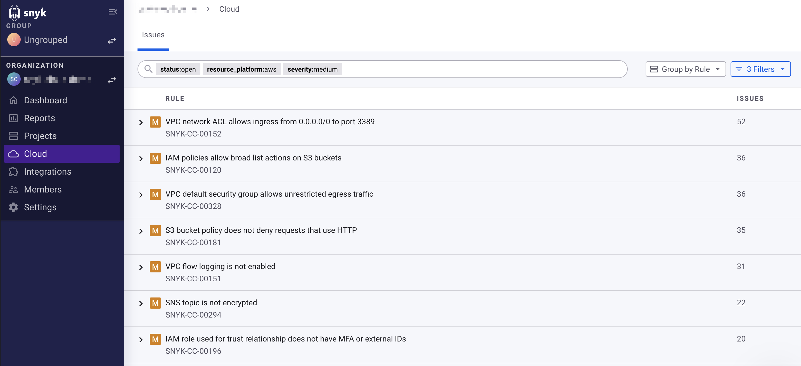

# IaC+ 및 클라우드 문제 관리


**기능 가용성**

[IaC에서 클라우드 문제 해결](../../iac+-code-to-cloud-capabilities/fix-cloud-issues-in-iac.md) 기능은 Terraform을 사용하는 사용자 중 AWS, Azure, 및/또는 Google Cloud 사용자만 이용할 수 있습니다.


Snyk이 IaC+ 또는 클라우드 환경을 스캔할 때, 해당 인프라 설정을 포괄적인 보안 규칙 집합에 대해 테스트합니다. 이러한 규칙은 보안 문제로 이어질 수 있는 잘못된 구성을 식별합니다. 예를 들어, Snyk은 Amazon Web Services (AWS) S3 버킷 구성을 스캔하여 해당 버킷이 공개로 읽을 수 있는지 확인하고 데이터 침해에 취약한지를 알 수 있습니다.

Snyk이 발견한 모든 IaC 또는 클라우드 구성 오류는 문제로 보고됩니다. Snyk 웹 UI의 [클라우드 문제 페이지](view-iac+-and-cloud-issues-in-the-snyk-web-ui.md)에서 각 이슈에 대한 세부 정보(상태, 심각도, 영향, 연관된 리소스 등)를 제공합니다.

<figure><figcaption>
웹 UI의 클라우드 문제 페이지
</figcaption></figure>

## 문제 이해

이슈에는 다음 구성 요소가 있습니다:

* **리소스:** 테스트된 클라우드 리소스(예: AWS S3 버킷)
* **규칙:** 리소스를 테스트하는 데 사용된 규칙(예: "S3 버킷이 공개로 읽을 수 있는지 여부")


자세한 내용은 [주요 개념](../key-concepts-for-iac+-and-cloud.md)을 확인하십시오.


첫 번째로 오동작이 감지되었을 때, Snyk은 해당 규칙과 리소스에 대한 이슈를 엽니다. 오동작이 존재하는 한, 해당 이슈는 스캔 간에 열려 있습니다.

이후의 스캔에서, 오동작이 해결되면 Snyk이 이슈를 닫습니다.

## 예시 이슈 수명주기

귀하의 환경에 공개로 읽을 수 있는 `prod-backups-bucket`이라는 AWS S3 버킷이 있는 경우, 이슈 수명주기는 다음과 같을 수 있습니다:

### **첫 번째 스캔**

1. 환경 스캔 중, Snyk은 `prod-backups-bucket`을 "S3 버킷이 공개로 읽을 수 있는지" 규칙에 대해 테스트합니다.
2. Snyk이 이슈를 엽니다.

### **두 번째 스캔**

1. 버킷을 수정하지 않습니다.
2. 다음 스캔에서, Snyk은 다시 `prod-backups-bucket`을 해당 규칙에 대해 테스트합니다.
3. 동일한 고유 식별자를 가진 이슈가 열린 채로 유지됩니다.

### **세 번째 스캔**

1. AWS에서 `prod-backups-bucket`을 비공개로 구성합니다.
2. 다음 스캔에서, Snyk은 다시 `prod-backups-bucket`을 해당 규칙에 대해 테스트합니다.
3. 버킷이 더 이상 공개로 읽을 수 없고 규칙을 충족하지 않기 때문에 Snyk은 이슈를 닫습니다.
