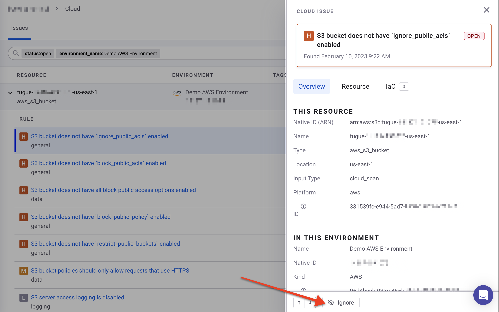
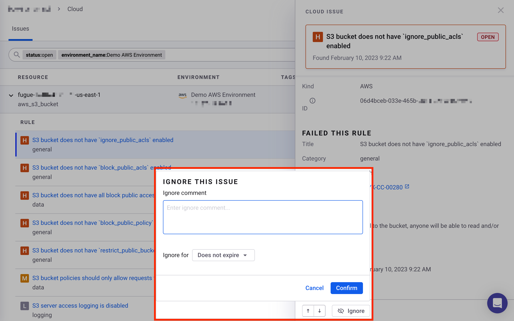
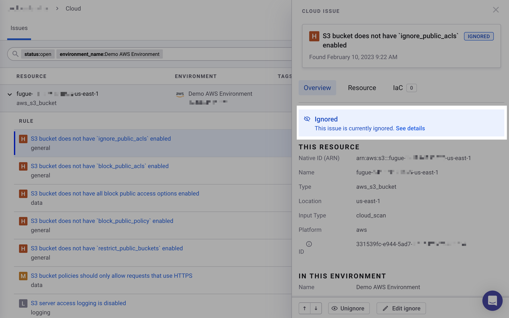
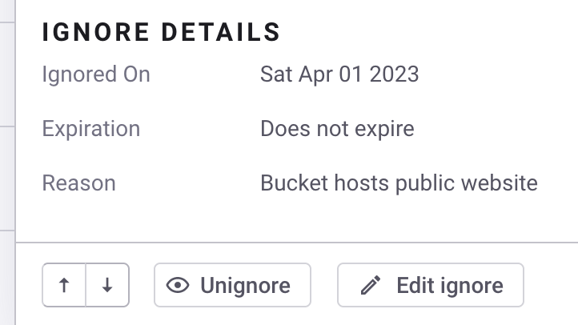

# 클라우드와 IaC+ 문제 무시하기

Snyk 웹 UI에서 클라우드 또는 IaC+ [문제](./)를 무시할 수 있습니다.

문제를 무시하는 것은 생성된 문제의 규칙이 리소스에 무관한 경우이거나 나중에 문제 해결을 연기하고 싶은 경우에 유용할 수 있습니다.

예를 들어, "S3 버킷이 `block_public_acls`를 활성화하지 않았음" 규칙으로 생성된 문제를 영구적으로 무시하여 공개적으로 사용되도록 의도된 S3 버킷에서 문제를 무시할 수 있습니다.

또는 나중에 문제를 해결할 수 있도록 문제를 일시적으로 억제할 수 있습니다.

무시는 조직 수준에서 적용됩니다.

## 문제 무시하기 

Snyk 웹 UI를 통해 문제를 무시하려면:

1. 조직의 클라우드 탭으로 이동합니다.
2. 무시하려는 문제를 선택합니다.
3. **무시하기** 버튼을 선택합니다.

    <figure><figcaption>
Snyk 웹 UI에서 클라우드 문제의 무시하기 버튼
</figcaption></figure>
4. 문제가 무시된 이유에 대한 코멘트를 추가합니다.
5. **무시 기간 설정** 드롭다운 메뉴에서 문제를 얼마 동안 무시할지 설정합니다. **만료되지 않음**을 선택하여 문제를 영구적으로 무시하거나, 14, 30, 60, 또는 90일 또는 사용자 지정 기간 동안 문제를 무시할 수 있습니다.

    <figure><figcaption>
Snyk 웹 UI에서 클라우드 문제의 무시 상세 설정
</figcaption></figure>
6. **확인**을 선택합니다.\
   "문제가 성공적으로 무시되었으며 다음 스캔에서 적용됩니다"라는 메시지가 표시됩니다.\
   또한, 보류 중인 무시 상태가 문제 패널에 표시됩니다.\
    (6).png>)
7. 무시를 즉시 적용하려면, [환경을 다시 스캔](../snyk-environments/scan-a-cloud-environment.md)합니다.\
   또는 무시가 다음 예정된 스캔에서 적용될 때까지 기다릴 수 있습니다.
8. 브라우저에서 페이지를 새로고침하여 사이드 패널에 "무시함" 메시지가 표시되는지 확인합니다.

<figure><figcaption>
Snyk 웹 UI에서 무시된 클라우드 문제의 예시
</figcaption></figure>

**상세 보기**를 선택하여 무시에 대한 다음 세부 정보를 볼 수 있습니다:

* 무시 일자
* 만료일
* 이유

문제가 무시된 후, 해당 문제를 **다시 무시**하거나 **편집**할 수 있습니다.

## 문제 다시 무시하기

Snyk 웹 UI를 통해 문제를 다시 무시하려면:

1. 조직의 클라우드 탭에서 무시된 문제를 선택합니다.
2. **무시 취소** 버튼을 선택합니다.
3. "문제가 성공적으로 무시 해제되었으며 다음 스캔에서 적용됩니다"라는 메시지가 표시됩니다.\
   또한, 문제 패널에 미적용 상태로 표시됩니다: 이 문제에 적용된 무시가 삭제되어 다음 스캔에서 제거됩니다.\
    (1) (1) (3).png>)
4. 무시를 즉시 적용하려면, [환경을 다시 스캔](../snyk-environments/scan-a-cloud-environment.md)합니다.\
   또는 무시가 다음 예정된 스캔에서 적용될 때까지 기다릴 수 있습니다.
5. 브라우저에서 페이지를 새로고침하여 사이드 패널의 "무시함" 메시지가 사라졌는지 확인합니다.

## 무시 편집하기

Snyk 웹 UI를 통해 무시를 편집하려면:

1. 조직의 클라우드 탭에서 무시된 문제를 선택합니다.
2. 사이드 패널에서 **무시 편집** 버튼을 선택합니다.
3. 코멘트, 무시 만료 날짜 또는 둘 다를 편집합니다.
4. **확인**을 선택합니다.\
   "무시가 성공적으로 편집되었으며 다음 스캔에서 적용됩니다"라는 메시지가 표시됩니다.
5. 편집된 무시를 즉시 적용하려면, [환경을 다시 스캔](../snyk-environments/scan-a-cloud-environment.md)합니다.\
   편집된 무시가 다음 예정된 스캔에서 적용될 때까지 기다릴 수도 있습니다.
6. 환경이 스캔된 후, 브라우저에서 페이지를 새로고침하여 편집된 무시 세부 정보를 확인합니다.