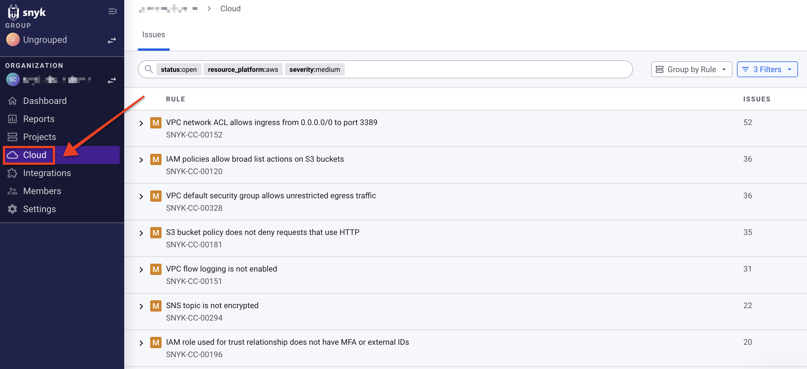
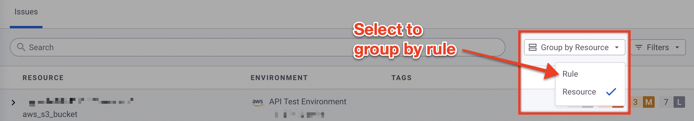
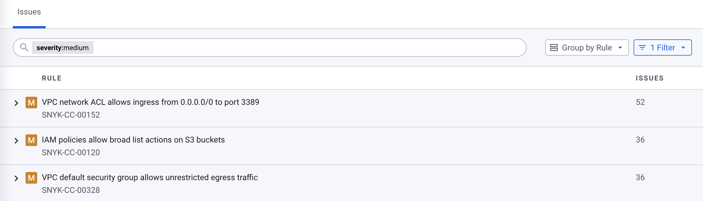
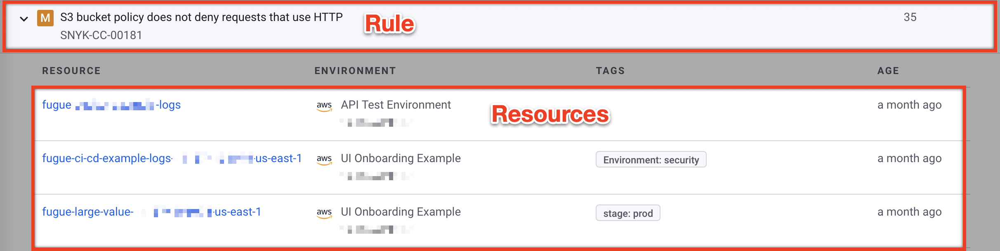
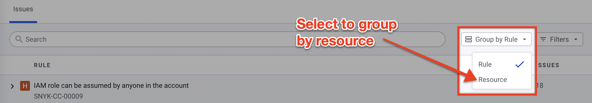
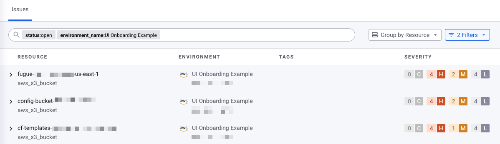
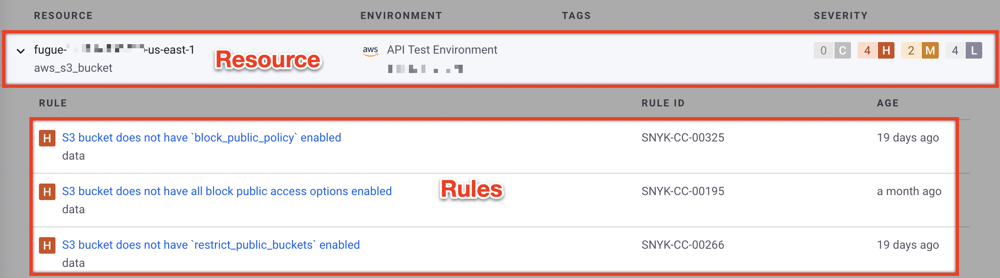
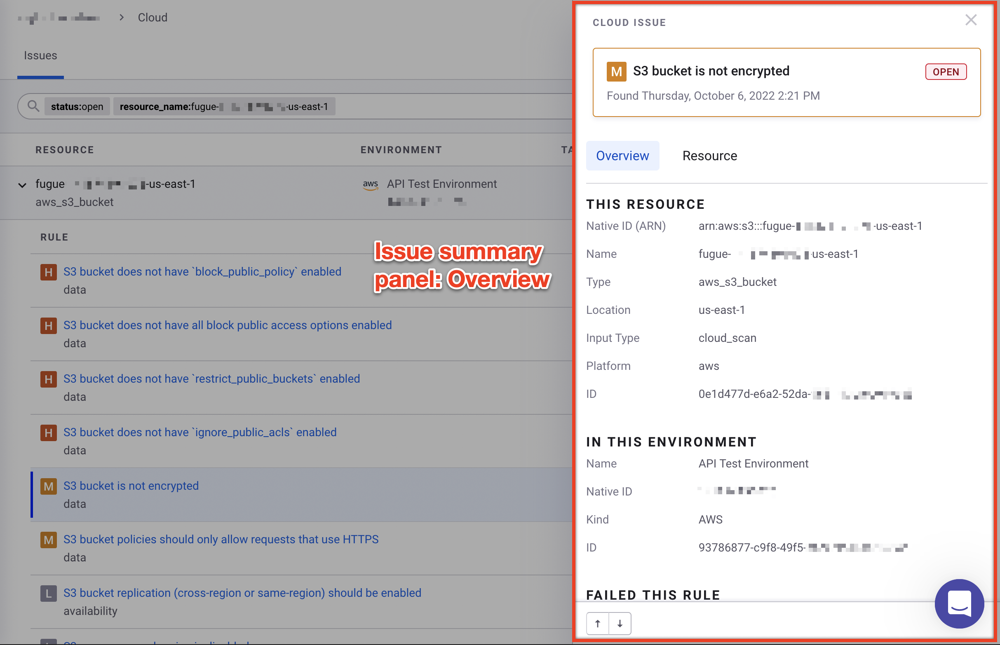
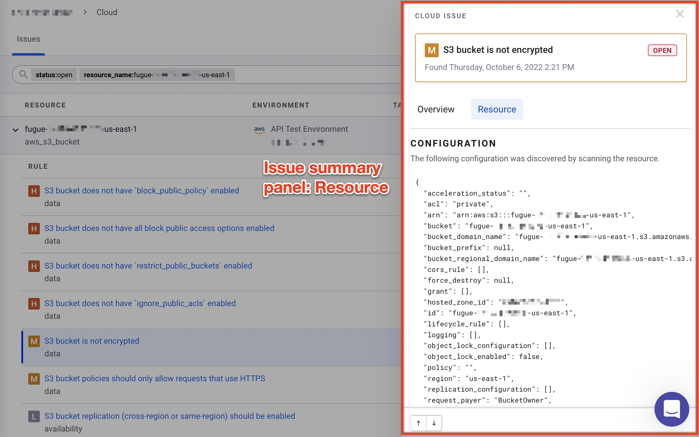
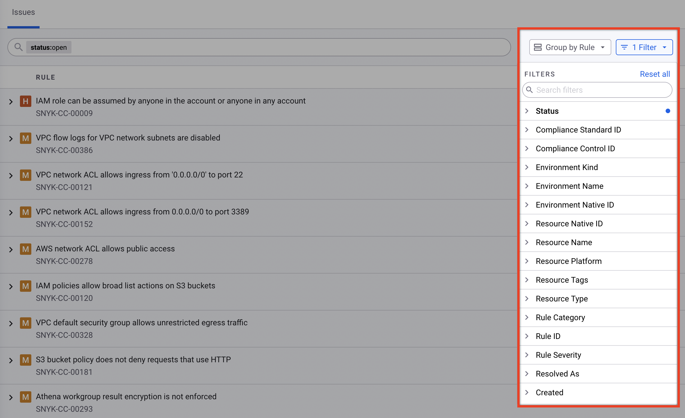

# Snyk 웹 UI에서 IaC+ 및 클라우드 이슈보기

조직의 클라우드 및 IaC+ 이슈를 Snyk 웹 UI를 통해 볼 수 있습니다.

Snyk 웹 UI에서 클라우드 이슈를 보려면 조직으로 이동하고 메뉴에서 **Cloud**를 선택하십시오.

<figure><figcaption>
이슈 보기를 선택합니다
</figcaption></figure>

기본적으로 Snyk는 조직의 모든 클라우드 환경에서 발생하는 오픈 이슈를 표시합니다. 이슈는 처음에는 [실패한 보안 규칙별로 그룹화](view-iac+-and-cloud-issues-in-the-snyk-web-ui.md#group-cloud-issues-by-rule)되지만, [리소스별로 그룹화](view-iac+-and-cloud-issues-in-the-snyk-web-ui.md#group-cloud-issues-by-resource)하도록 선택할 수 있습니다.

## 규칙별 이슈 그룹화

기본적으로 이슈는 규칙별로 그룹화됩니다.

대신 리소스별로 그룹화했다면, **검색 바 옆에 있는 그룹화 기준** 드롭다운 메뉴를 선택하고 **규칙**을 선택하여 다시 규칙별로 그룹화할 수 있습니다:

<figure><figcaption>
규칙별 그룹화
</figcaption></figure>

규칙은 심각도로 정렬되고 이슈 수에 따라 가장 높은 수부터 낮은 수까지 정렬됩니다.

## 규칙 세부 정보

각 규칙은 다음 정보를 보여줍니다:

* 심각도
  * C: 심각
  * H: 높음
  * M: 중간
  * L: 낮음
* 규칙 제목
* 규칙 ID
* 오픈 이슈 수

<figure><figcaption>
규칙별로 그룹화된 이슈
</figcaption></figure>

기본적으로 규칙을 확장하려면 해당 규칙을 선택하여 **행 확장** (`>`) 기호를 선택하면 해당 규칙과 연관된 오픈 이슈가 있는 모든 리소스를 볼 수 있습니다. 각 리소스는 다음 정보를 보여줍니다:

<figure><figcaption>
리소스를 보여주기 위해 확장된 규칙
</figcaption></figure>

* 리소스 이름
* 환경 종류 (공급자)
* 환경 이름
* 환경 네이티브 ID (Amazon Web Services 계정 ID, Google 프로젝트 ID, Azure 구독 등)
* 리소스 태그
* 이슈 생성일

## 리소스별 이슈 그룹화

이슈가 현재 규칙별로 그룹화되어 있는 경우 **검색 바 옆에 있는 그룹화 기준** 드롭다운 메뉴를 선택하고 **리소스**를 선택하여 리소스별로 그룹화할 수 있습니다:

<figure><figcaption>
리소스별로 그룹화
</figcaption></figure>

리소스는 이슈의 심각도로 정렬되고 이슈 수에 따라 가장 높은 수부터 낮은 수까지 정렬됩니다.

## 리소스 세부 정보

각 리소스는 다음 정보를 보여줍니다:

* 리소스 이름
* 리소스 유형
* 환경 종류
* 환경 이름
* 환경 네이티브 ID
* 리소스 태그
* 각 심각도에 대한 이슈 수

<figure><figcaption>
리소스별로 그룹화된 이슈
</figcaption></figure>

기본적으로 리소스를 확장하면 해당 리소스와 연관된 오픈 이슈를 가진 모든 규칙이 표시됩니다.

<figure><figcaption>
규칙을 보여주기 위해 확장된 리소스
</figcaption></figure>

각 규칙은 다음 정보를 보여줍니다:

* 심각도
* 규칙 제목
* 규칙 카테고리
* 규칙 ID
* 이슈 생성일

## 이슈 요약 패널에서 이슈 세부 정보보기

이슈를 보려면 행 왼쪽의 **확장 행** (`>`) 기호를 선택한 다음 해당 리소스 또는 규칙을 선택하십시오. Snyk는 클라우드 이슈 세부 정보를 표시합니다.

클라우드 이슈 요약 패널은 기본적으로 **개요**를 표시하며 다음 정보를 포함합니다:

* 심각도
* 상태 (오픈 또는 닫힘)
* 리소스 세부 정보:
  * 네이티브 ID (Amazon 리소스 이름); AWS 전용
  * 이름
  * 유형
  * 위치 (AWS 지역, Google 프로젝트, Azure 구독, Terraform 파일 등)
  * 입력 유형 (`cloud_scan`, `tf_hcl` 등)
  * 플랫폼 (`aws`, `google`, `azure` 등)
  * ID
* 환경 세부 정보:
  * 이름
  * 네이티브 ID (AWS 계정 ID, Google 프로젝트, Azure 구독, `:cli` 등)
  * 종류 (AWS, Google, Azure, CLI 등)
  * ID
* 규칙 세부 정보:
  * 제목
  * 카테고리
  * 심각도
  * ID, 수정 권고 링크가 포함된
  * 규칙 설명 (**수정해야 하는 이유** 섹션)

<figure><figcaption>
이슈 요약 패널, 개요 탭
</figcaption></figure>

**리소스** 탭을 선택하여 스캔된 리소스의 속성을 볼 수 있습니다:

<figure><figcaption>
이슈 요약 패널, 리소스 탭
</figcaption></figure>

## 이슈 필터링

표시할 클라우드 이슈를 필터링하려면:

1. **필터** 드롭다운 메뉴를 선택하십시오. 메뉴 이름에 각 필터가 선택된 횟수가 표시됩니다. 예를 들어 **1개의 필터**가 선택된 경우가 있습니다.
2. 필터링할 매개변수를 선택하십시오. 예를 들어 **심각도**를 선택하십시오.
3. 표시할 값을 선택하십시오. 예를 들어 **높음**을 선택하십시오.

기본적으로 **상태** 필터가 열린 이슈만 포함될 수 있도록 설정되어 있습니다.

컴플라이언스 컨트롤, 리소스 유형, 환경 이름 등으로 이슈를 필터링할 수도 있습니다.

<figure><figcaption>
이슈 페이지의 필터
</figcaption></figure>

## 이슈 검색

**필터** 드롭다운 메뉴에서 필터를 선택할 때 키-값 쌍이 검색 바에 표시됩니다.

키-값 쌍으로 클라우드 이슈를 검색하려면:

1. 검색 바를 선택하십시오.
2. 드롭다운 목록에서 키를 선택하거나 사용 가능한 필터 목록에서 키를 입력하십시오.
3. 드롭다운 목록에서 값을 선택하거나 값을 입력하십시오.

키-값 쌍을 제거하려면 **X**를 선택하거나 키보드의 **Delete** 키를 누르십시오.