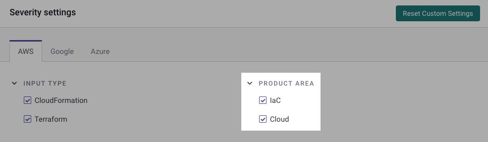

# IaC+ 및 클라우드 규칙 관리


귀하의 조직에 활성화된 제품에 따라 규칙 설정 페이지의 이름이 다를 수 있습니다.


귀하의 조직에서 [+](../iac+-code-to-cloud-capabilities/)가 활성화된 경우, 조직의 **설정 > Snyk Cloud & IaC** 페이지에서 모든 Snyk 클라우드 및 IaC 규칙 목록을 볼 수 있습니다.

각 규칙은 [Cloud Security Rules](https://security.snyk.io/rules/cloud/) 사이트에서 자세한 수정 안내로 연결됩니다.

규칙이 Snyk 클라우드 환경에 적용되면 **Cloud** 태그가 있고, Snyk IaC에 적용되면 **IaC** 태그가 있습니다. 대부분의 규칙은 둘 다에 적용됩니다. 예외로는 [SNYK-CC-00168](https://security.snyk.io/rules/cloud/SNYK-CC-00168)와 같이 누락된 리소스를 확인하는 클라우드 전용 규칙이 포함됩니다. 예를 들어, "Config 구성 변경을 위한 CloudWatch 로그 메트릭 필터 및 경보를 설정해야 함"입니다.

<figure><figcaption>
Snyk 클라우드 및 IaC 설정 페이지
</figcaption></figure>

## 사용자 정의 심각도 수준 설정

규칙에 대해 사용자 정의 심각도 수준을 설정하려면:

1. **설정 > Snyk Cloud & IaC**로 이동합니다.
2. **심각도 설정** 섹션에서 원하는 클라우드 공급자 탭을 선택합니다.
3. 업데이트하려는 규칙을 찾아 드롭다운 메뉴에서 새로운 심각도 수준을 선택합니다.

<figure><figcaption>
드롭다운 메뉴에서 새로운 규칙 심각도 수준을 선택합니다.
</figcaption></figure>

변경 사항은 환경의 다음 스캔 후에 적용됩니다.

모든 사용자 정의 심각도를 재설정하려면 **사용자 정의 설정 재설정**을 선택합니다.

## 클라우드 또는 IaC+ 영역별 규칙 필터링


이 섹션은 클라우드와 IaC+를 모두 활성화한 조직 또는 IaC+만 해당됩니다.


기본적으로 모든 규칙이 표시됩니다. **제품 영역** 섹션에서 Cloud 상자 선택을 해제하여 클라우드 전용 규칙을 숨기거나, IaC 상자를 선택하여 IaC 전용 규칙을 숨길 수 있습니다.

<figure><figcaption>
제품 영역 섹션을 사용하여 제품 영역별로 규칙을 필터링할 수 있습니다.
</figcaption></figure>