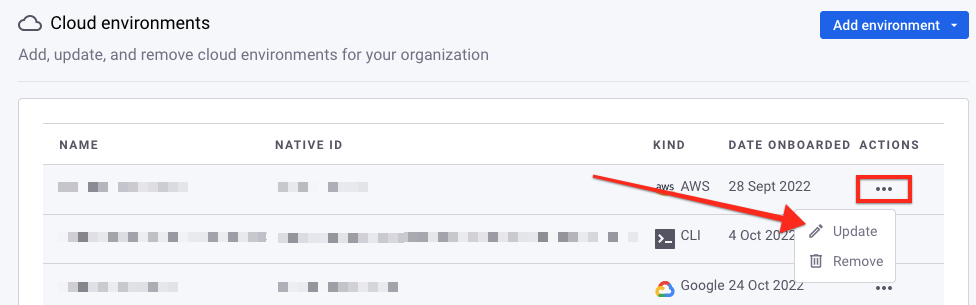
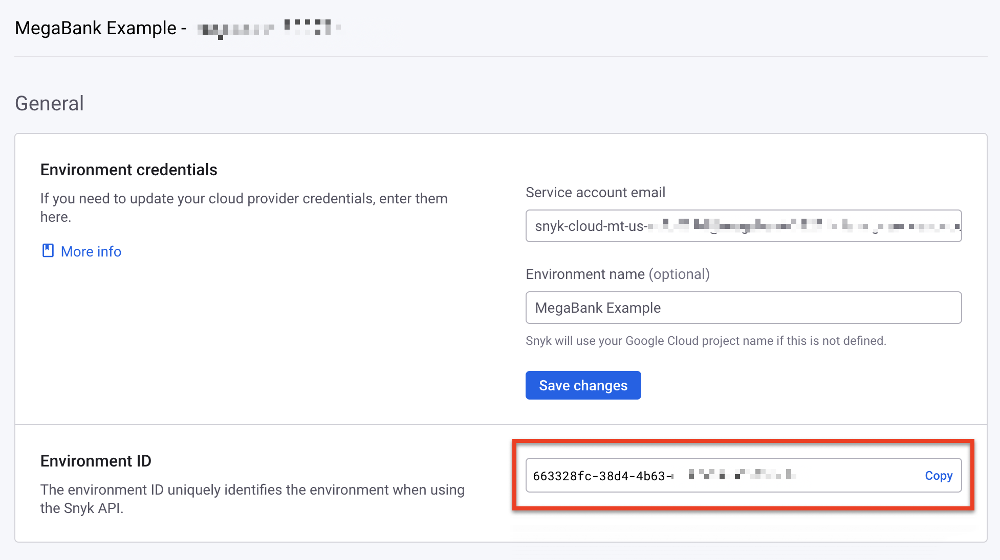

# 환경 ID 찾기

일부 작업은 Snyk API를 사용하여 환경을 업데이트하거나 삭제하는 경우 환경 ID가 필요합니다.

환경의 ID를 찾는 방법은 다음과 같습니다:

* [웹 UI](find-an-environment-id.md#web-ui)
* [API](find-an-environment-id.md#api)

## 웹 UI

[웹 UI](https://app.snyk.io/)를 사용하여 환경 ID를 찾으려면 다음 단계를 따릅니다:

1. 조직 **설정 > 클라우드 환경**으로 이동합니다.
2. **작업** 열에서 원하는 환경에 대해 `...` 아이콘을 선택합니다.
3. **업데이트**를 선택합니다.

    <figure><figcaption><p>설정 페이지의 클라우드 환경에서 환경 업데이트</p></figcaption></figure>
4. **환경 ID** 섹션에서 환경 ID를 복사하려면 **복사**를 선택합니다.

    <figure><figcaption><p>환경 ID 복사</p></figcaption></figure>

## API

API를 사용하여 환경 ID를 찾으려면 다음 형식으로 [`/cloud/environments`](https://apidocs.snyk.io/#get-/orgs/-org\_id-/cloud/environments) 엔드포인트에 요청을 보냅니다:

```
curl -X GET \
  'https://api.snyk.io/rest/orgs/YOUR-ORGANIZATION-ID/cloud/environments?version=2022-12-21~beta' \
  -H 'Authorization: token YOUR-API-TOKEN'
```

출력에서 원하는 환경의 `data.id` 속성을 찾습니다. 다음 예제에서 ID는 `3b7ccff9-8900-4e54-0000-1234abcd1234`입니다:

```
{
  "jsonapi": {
    "version": "1.0"
  },
  "data": {
    "id": "3b7ccff9-8900-4e54-0000-1234abcd1234",
    <length에 따라 줄임>
  }
}
```

## 환경 필터링

쿼리 매개변수를 사용하여 환경 목록을 필터링하여 특정 환경을 쉽게 찾을 수 있습니다. 예를 들어, API 요청에 `kind=google`을 추가하여 Google 클라우드 환경만 반환할 수 있습니다:

```
curl -X GET \
  '환경 필터링 명령어' \
  -H 'Authorization: token YOUR-API-TOKEN'
```