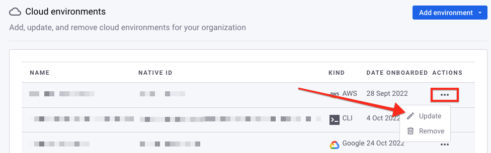

# 클라우드 환경 업데이트

다음과 같은 [클라우드 환경](../key-concepts-for-iac+-and-cloud.md#environments)의 속성을 업데이트할 수 있습니다:

* **AWS:** 환경 이름 및 IAM 역할 ARN(Amazon Resource Name). 새로운 역할 ARN은 이전 역할 ARN과 동일한 AWS 계정 ID를 가져야 합니다. [역할 ARN 찾기](../../cloud-platforms-integrations/aws-integration/aws-integration-api/step-3-create-and-scan-a-snyk-cloud-environment.md#find-the-role-arn) 참조.
* **Google:** 환경 이름 및 서비스 계정 이메일 주소. 새로운 서비스 계정 이메일은 이전 것과 동일한 프로젝트 ID와 연관되어야 합니다.
* **Azure:** 환경 이름 및 애플리케이션 ID. 새로운 애플리케이션 ID는 이전 것과 동일한 구독과 테넌트와 연관되어야 합니다.

예를 들어, Terraform이나 CloudFormation 템플릿에서 역할 이름을 변경하고 변경 사항을 배포하는 경우 Snyk IAM 역할 ARN을 업데이트해야 합니다.

다음 방법을 사용하여 Snyk 클라우드 환경을 업데이트할 수 있습니다:

* [웹 UI](update-a-cloud-environment.md#web-ui)
* [API](update-a-cloud-environment.md#api)

## 웹 UI

[Snyk 웹 UI](https://app.snyk.io)를 사용하여 환경을 업데이트하는 방법은 다음과 같습니다:

1. 조직 **설정(톱니바퀴 아이콘) > 클라우드 환경**으로 이동합니다.
2. **작업** 열에서 업데이트하려는 환경의 `...` 아이콘을 선택합니다.
3.  **업데이트**를 선택합니다.

    <figure><figcaption><p>환경을 업데이트하려면 ... 아이콘을 선택합니다.</p></figcaption></figure>
4.  **일반** 섹션에서 업데이트된 환경 이름, 자격 증명 또는 둘 다를 입력합니다.

    <div><figure><figcaption><p>AWS 환경을 업데이트하는 예시입니다.</p></figcaption></figure> <figure><figcaption><p>Google 환경을 업데이트하는 예시입니다.</p></figcaption></figure></div>
5. **변경 내용 저장**을 선택합니다.

## API

Snyk API를 사용하여 환경을 업데이트하는 방법은 다음과 같습니다:

1. [환경 ID 찾기](update-a-cloud-environment.md#find-the-environment-id)
2. [환경을 업데이트하는 API 요청 보내기](update-a-cloud-environment.md#update-the-environment)

### 환경 ID 찾기

먼저 업데이트하려는 클라우드 환경의 ID를 찾습니다. 다음 형식에 맞춰 [`/cloud/environments`](https://apidocs.snyk.io/#get-/orgs/-org_id-/cloud/environments) 엔드포인트에 요청을 보냅니다:

```
curl -X GET \
  'https://api.snyk.io/rest/orgs/귀하의-조직-ID/cloud/environments?version=2022-12-21~beta' \
  -H 'Authorization: token 귀하의-API-토큰'
```

출력에서 `data.id` 속성을 찾습니다. 다음 예시에서 ID는 `3b7ccff9-8900-4e54-0000-1234abcd1234`입니다:

```json
{
  "jsonapi": {
    "version": "1.0"
  },
  "data": {
    "id": "3b7ccff9-8900-4e54-0000-1234abcd1234",
    <length를 위해 일부 내용 삭제>
  }
}
```

### 환경 업데이트

환경을 업데이트하려면 클라우드 제공자에 해당하는 형식으로 다음과 같이 엔드포인트로 요청을 보냅니다.

#### AWS

```
curl -X PATCH \
'https://api.snyk.io/rest/orgs/귀하의-조직-ID/cloud/environments/귀하의-환경-ID?version=2022-12-21~beta' \
-H 'Authorization: token 귀하의-API-토큰' \
-H "Content-Type:application/vnd.api+json"  -d '{
  "data": {
    "attributes": {
      "options": {
        "role_arn": "귀하의-새로운-역할-ARN"
      }
    },
    "type": "resource"
  }
}'
```

#### Google

`data.attributes.options.service_account_email` 필수입니다. `data.attributes.options.project_id` 필드로 프로젝트 ID를 명시적으로 지정할 수 있지만 현재 프로젝트 ID와 다를 수 없습니다.

```
curl -X PATCH \
'https://api.snyk.io/rest/orgs/귀하의-조직-ID/cloud/environments/귀하의-환경-ID?version=2022-12-21~beta' \
-H 'Authorization: token 귀하의-API-토큰' \
-H "Content-Type:application/vnd.api+json"  -d '{
  "data": {
    "attributes": {
      "options": {
        "service_account_email": "귀하의-새로운-서비스-계정-이메일"
      }
    },
    "type": "resource"
  }
}'
```

#### Azure

`data.attributes.options.tenant_id`와 `data.attributes.options.subscription_id`는 필수이며 현재 값과 달라서는 안 됩니다.

```
curl -X PATCH \
'https://api.snyk.io/rest/orgs/귀하의-조직-ID/cloud/environments/귀하의-환경-ID?version=2022-12-21~beta' \
-H 'Authorization: token 귀하의-API-토큰' \
-H 'Content-Type:application/vnd.api+json' -d '{
  "data": {
    "attributes": {
      "name": "귀하의-새로운-환경-이름",
      "options": {
        "application_id": "귀하의-새로운-애플리케이션-ID",
        "tenant_id": "00000000-0000-0000-1234-12345678abcd",
        "subscription_id": "abcd1234-abcd-1234-0000-000000000000"
      }
    },
    "type": "resource"
  }
}'
```

### API 응답 이해

Snyk은 업데이트된 환경 세부 정보가 포함된 JSON 문서를 반환합니다. 예를 들어, 다음 응답은 AWS 환경을 보여줍니다:

```json
{
  "jsonapi": {
    "version": "1.0"
  },
  "data": {
    "id": "3b7ccff9-8900-4e54-0000-1234abcd1234",
    "type": "environment",
    "attributes": {
      "name": "예시 AWS 환경",
      "options": {
        "role_arn": "arn:aws:iam::123412341234:role/snyk-cloud-role-updated"
      },
      "native_id": "123412341234",
      "properties": {
        "account_id": "123412341234"
      },
      "kind": "aws",
      "revision": 2,
      "created_at": "2022-07-31T00:50:49Z",
      "status": "success",
      "updated_at": "2022-08-17T18:18:01Z"
    },
    "relationships": {
      "organization": {
        "data": {
          "id": "d70c1768-5675-0000-1234-abcd1234abcd",
          "type": "organization"
        },
        "links": {
          "related": "/orgs/d70c1768-5675-0000-1234-abcd1234abcd?version=2022-12-21~beta"
        }
      }
    }
  }
}
```

JSON 출력의 `data.attributes.options` 및 `data.attributes.properties` 필드는 클라우드 제공자에 따라 다를 수 있으며 업데이트된 정보를 보여줍니다.
