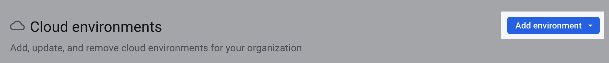

# 환경 보기, 추가 및 제거

조직 내 모든 Snyk 환경을 보려면 조직 **설정 (톱니 모양 아이콘) > 클라우드 환경** 으로 이동하세요.

클라우드 환경 테이블은 각 환경에 대해 다음 정보를 표시합니다:

- 이름
- 네이티브 ID (예: AWS 계정 ID, Google 프로젝트 ID, Azure 구독, CLI)
- 종류 (예: AWS, Google, Azure, CLI)
- 등록일

<figure><figcaption>
Snyk 웹 UI의 Snyk 환경 페이지
</figcaption></figure>

## 클라우드 환경 추가

클라우드 환경을 추가하려면 **환경 추가** 드롭다운을 선택하고 클라우드 공급업체를 선택하십시오. [AWS 통합: Web UI](../../cloud-platforms-integrations/aws-integration/aws-integration-web-ui/), [Google 클라우드 통합: Web UI](../../cloud-platforms-integrations/google-cloud-integration/google-cloud-integration-web-ui/) 또는 [Azure 통합: Web UI](../../cloud-platforms-integrations/azure-integration-for-cloud-configurations/azure-integration-web-ui/)의 단계에 따라 환경을 생성하십시오. IaC+ 환경 종류에서는 지원되지 않습니다.

<figure><figcaption>
Snyk 웹 UI에서 환경 추가
</figcaption></figure>

또한 Snyk API를 이용하여 환경을 추가할 수 있습니다:

- [AWS 통합: API](../../cloud-platforms-integrations/aws-integration/aws-integration-api/)
- [Google 클라우드 통합: API](../../cloud-platforms-integrations/google-cloud-integration/google-cloud-integration-api/)
- [Azure 통합: API](../../cloud-platforms-integrations/azure-integration-for-cloud-configurations/snyk-cloud-for-azure-api/)

## IaC+ 또는 클라우드 환경 제거

IaC+ 또는 클라우드 환경을 제거하려면:

1. **작업** 열에서 제거하려는 환경의 `...` 아이콘을 선택하세요.
2. **제거**를 선택하세요.
3. 확인 모달에서 **예, 제거**를 선택하세요.

<figure><figcaption>
Snyk 웹 UI에서 환경 제거
</figcaption></figure>

또한 [Snyk API](remove-an-environment.md#api)를 사용하여 환경을 제거할 수 있습니다.