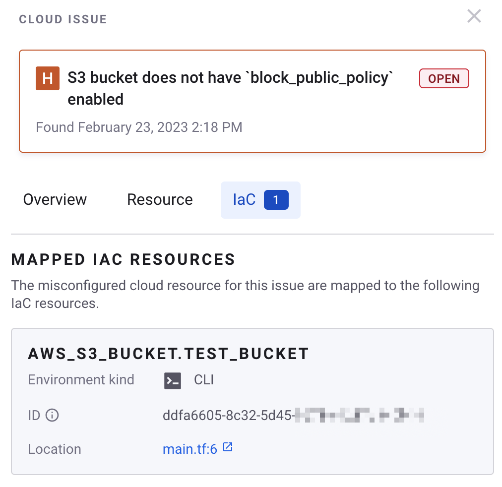

# IaC에서 클라우드 문제 해결하기


**릴리스 상태**

IaC+에서 제공되는 클라우드 문제 해결 기능은 AWS, Azure, Google Cloud를 지원하며 [IaC+](./)에 대해서만 사용할 수 있습니다.

{{Snyk IaC}}+는 현재 가입을 받지 않는 닫힌 베타 버전 상태입니다.\
자세한 기능에 대해서는 [현재 IaC로 시작하기](https://docs.snyk.io/scan-using-snyk/snyk-iac/getting-started-with-current-iac)에서 확인하세요.


IaC에서 클라우드 문제 해결 기능은 클라우드 리소스를 잘못 배포하는 데 사용된 IaC 소스 코드에서 클라우드 문제를 해결할 수 있도록 하며, 클라우드 문제를 IaC 템플릿로 직접 연결하여 클라우드 문제를 해결합니다.

많은 Snyk 고객이 IaC를 사용하여 클라우드 리소스를 배포하고 관리합니다. 그러나 기관은 여전히 잘못 구성된 IaC 템플릿을 배포할 수 있으며, 이는 잘못 구성된 클라우드 리소스 및 따라서 클라우드 컨텍스트 문제로 이어집니다. 이는 파이프라인이 클라우드 구성 오류를 발견해도 배포를 차단하는 방식으로 구성되지 않은 경우에 발생할 수 있습니다.

이 클라우드 문제를 해결하기 위해 보안팀은 잘못 배포된 리소스를 소유하는 팀을 수동으로 확인하고, 그런 다음 개발자가 사용한 적절한 IaC 템플릿을 수동으로 찾아야합니다. 이 과정은 매우 시간이 많이 소요될 수 있습니다.

이 기능은 이러한 수동 단계를 없애고 수정해야 할 기본 IaC 템플릿에 대한 링크를 사용자에게 제공합니다.

## IaC에서 클라우드 문제를 해결하는 방법 <a href="#docs-internal-guid-445fbd0a-7fff-7c11-045c-437badbb9640" id="docs-internal-guid-445fbd0a-7fff-7c11-045c-437badbb9640"></a>

Snyk는 가능한 경우 클라우드 리소스를 소스 IaC 템플릿에 "매핑"하여 이 기능을 제공합니다. Snyk는 이를 위해 Terraform 상태 파일에 포함된 리소스 ID와 같은 정보를 활용하여 클라우드 리소스를 Terraform 상태와 IaC 소스 코드에 매핑할 수 있습니다.

Snyk는 CLI를 통해 Terraform 상태 파일에 액세스하며, 배포 파이프라인에 통합되어 있어야 합니다. 민감한 정보 가능성 때문에 `.tfstate` 파일을 Snyk 플랫폼으로 보내지 않습니다. 대신, Snyk는 리소스 ID와 같은 매핑에 필요한 최소한의 데이터를 얻고 이 정보를 Snyk 플랫폼으로 보내는 [매핑 아티팩트](../getting-started-with-iac+-and-cloud-scans/key-concepts-for-iac+-and-cloud.md#resource-mapping)를 생성합니다. 기타 구성 데이터는 매핑 아티팩트에 포함되지 않습니다.

Snyk는 클라우드 환경을 스캔할 때 매핑 아티팩트, 클라우드 리소스 및 IaC 리소스를 분석하여 클라우드 리소스에서 IaC 소스 템플릿으로의 [리소스 매핑](../getting-started-with-iac+-and-cloud-scans/key-concepts-for-iac+-and-cloud.md#resource-mapping)을 생성합니다.

## IaC에서 클라우드 문제 해결에 필요한 사전 조건 <a href="#docs-internal-guid-1c18d3e8-7fff-6839-26b4-06682c96a199" id="docs-internal-guid-1c18d3e8-7fff-6839-26b4-06682c96a199"></a>

다음 사항이 필요합니다:

* Snyk [서비스 계정](../../../enterprise-setup/service-accounts/) 및 API 토큰 액세스
* IaC+가 있는 Snyk 조직 액세스
* CI/CD를 통해 AWS, Azure, Google Cloud에 배포된 클라우드 리소스
* Terraform 버전 0.11 이상

## IaC에서 클라우드 문제 해결의 단계

### 단계 1: IaC 및 클라우드 환경을 Snyk에 등록

Snyk CLI 워크플로(`snyk iac test --report`)를 통해 IaC+ 환경을 등록하고, [AWS 통합](../cloud-platforms-integrations/aws-integration/), [Azure 통합](../cloud-platforms-integrations/azure-integration-for-cloud-configurations/snyk-cloud-for-azure-api/), 또는 [Google Cloud 통합](../cloud-platforms-integrations/google-cloud-integration/)을 통해 관련 클라우드 환경을 등록하세요.

`snyk iac test`는 Git 리포지토리의 루트 폴더에서 실행해야 합니다. GitLab이나 Azure DevOps를 사용하는 경우 다음 CLI 명령을 사용하여 `target-reference` 옵션을 추가하여 SCM 링크를 생성할 수 있습니다.

```
snyk iac test --report --target-reference=$(git branch --show-current)
```

AWS, Azure 또는 Google Cloud와 같은 클라우드 환경은 CI/CD 도구를 통해 Terraform을 사용하여 배포된 리소스가 포함되어야 합니다.

### 단계 2: CI/CD 파이프라인 스크립트 구성 <a href="#docs-internal-guid-d24f5230-7fff-18a1-9bd7-807654e06d0c" id="docs-internal-guid-d24f5230-7fff-18a1-9bd7-807654e06d0c"></a>

다음을 수행하는 CI/CD 스크립트를 구성하세요:

* `terraform state pull`을 통해 Terraform 상태를 가져옵니다.
* Snyk CLI를 설치하고 관련 옵션과 함께 [snyk iac capture](https://docs.snyk.io/snyk-cli/commands/iac-capture)를 실행합니다.

다음 섹션에서 Snyk에서 제공하는 샘플 CI/CD 스크립트를 참조할 수 있습니다.

* [GitHub Actions](fix-cloud-issues-in-iac.md#github-actions-example)
* [CircleCI](fix-cloud-issues-in-iac.md#circleci-example)

#### GitHub Actions 예시

GitHub에서 다음과 같은 환경 변수를 [암호화된 리포지토리 시크릿](https://docs.github.com/en/actions/security-guides/encrypted-secrets#creating-encrypted-secrets-for-a-repository)로 설정하세요:

* `AWS_ACCESS_KEY_ID` - `terraform apply` 및 `terraform state pull`에 사용됩니다.
* `AWS_SECRET_ACCESS_KEY` - `terraform apply` 및 `terraform state pull`에 사용됩니다.
* `SNYK_TOKEN` - Snyk 서비스 계정의 API 토큰
* `SNYK_ORG_ID` - Snyk 조직 ID

```yaml
name: continuous-delivery
on:
  push:
    branches:
      - main
jobs:
  delivery:
    runs-on: ubuntu-latest
    env:
      AWS_ACCESS_KEY_ID: ${{ secrets.AWS_ACCESS_KEY_ID }}
      AWS_SECRET_ACCESS_KEY: ${{ secrets.AWS_SECRET_ACCESS_KEY }}
      SNYK_TOKEN: ${{ secrets.SNYK_TOKEN }}
    steps:
      - uses: actions/checkout@v3
      - uses: hashicorp/setup-terraform@v2
        with:
          terraform_wrapper: false
      - uses: snyk/actions/setup@master
      - run: terraform init

      - name: terraform plan
        run: terraform plan -input=false

      - name: snyk iac test
        run: snyk iac test --org=${{ secrets.SNYK_ORG_ID }} --report || true

      - name: terraform apply
        run: terraform apply -auto-approve -input=false

      - name: capture terraform state
        run: terraform state pull | snyk iac capture --org=${{ secrets.SNYK_ORG_ID }} --stdin
```

#### CircleCI 예시

CircleCI에서 다음 [환경 변수](https://circleci.com/docs/env-vars/)를 설정하세요:

* `AWS_ACCESS_KEY_ID` - `terraform apply` 및 `terraform state pull`에 사용됩니다.
* `AWS_SECRET_ACCESS_KEY` - `terraform apply` 및 `terraform state pull`에 사용됩니다.
* `SNYK_TOKEN` - Snyk 서비스 계정의 API 토큰
* `SNYK_ORG_ID` - Snyk 조직 ID

```yaml
version: 2.1

orbs:
  terraform: circleci/terraform@3.2.0
  snyk: snyk/snyk@1.5.0
jobs:
  delivery:
    machine:
      image: ubuntu-2204:current
    resource_class: medium
    steps:
      - checkout
      - terraform/install:
          terraform_version: 1.4.2
      - snyk/install

      - terraform/plan

      - run:
          name: snyk iac test
          command: snyk iac test --org=$SNYK_ORG_ID --report || true

      - terraform/apply
      
      - run:
          name: capture terraform state
          command: terraform state pull | snyk iac capture --org=$SNYK_ORG_ID --stdin

workflows:
  continuous-delivery:
    jobs:
      - delivery
```

### 단계 3: 파이프라인 실행 <a href="#docs-internal-guid-a2671bcf-7fff-a65d-b991-ff8b7f32cc9e" id="docs-internal-guid-a2671bcf-7fff-a65d-b991-ff8b7f32cc9e"></a>

CI/CD 파이프라인을 실행하여 Terraform 상태를 가져오고 [snyk iac capture](https://docs.snyk.io/snyk-cli/commands/iac-capture)를 실행하면 Snyk가 Terraform 상태 파일에서 최소한의 정보를 사용한 [매핑 아티팩트](../getting-started-with-iac+-and-cloud-scans/key-concepts-for-iac+-and-cloud.md#resource-mapping)를 생성하고 Snyk로 보냅니다.

매핑 아티팩트가 생성되거나 업데이트되면 Snyk는 IaC 리소스, 클라우드 리소스 및 매핑 아티팩트를 조직 전체에서 분석하여 클라우드 및 IaC 리소스 간의 연결을 포함하는 리소스 매핑을 생성합니다.

### 단계 4: 몇 분 기다리고 클라우드 문제 페이지 확인 <a href="#docs-internal-guid-c33c6869-7fff-eb8c-a85d-9060c4575809" id="docs-internal-guid-c33c6869-7fff-eb8c-a85d-9060c4575809"></a>

몇 분 기다려 Snyk가 클라우드 환경을 스캔하고 매핑 실행을 완료하고 리소스 매핑을 업데이트할 수 있도록 하세요.

[클라우드 문제 페이지](../getting-started-with-iac+-and-cloud-scans/manage-iac+-and-cloud-issues/view-iac+-and-cloud-issues-in-the-snyk-web-ui.md)로 이동하고 **has\_iac\_mappings** 필터를 `true`로 설정하여 클라우드 문제에서 IaC 리소스에 매핑된 리소스가 표시되도록 하세요.

<figure><figcaption><p><strong>has_iac_mappings</strong> 필터 사용</p></figcaption></figure>

해당하는 클라우드 문제는 이제 지원되는 리소스 유형에 대한 IaC 리소스를 포함하는 **IaC** 탭을 통해 보여집니다. 각 IaC 리소스에는 리소스 이름, IaC 템플릿 위치 및 사용 가능한 경우 SCM 도구로의 링크와 함께 정보가 포함됩니다.

<figure><figcaption><p>클라우드 문제의 IaC 탭에 표시된 매핑된 IaC 리소스 정보</p></figcaption></figure>

## 지원되는 리소스 유형

다음은 지원되는 리소스 유형 목록입니다.

### AWS

* aws\_api\_gateway\_deployment
* aws\_api\_gateway\_resource
* aws\_api\_gateway\_rest\_api
* aws\_cloudtrail
* aws\_cloudwatch\_log\_group
* aws\_db\_instance
* aws\_db\_subnet\_group
* aws\_default\_security\_group
* aws\_default\_vpc
* aws\_dynamodb\_table
* aws\_ebs\_volume
* aws\_eip
* aws\_flow\_log
* aws\_iam\_access\_key
* aws\_iam\_group
* aws\_iam\_group\_policy
* aws\_iam\_group\_policy\_attachment
* aws\_iam\_instance\_profile
* aws\_iam\_policy
* aws\_iam\_policy\_attachment
* aws\_iam\_role
* aws\_iam\_role\_policy
* aws\_iam\_role\_policy\_attachment
* aws\_iam\_user
* aws\_iam\_user\_policy
* aws\_iam\_user\_policy\_attachment
* aws\_instance
* aws\_internet\_gateway
* aws\_kms\_key
* aws\_lambda\_function
* aws\_lambda\_permission
* aws\_network\_acl
* aws\_network\_interface
* aws\_rds\_cluster
* aws\_rds\_global\_cluster
* aws\_route\_table
* aws\_route\_table\_association
* aws\_s3\_account\_public\_access\_block
* aws\_s3\_bucket
* aws\_s3\_bucket\_acl
* aws\_s3\_bucket\_logging
* aws\_s3\_bucket\_policy
* aws\_s3\_bucket\_public\_access\_block
* aws\_s3\_bucket\_server\_side\_encryption\_configuration
* aws\_security\_group
* aws\_security\_group\_rule
* aws\_sns\_topic
* aws\_subnet aws\_vpc

### Azure

* azurerm\_resource\_group
* azurerm\_storage\_account
* azurerm\_sql\_active\_directory\_administrator
* azurerm\_network\_interface
* azurerm\_subnet
* azurerm\_virtual\_machine\_extension
* azurerm\_virtual\_network
* azurerm\_managed\_disk
* azurerm\_subscription\_policy\_assignment
* azurerm\_storage\_data\_lake\_gen2\_filesystem
* azurerm\_synapse\_firewall\_rule
* azurerm\_synapse\_workspace
* azurerm\_storage\_account\_network\_rules
* azurerm\_service\_fabric\_cluster
* azurerm\_security\_center\_auto\_provisioning
* azurerm\_security\_# dns_managed_zone
* google_compute_instance_template
* google_compute_instance
* google_service_account
* google_compute_network
* google_compute_subnetwork
* google_compute_ssl_policy
* google_compute_project_metadata
* google_compute_firewall
* google_compute_disk
* google_kms_crypto_key
* google_sql_user