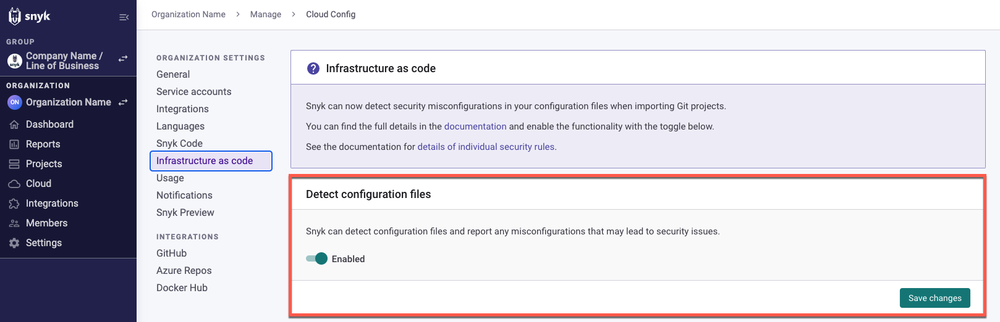

# 테라폼 파일에서 보안 문제를 찾기 위한 통합 설정


이 페이지는 현재 IaC에만 해당됩니다.


Snyk는 소스 코드 저장소에서 당신의 테라폼 파일을 테스트하고 모니터링하여 클라우드 환경을 보다 안전하게 보호하는 데 조언을 제공하며, 프로덕션으로 푸시하기 전에 설정 오류를 잡아내고 수정하는 데 도움을 줍니다.

## 지원되는 Git 저장소 및 테라폼 파일 형식

Snyk는 인테그레이트된 Git 저장소에서 Terraform (`.tf`) 파일을 스캔합니다. `snyk iac test` CLI 명령을 사용하여 모듈을 보유한 저장소를 가져와서 테라폼 모듈 저장소를 스캔하거나, 디렉토리 자체를 스캔하여 테라폼 파일을 스캔할 수 있습니다.

테라폼 파일을 스캔하면 모듈에 정적으로 구성된 모든 것에 대한 보안 피드백을 받을 수 있습니다. 반복 및 예약된 테스트를 활용하려면 최상의 방법을 따르고 SCM에서 직접 사용자 정의 모듈을 가져와야 합니다.

변수 보간 기능에 대한 Snyk 블로그 글을 참조하세요: [{{Snyk IaC}} public beta introduces Terraform plan analysis](https://snyk.io/blog/snyk-iac-public-beta-introduces-terraform-plan-analysis/). 이를 통해 CLI를 통해 테라폼 Plan 출력을 스캔하여 배포를 생성하는 데 사용된 모듈의 출력을 포함하여 전체 테라폼 배포를 스캔할 수 있습니다.

## Snyk를 구성하여 테라폼 설정 파일을 스캔하도록 설정

### **테라폼 파일을 스캔하기 위한 사전 조건**

* Snyk에서 구성 중인 조직의 관리자이어야 합니다.
* 이미 Git 저장소를 통합했는지 확인하세요. 자세한 내용은 [Git 저장소 (SCM) 통합](../../../../scm-ide-and-ci-cd-integrations/snyk-scm-integrations/)을 참조하세요.

### **Snyk를 사용하여 테라폼 파일을 스캔하도록 구성**

* 계정에 로그인하고 관리하려는 해당 그룹 및 조직으로 이동하세요.\
  통합은 조직별로 관리됩니다.
* 아래와 같이 설정을 전환하여 Snyk가 인프라스트럭처 코드 파일을 감지하도록 설정하세요:

<figure><figcaption>
인프라스트럭처 코드 구성 파일 감지 활성화
</figcaption></figure>

* 필요한 경우, AWS 탭에서 **인프라스트럭처 코드** **심각도 설정**을 검토하고 조정하세요.\
  검사할 파일 유형을 선택하고, 클라우드포메이션, 테라폼 또는 둘 다를 선택하고, API 게이트웨이에 대해 각각의 심각도 수준을 선택하도록 풀 다운 선택하세요.

<figure><figcaption>
IaC 스캔을 위한 심각도 설정 선택
</figcaption></figure>