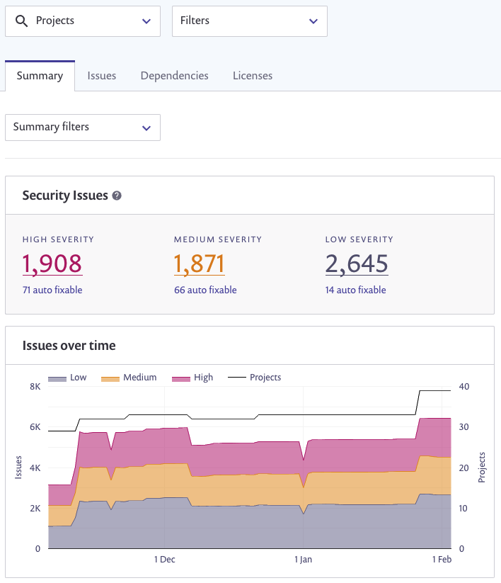
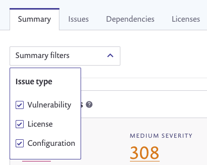

# {{ Snyk }} IaC 문제 보고서 보기

{{Infrastrucure as Code}} 구성 파일에서 문제를 보려면 [{{ Snyk }} 보고서](../../manage-issues/reporting/legacy-reports/)를 사용하세요.

## 요약 페이지

기본적으로 요약 통계 및 그래프에 나타나는 {{Infrastrucure as Code}} 구성 문제는 프로젝트 및 문제 유형 전체에서 발생하는 모든 열린 문제를 보여줍니다.

<figure><figcaption><p>보고서 요약 페이지</p></figcaption></figure>

IaC 문제만 보려면 **요약 필터** 드롭다운에서 **구성**을 선택하세요:



요약 탭에 대한 자세한 내용은 [보고서 요약 탭](../../manage-issues/reporting/legacy-reports/legacy-reports-summary-tab.md) 문서를 참조하세요.

## 문제 페이지

**문제** 페이지를 선택하여 프로젝트 전체의 열린 문제에 대한 자세한 정보를 확인하세요.

IaC 문제만 보려면 **문제 필터** 드롭다운에서 **구성**을 선택하세요.

<figure><figcaption><p>IaC 문제 페이지</p></figcaption></figure>

여기에는 각 문제의 제목, 유형 및 심각성이 표시됩니다.

그룹화되지 않은 문제를 볼 수도 있습니다. 이는 문제가 발견된 프로젝트 파일에 대한 자세한 정보와 처음 도입된 시기에 대한 세부 정보를 보여줍니다.

 (1) (1) (1) (1) (1) (1) (1) (1) (1) (1) (1) (1) (1) (1) (5) (7).png>)

문제 탭에 대한 자세한 내용은 [문제 탭](../../manage-issues/reporting/legacy-reports/legacy-reports-issues-tab.md) 문서를 참조하세요.

**문제를 내보내기** 하려면 **내보내기 버튼을 사용하여** 취약점과 동일한 형식의 CSV 파일로 문제를 내보낼 수 있습니다.

## IaC 문제에 대한 API 액세스

API 엔드포인트 [최신 문제 목록 가져오기](../../snyk-api/reference/reporting-api-v1.md#reporting-issues-latest)를 사용하여 전체 문제 목록을 볼 수 있습니다.

**{{Infrastrucure as Code}}** 문제만 검색하려면 다음과 같은 본문 페이로드를 제출하세요:

```
{
  "filters": {
    "orgs": ["내-공개-기관-id"],
    "types": [
      "구성"
    ]
  }
}
```


Snyk UI **설정** 페이지에서 대상 조직을 보는 경우 **공개 조직 ID**를 얻을 수 있습니다.


매개 변수의 전체 목록은 API 엔드포인트 [최신 문제 목록 가져오기](../../snyk-api/reference/reporting-api-v1.md#reporting-issues-latest) 문서를 참조하세요.