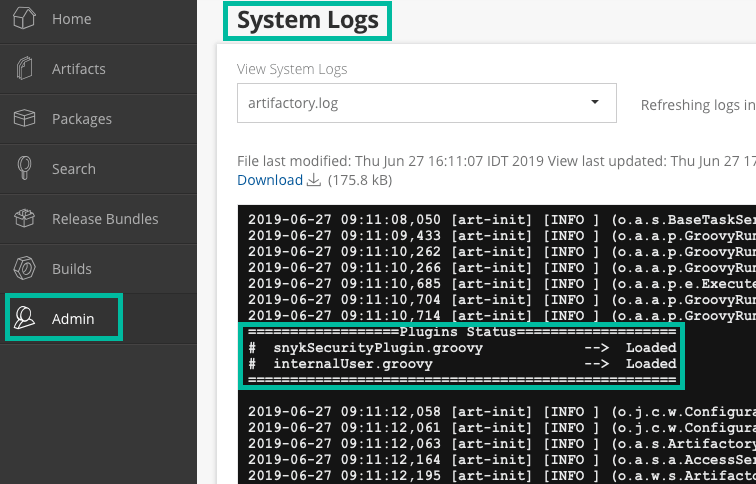

# Artifactory Gatekeeper 플러그인


**기능 가용성**\
이 기능은 엔터프라이즈 플랜에서만 사용할 수 있습니다. 자세한 정보는 [요금제 및 가격](https://snyk.io/plans/)을 참조하십시오.


Artifactory를 위한 Snyk 플러그인을 사용하면 아티팩트를 오픈 소스 취약점 및 라이선스 문제에 대해 스캔할 수 있습니다.

플러그인이 설치된 후에는 백그라운드에서 실행되어 다음과 같은 작업을 자동으로 수행할 수 있습니다:

* Snyk에서 보고된 취약점 및 라이선스 문제 수를 아티팩트의 속성으로 추가
* 구성된 임계값에 따라 취약점 및 라이선스 문제가 있는 패키지의 다운로드를 개발자가 차단

아티팩트를 워크플로의 일부로 스캔하고 그 테스트 결과를 직접 Artifactory UI에서 표시함으로써, Snyk Artifactory 게이트키퍼 플러그인을 사용하여 응용 프로그램 보안에 위험이 되는 문제를 더 신속하게 추적하고 해당 아티팩트를 프로젝트에서 사용하는 것을 피할 수 있습니다.


이 페이지는 Artifactory 플러그인을 참조하며, 이 플러그인은 Artifactory 머신에 설치된 독립적인 소프트웨어로 게이트키퍼 역할을 수행하여 취약한 패키지가 Artifactory 인스턴스에서 다운로드되는 것을 차단합니다.

이 플러그인은 [Maven용 Artifactory 레지스트리](../../package-repository-integrations/artifactory-package-repository-connection-setup/artifactory-registry-for-maven.md)와 별도이며, 이 플러그인을 통해 SCM 스캔을 사용하여 사용자 정의 패키지 레지스트리를 구성할 수 있습니다.


## Artifactory 플러그인이 지원하는 패키지 관리자

* npm
* Maven (.jar 파일)
* Gradle (.jar 파일)
* sbt (.jar 파일)
* pip (PyPi)
* CocoaPods
* Ruby Gems
* Nuget

## Artifactory 플러그인을 위한 사전 준비 사항

* Snyk 엔터프라이즈 계정
* Artifactory 버전 7.4.3 이상

## Artifactory와 Snyk 간에 교환되는 데이터

Artifactory는 패키지 이름과 버전을 Snyk API 인스턴스의 테스트 엔드포인트로 전송합니다. 헤더에서는 인증 토큰이 전송됩니다.

Artifactory 설치가 프록시를 사용하도록 구성된 경우, Snyk도 자동으로 그를 사용합니다. 프록시가 인증된 또는 Kerberos 프록시인 경우 문제가 발생할 수 있지만, 표준 인증되지 않은 전달 프록시는 Artifactory 설치와 해당 JVM이 올바르게 프록시로 구성된 경우 작동할 수 있습니다.

Snyk는 올바른 패키지 관리자와 함께 [`https://api.snyk.io/v1/test`](https://api.snyk.io/v1/test)를 호출합니다.

## Artifactory 플러그인 설치

1. Snyk 계정에 로그인합니다.
2. **Settings** > **General**을 선택하여 다음을 찾아 복사하고 저장합니다:
   1. 서비스 계정 토큰 또는 조직 API 토큰
   2. 조직 중 하나의 조직 ID
3. [GitHub의 Snyk Artifactory 플러그인 리포지토리](https://github.com/snyk/artifactory-snyk-security-plugin)로 이동한 다음 **릴리스**로 이동합니다.
4. 가장 최신 릴리스에서 **Assets** 섹션을 확장하여 artifactory-snyk-security-plugin-\<version>.zip 아카이브를 다운로드합니다.
5. 아카이브를 추출합니다. 다음 구조를 갖게 될 것입니다: `plugins (폴더)` 다음에
   * `snykSecurityPlugin.groovy - 플러그인`
   * `snykSecurityPlugin.properties - 플러그인 구성`
   * `lib (폴더)`
     * `artifactory-snyk-security-core.jar - 플러그인 라이브러리`
     * `snykSecurityPlugin.version - 플러그인 버전`
6. 텍스트 편집기에서 `snykSecurityPlugin.properties`를 엽니다.
   1. 이전 단계에서 얻은 API 토큰 및 조직 ID를 각각 `snyk.api.token` 및 `snyk.api.organization`으로 설정합니다.
   2. 필요한 대로 나머지 속성을 구성하거나 기본 값으로 남깁니다. [플러그인 구성](artifactory-gatekeeper-plugin.md#plugin-configuration) 섹션을 참조하십시오.
   3. 속성의 전체 목록은 [GitHub의 속성 파일을 확인하십시오](https://github.com/snyk/artifactory-snyk-security-plugin/blob/master/core/src/main/groovy/io/snyk/plugins/artifactory/snykSecurityPlugin.properties).
7. 모든 파일을 `$JFROG_HOME/artifactory/etc/artifactory/plugins`에 배치합니다.
8. Artifactory 서버를 다시 시작합니다. **참고: 지금 새로 고침** 또는 **다시로드**는 충분하지 않습니다. Artifactory를 다시 시작해야 합니다.
9. Artifactory 인스턴스에 로그인하여 **System Logs**로 이동하여 Snyk가 성공적으로 설치되었는지 확인합니다.

<figure><figcaption><p>Snyk의 성공적인 설치</p></figcaption></figure>

## Artifactory 플러그인 작동 방식

Artifactory **원격 저장소**에서 패키지 관리자 또는 URL에서 다운로드 요청이 발생할 때마다, Snyk는 아티팩트를 자동으로 취약점과 라이선스 문제에 대해 스캔합니다. Snyk가 발견한 문제는 아티팩트 속성으로 유지됩니다. 이러한 속성을 기반으로 나중에 패키지에 대한 액세스가 제어되며, 플러그인 구성에서 설정된 심각성 임계값에 따라 조정됩니다.

구성에 따라 플러그인은 주기적으로 패키지를 다시 스캔하여 문제 메타데이터를 최신 상태로 유지할 수 있습니다.

이 플러그인은 원격 저장소에서만 작동합니다. **로컬로 저장된 아티팩트를 스캔하지 않습니다**. 대신 Snyk에 대한 메타 정보로 쿼리를 실행합니다. 따라서 게이트키퍼를 통해 허용된 발행된 원격 저장소의 아티팩트만 Snyk Artifactory 플러그인에 의해 조사될 수 있습니다.

다운로드 상태에 대한 자세한 정보를 보려면 **시스템 로그**를 엽니다.

스캔이 문제를 찾으면 구성에 따라 다운로드 요청이 HTTP 상태 코드 "403 Forbidden"으로 차단될 수 있습니다.

스캔의 **결과**는 스캔한 아티팩트 **속성 하에** 찾을 수 있으며 문제를 무시하고 다운로드를 허용할지 여부를 결정할 수 있습니다. 아티팩트를 찾기 위해 **Artifactory 검색 바**를 사용하거나 **트리 뷰**를 탐색합니다.

<figure><figcaption><p>스캔 결과</p></figcaption></figure>

## 플러그인 구성

플러그인 구성은 이 파일에서 로드됩니다: `$JFROG_HOME/artifactory/etc/artifactory/plugins/snykSecurityPlugin.properties`. 파일의 변경 사항이 적용되려면 Artifactory를 다시 시작해야 합니다.

<table data-header-hidden><thead><tr><th width="411"></th><th width="116"></th><th></th></tr></thead><tbody><tr><td><strong>매개변수</strong></td><td><strong>기본 값</strong></td><td><strong>설명</strong></td></tr><tr><td><code>snyk.api.token</code></td><td></td><td>서비스 계정 토큰 또는 조직 API 토큰</td></tr><tr><td><code>snyk.api.organization</code></td><td></td><td>하나의 Snyk 조직의 조직 ID</td></tr><tr><td><code>snyk.api.url</code></td><td>https://api.sn<br>yk.io/v1/</td><td>Snyk API 기본 URL</td></tr><tr><td><code>snyk.scanner.test.continuously</code></td><td>false</td><td>플러그인이 주기적으로 Snyk에서 취약성 데이터를 새로 고치거나 패키지가 처음 요청될 때 얻은 결과에 따라 액세스를 필터링해야 하는지를 결정합니다. 지속적 모드인 경우, 이미 사용자가 허용한 패키지에 대해 새로운 취약점이 보고되지 않습니다.</td></tr><tr><td><code>snyk.scanner.frequency.hours</code></td><td>168</td><td>스캔 결과 만료 시간 (지속 모드만 해당). 최근 스캔이 이 시간 내에 이루어졌으면, 필터링은 이전 결과를 존중합니다. 해당 시간을 초과하면 새로운 Snyk 테스트 요청이 이루어집니다. 이 속성을 0으로 설정하면, 플러그인은 아티팩트에 액세스할 때마다 테스트를 트리거합니다.</td></tr><tr><td><code>snyk.scanner.vulnerability.threshold</code></td><td>low</td><td>취약점 문제에 대한 전역 임계값. 허용되는 값: "low", "medium", "high", "critical", "none"</td></tr><tr><td><code>snyk.scanner.license.threshold</code></td><td>low</td><td>라이선스 문제에 대한 전역 임계값. 허용되는 값: "low", "medium", "high", "critical", "none"</td></tr></tbody></table>

속성의 전체 목록은 [GitHub에서 속성 파일을 확인하십시오](https://github.com/snyk/artifactory-snyk-security-plugin/blob/master/core/src/main/groovy/io/snyk/plugins/artifactory/snykSecurityPlugin.properties).

## 아티팩트 속성

이는 플러그인이 스캔된 아티팩트에 설정하는 속성입니다. 이러한 속성 값에 따라 아티팩트 액세스가 허용되거나 거부됩니다.

<table data-header-hidden><thead><tr><th width="444"></th><th></th></tr></thead><tbody><tr><td><strong>속성</strong></td><td><strong>설명</strong></td></tr><tr><td><code>snyk.test.timestamp</code></td><td>Snyk가 아티팩트를 마지막으로 스캔한 날짜 및 시간.</td></tr><tr><td><code>snyk.issue.url</code></td><td>취약점에 대한 Snyk 데이터베이스와 취약한 버전, 사용 가능한 업그레이드, 그리고 Snyk 패치에 대한 구체적인 세부 정보를 포함한 URL입니다.</td></tr><tr><td><code>snyk.issue.vulnerabilities</code></td><td>구성된 임계값에 관계없이 취약점 요약 스캔 결과가 표시됩니다.</td></tr><tr><td><code>snyk.issue.vulnerabilities.forceDownload</code></td><td><code>true</code>인 경우에는 이 아티팩트에 취약점이 있더라도 다운로드를 허용합니다.</td></tr><tr><td><code>snyk.issue.vulnerabilities.forceDownload.info</code></td><td>forceDownload가 활성화된 이유에 대한 추가 정보를 제공합니다.</td></tr><tr><td><code>snyk.issue.licenses</code></td><td>구성된 임계값에 관계없이 라이선스 요약 스캔 결과가 표시됩니다.</td></tr><tr><td><code>snyk.issue.licenses.forceDownload</code></td><td><code>true</code>인 경우에는 이 아티팩트에 라이선스 문제가 있더라도 다운로드를 허용합니다.</td></tr><tr><td><code>snyk.issue.licenses.forceDownload.info</code></td><td>forceDownload가 활성화된 이유에 대한 추가 정보를 제공합니다.</td></tr></tbody></table>

## Artifactory 게이트키퍼 플러그인의 문제 해결

`${ARTIFACTORY_HOME}/var/etc/artifactory/logback.xml` 파일을 수정하여 디버그 로그를 활성화할 수 있습니다. 다음의 줄을 추가합니다:

```
<logger name="io.snyk" level="debug"/>
```

Artifactory는 새 구성을 자동으로 가져옵니다. 그렇지 않은 경우, Artifactory를 다시 시작하십시오.
