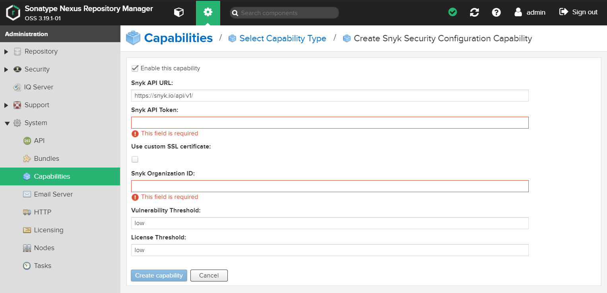
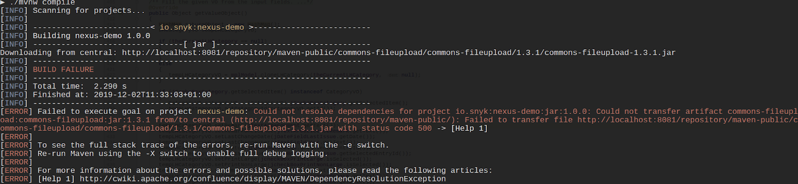

# Nexus 리포지토리 관리자 Gatekeeper 플러그인


**기능 가용성**\
이 기능은 엔터프라이즈 플랜에서만 사용 가능합니다. 자세한 정보는 [플랜 및 가격](https://snyk.io/plans/) 페이지를 참조하십시오.


Snyk Nexus 리포지토리 관리자 게이트키퍼 플러그인을 Nexus 인스턴스에 직접 설치하여 구성에 따라 아티팩트에서 오픈 소스 취약점과 라이선스 정보를 추적할 수 있습니다.

플러그인이 설치된 후에 Snyk는 백그라운드에서 실행되며 개발자의 CLI에서 다운로드 요청이 발생할 때 자동으로 다음과 같은 작업을 수행합니다.

* 아티팩트를 조사하여 라이선스 문제와 취약점을 스캔하고, 아티팩트에서 발견된 알려진 취약점에 대한 수정 데이터를 제공합니다.
* 개발자가 취약한 패키지를 다운로드하려고 할 때 Snyk 결과 및 심각도 임계값 구성에 따라 다운로드를 차단합니다.

작업의 일부로 아티팩트를 스캔하고 해당 테스트 결과를 표시함으로써 Snyk 플러그인은 개발자가 자신의 패키지와 관련된 위험을 파악할 수 있도록 하고, 관리자가 애플리케이션 보안에 위험이 되는 문제를 빠르게 식별하고 프로젝트에서 해당 아티팩트를 사용하지 않도록 도와줍니다.

## **지원되는 언어 및 패키지 매니저**

Snyk Nexus 플러그인은 Maven과 npm 의존성 스캐닝을 지원합니다.

## Nexus와 Snyk 간의 교환되는 데이터

Nexus는 패키지 이름과 버전을 Snyk API 인스턴스의 테스트 엔드포인트로 전송합니다. 헤더에서는 인증 토큰이 전송됩니다.

Nexus 설치가 프록시를 사용하도록 구성되어 있는 경우, Snyk도 자동으로 사용합니다. 프록시가 인증 또는 케르버스 프록시인 경우 문제가 발생할 수 있지만, Nexus 설치 및 해당 JVM이 프록시로 올바르게 구성된 경우 표준 인증되지 않은 전달 프록시는 작동해야 합니다.

Snyk는 올바른 패키지 관리자와 버전으로 [`https://api.snyk.io/v1/test`](https://api.snyk.io/v1/test)를 호출합니다.

## **Nexus 리포지토리 관리자 게이트키퍼 플러그인 작동 방식**

Nexus 리포지토리 관리자에 Snyk 기능을 사용하여 이 플러그인을 설치한 후, 개발자가 아티팩트 중 하나를 다운로드 요청할 때마다 취약점과 라이선스 문제를 조사합니다.

1. 관리자는 **기능** 섹션에서 Snyk 구성을 설치하고 업데이트하며, 이때 Snyk의 인증 토큰과 조직 ID를 입력합니다.
2. Snyk는 관리자가 입력한 API 토큰 및 조직 ID를 사용하여 계정 구성을 인증하고 계속해서 백그라운드에서 실행됩니다.
3. 개발자가 Nexus 인스턴스에서 로컬 환경으로 아티팩트를 다운로드하려고 시도할 때, Snyk 보안 구성 기능에 대한 심각도 임계값이 구성된 경우 패키지가 차단됩니다.
4. 오류가 개발자의 CLI에 표시되며 오류에 대한 자세한 내용을 포함하는 링크가 포함되어 있으며, 또한 관리자를 위한 Nexus 인터페이스에는 취약점 및 라이선스에 대한 알려진 문제 수에 대한 자세한 내용이 표시됩니다.

## Nexus **리포지토리 관리자** 게이트키퍼 플러그인 설정 방법

취약점을 검사하고 조직의 아티팩트에 대한 취약점을 스캔하고 관리하는 플러그인을 설치하려면 다음 지침을 따르십시오.

### Nexus **리포지토리 관리자** 게이트키퍼 플러그인 사전 요구 사항

* 시작하기 전에 Snyk의 엔터프라이즈 계정에 가입해야 합니다.
* Snyk 계정의 관리자이거나 소유자여야 합니다.
* 팀원의 컴퓨터에 다음 중 하나가 설치되어 있어야 합니다:
  * Nexus 리포지토리 관리자 OSS v3.15.0 이상
  * Nexus 리포지토리 관리자 Pro v3.15.0 이상

### 플러그인을 Nexus 서버에 설치하기

1. [Snyk Nexus 보안 플러그인 GitHub 리포지토리](https://github.com/snyk/nexus-snyk-security-plugin/releases)에서 번들을 다운로드합니다.
2. 번들에서 `nexus-snyk-security-plugin.kar` 파일을 Nexus 서버의 `/deploy`에 복사합니다.
3. Nexus 인터페이스에서 **기능** 영역에서 Snyk 보안 구성을 활성화합니다. 자세한 내용은 [Sonatype 설명서](https://help.sonatype.com/repomanager2/configuration/accessing-and-configuring-capabilities)를 참조하십시오.

### **능력 설정**

1. Snyk 계정에 이동하여 개인 API 토큰 또는 서비스 계정 토큰과 **조직 ID**를 복사하고 저장합니다. Snyk에서 계정을 인증하려면 토큰과 조직 ID가 모두 구성되어 있어야 합니다. 이 플러그인은 Snyk에 데이터를 가져오지 않기 때문에 사용 중인 조직 ID 중 하나를 사용할 수 있습니다.
2. Nexus 인스턴스에서 **기능** 섹션으로 이동하여 **Snyk 보안 구성**을 선택하여 편집합니다.
3. **이 능력 사용**을 확인하고 다음 필드에 대한 세부 정보를 입력합니다:
   * **Snyk API URL** - Snyk 요청에 사용할 API 엔드포인트를 입력합니다.
   * **Snyk API 토큰** - 1단계에서 저장한 토큰 값을 붙여넣습니다.
   * **Snyk 조직 ID** - 1단계에서 저장한 값을 붙여넣습니다.
   * **취약점 임계값** - 기본값은 `low`입니다. 유효한 값은 `none` (아티팩트 다운로드를 차단하지 않음), `low`, `medium`, `high`를 포함합니다. 필요에 따라 구성을 수동으로 업데이트하십시오.
   * **라이선스 임계값** - 기본값은 `low`입니다. 유효한 값은 `none` (아티팩트 다운로드를 차단하지 않음), `low`, `medium`, `high`를 포함합니다. 필요에 따라 구성을 수동으로 업데이트하십시오.
4. Nexus 서비스 인스턴스를 종료한 다음 다시 시작합니다.
5. Nexus 인스턴스에 로그인하여 Snyk 번들이 성공적으로 설치되었는지 확인합니다.

<figure><figcaption>
구성 가능한 능력
</figcaption></figure>

### 팀 아티팩트에서 취약점 추적하기

플러그인이 설치된 후, 개발자가 아티팩트를 다운로드 요청할 때마다 다음이 발생합니다.

* 구성한 심각도 임계값에 따라 다운로드가 차단됩니다.
* 스캔 결과가 개발자에게 표시되며 오류에 대한 자세한 내용 링크가 제공됩니다.
* 결과는 아티팩트의 Nexus 인터페이스의 **속성** 섹션에 있는 Snyk 보안 부분에 저장됩니다.

<figure><figcaption>
스캔 결과
</figcaption></figure>

<figure><figcaption>
스캔 결과 표시하는 속성
</figcaption></figure>

결과를 검토하여 아티팩트에서 발견된 문제를 평가하고 조치 방안을 결정할 수 있습니다.

다음은 Nexus의 Snyk 속성에 대한 설명입니다.

| **속성**                   | **설명**                                                                             |
| ------------------------ | ---------------------------------------------------------------------------------- |
| `issues_licenses`        | 구성된 임계값과 관계없이 이 행은 라이선스 요약 스캔 결과를 표시합니다.                                           |
| `issues_url`             | 이는 취약점에 대한 Snyk 데이터베이스 및 설명의 URL이며, 취약 버전, 사용 가능한 업데이트 및 Snyk 패치에 대한 특정 정보를 포함합니다. |
| `issues_vulnerabilities` | 구성된 임계값과 관계없이 이 행은 취약점 요약 스캔 결과를 표시합니다.                                            |

### Nexus Repository Manager 게이트키퍼 플러그인에 대한 문제 해결

Snyk에 연결하는 데 문제가 발생하면 다음 사항을 확인하거나 [Snyk 지원에 요청을 제출](https://support.snyk.io)해 보십시오.

* 관련 오류를 확인하기 위해 Nexus 로그를 확인합니다.
* 능력의 구성을 위해 API URL을 올바르게 입력했는지 확인합니다.
* Broker 구성에 대해 Snyk 서비스가 실행 중인지 확인합니다.

## **빌드 중에 Snyk 사용하기**

Snyk는 Nexus 인스턴스에서 백그라운드에서 계속 실행되며, 팀원 중 누군가 다운로드를 요청할 때마다 Snyk가 자동으로 아티팩트를 스캔하여 취약점 및 라이선스 문제를 평가하고 구성에 따라 요청을 차단합니다.

스캔이 끝나면 다음과 같은 예와 같이 다운로드가 차단된 경우 오류 메시지를 받습니다. 해당 아티팩트에서 발견된 알려진 취약점에 대한 자세한 내용 링크도 제공됩니다.

<figure><figcaption>
오류 메시지 예제
</figcaption></figure>

링크를 클릭하여 해당 아티팩트에서 발견된 취약점 수 및 심각성을 확인할 수 있습니다.
