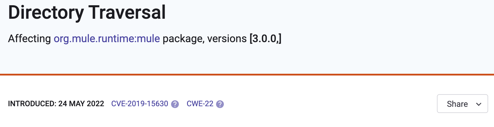
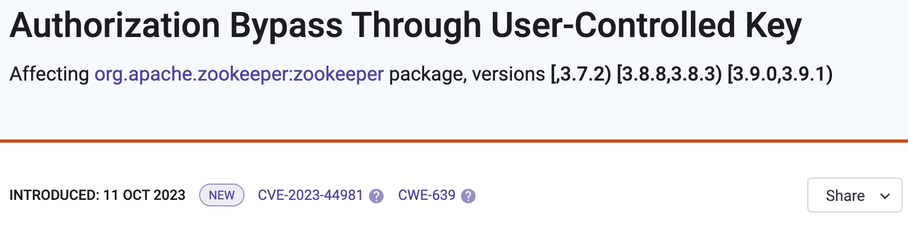

# Snyk 취약점 데이터베이스

[Snyk 취약점 데이터베이스](https://security.snyk.io)에는 알려진 보안 취약점의 포괄적인 목록이 포함되어 있습니다. 이는 Snyk 제품이 코드 취약점을 찾고 수정하는 데 사용하는 주요 보안 정보를 제공합니다.

데이터베이스를 [여기](https://security.snyk.io/)에서 검토하거나 데이터베이스 정보를 자체 시스템에 통합할 수 있습니다.


이 데이터베이스는 Snyk가 보안에 대한 공식적인 권위로 인정됨에 따라 표준 기구의 데이터베이스와 별개입니다.


## 취약점 데이터베이스 소개

### Snyk 보안 팀

Snyk 보안 팀은 새로운 취약점을 발견하기 위해 헌신하는 전문가들의 그룹입니다. 해당 팀은 CVE와 같은 기관에 여러 발견을 기여했습니다.


Snyk 취약점 데이터베이스


Snyk 보안 팀은 데이터베이스를 유지하여 데이터베이스가 지속적으로 높은 정확도를 유지하도록 하며, 잘못된 양성 결과를 제거합니다.

* 데이터베이스의 모든 항목은 분석되고 검증됩니다.
* 팀은 또한 새로운 취약점을 발견하기 위해 독점적인 연구에 투자합니다. [공개된 취약점 목록](https://app.snyk.io/disclosed-vulnerabilities)을 참조하여 첫 번째 자연인 및 제 3자 연구에 의해 발견된 모든 취약점을 볼 수 있습니다.

### 구간 표기법과 의미 버전

Snyk 취약점 데이터베이스는 다양한 지원되는 생태계에 걸쳐 [의미적 버전](https://semver.org/)을 표현하기 위해 구간 표기법을 사용합니다.

Snyk 취약점 데이터베이스에 나열된 모든 취약점에 대한 구간 표기법을 확인할 수 있습니다. 다양한 구간 표기법이 지원됩니다:

* 오픈 구간 표기법 - 이는 모든 한계점을 포함하지 않으며 표기에 `()` 괄호를 사용합니다.

<figure><figcaption></figcaption></figure>

* 닫힌 구간 표기법 - 이는 모든 한계점을 포함하며 표기에 `[]` 괄호를 사용합니다.

<figure><figcaption></figcaption></figure>

* 반 열린 구간 표기법 - 이는 한계점 중 하나만 포함하며 표기에 `[)` 또는 `(]` 괄호를 사용합니다. 이 예에서 무한한 닫힌 구간을 이러한 형식으로 제시한 `[.,3.7.2)`는 '3.7.2' 버전까지 영향을 준다는 것을 의미합니다.

### 취약점 소스

Snyk 데이터베이스의 대부분의 취약점은 다음 소스 중 하나에서 시작됩니다:

1. **기타 취약점 데이터베이스 모니터링**, [NVD](https://nvd.nist.gov)와 많은 기타 데이터베이스의 CVE 등을 포함합니다.
2. **GitHub 사용자 활동 모니터링**, 취약점을 나타낼 수 있는 이슈, PR 및 커밋 메시지를 포함합니다.
3. **대량 연구**, 오픈 소스 패키지 코드 전체에서 반복되는 보안 오류를 찾는 도구를 사용합니다.
4. **수동 연구**, Snyk 보안 팀이 더 많은 사용되는 패키지를 위해 수동으로 보안 결함을 심사합니다.

실제 취약점으로 간주되는 모든 문제에 대해 Snyk는 올바른 CVSS(심각성) 점수 및 패키지 버전 지정을 할당하고 고문서를 만들어 이 문제를 Snyk 제품에서 사용할 수 있도록 합니다.

## 취약점 데이터베이스를 시스템에 통합하기

나만의 시스템에 정보를 통합하는 것은 이미 자체 보안 제품을 보유한 고객에게 유용할 수 있습니다. 이는 Snyk의 전문 지식 및 축적된 지식에 액세스하여 개발 팀이 신속하게 오픈 소스 및 컨테이너 코드를 안전하게 만들 수 있도록 해줍니다.

Snyk 취약점 데이터베이스에는 두 가지 피드가 포함되어 있습니다:

* 애플리케이션 피드: 수동으로 정리된 콘텐츠 및 요약, 필요한 경우 코드 스니펫을 포함합니다.
* 운영 체제 피드: 모든 지원되는 Linux 배포판에서 Linux 취약점을 제공합니다.

이러한 피드는 독립적인 제품으로 별도로 라이선스가 부여됩니다.
