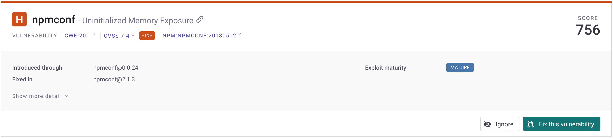
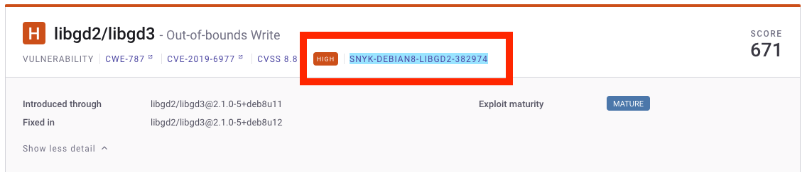
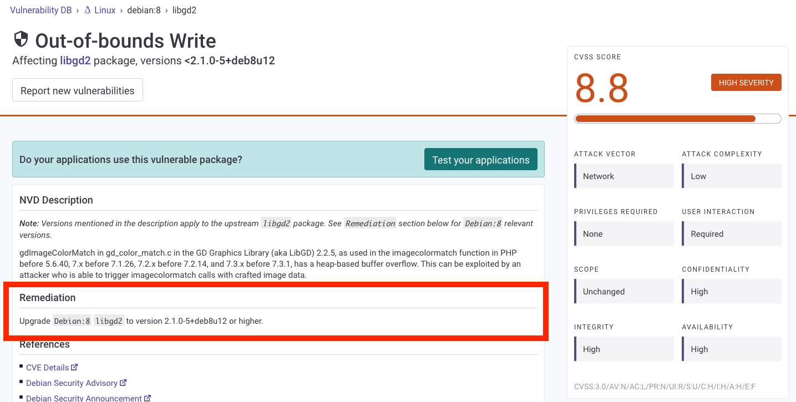

# 취약점 수정 유형

하나 이상의 프로젝트를 통합하거나 CLI로 스캔하여 Snyk로 가져온 후에는 Snyk가 발견한 취약점을 나열합니다. 목록을 보려면 프로젝트로 이동하여 취약점을 보고 싶은 프로젝트가 포함된 타겟을 선택하고 해당 프로젝트를 선택하여 문제 목록을 엽니다.


문제 목록에는 수정된 취약점이 표시되지 않습니다. 이러한 것들은 더 이상 취약점으로 간주되지 않습니다.


문제 목록의 사이드바에는 필터 그룹이 있습니다. 취약점과 관련된 필터는 다음과 같습니다:

* **계산된 수정 가능성** 필터를 사용하여 문제 해결 경로에 따라 취약점을 볼 수 있습니다.
* "\*\*다음 내용에 수정됨" 이용 가능 \*\* 필터를 사용하여 발견된 취약점이 수정된 버전이 있는지 확인할 수 있습니다.

## 계산된 수정 가능성 필터

계산된 수정 가능성 필터에는 다음이 포함됩니다:

* **수정 가능:** 식별된 모든 문제에 대한 수정이 있으므로 모든 상세 경로에 문제 해결 방법이 있고 문제가 수정 가능합니다. 지원되는 생태계와 가져오기에 대해서는 **이 취약점 수정** 버튼이 제공됩니다. 이 옵션은 CLI 또는 수정 PR을 지원하지 않는 생태계를 사용하여 가져온 프로젝트에는 제공되지 않습니다.
* **부분적으로 수정 가능:** 문제에는 업그레이드 가능한 경로가 있습니다. 현재 프로젝트를 업그레이드하는 방법을 Snyk가 찾았습니다. JavaScript 또는 TypeScript 생태계를 사용하고 npm 또는 Yarn 패키지 매니저를 사용하는 경우 모든 상세 경로 중 하나만 수정이 가능한 경우 문제가 부분적으로 수정 가능하며 **이 취약점 부분적으로 수정** 옵션이 제공됩니다.
* **지원되는 수정 없음:** 문제에 업그레이드 가능한 경로가 없습니다.

### 수정 가능

Snyk 오픈소스 및 Snyk 컨테이너너 프로젝트에서 수정 PR을 사용하는 SCM 워크플로우를 통해 가져온 경우 Docker, JavaScript, Java, Ruby, Python 또는 .NET 생태계의 경우에는 **이 취약점 수정** 버튼을 사용할 수 있습니다.


수정 PR 워크플로우에서는 **이 취약점 수정** 옵션이 제공되지 않습니다.


**수정 가능** 이슈에서 **이 취약점 수정**을 사용할 수 있는 프로젝트의 경우, Snyk는 의존성을 안전한 버전으로 업데이트하기 위해 리포지토리에 대한 풀 Request를 엽니다.

문제 카드에서 **이 취약점 수정** 버튼을 찾아서 Snyk가 프로젝트에 대한 풀 Request를 열 수 있는지 확인합니다. 문제의 문제 해결 가능성에 대한 세부 정보를 보려면 **문제 카드**를 확인하세요.

<figure><figcaption>
수정 가능한 취약성
</figcaption></figure>

### 부분적으로 수정 가능

JavaScript 또는 TypeScript 생태계를 사용하고 npm 또는 Yarn을 패키지 매니저로 사용하는 경우 취약점을 부분적으로 수정할 수 있습니다.

문제 카드의 세부 경로 영역에 문제에 대한 **부분적으로 수정된** 취약성 정보를 볼 수 있습니다.


문제 수정 가능성은 JavaScript 및 TypeScript에 대해서만 제공됩니다.


<figure><figcaption>
일부 수정 가능한 취약성
</figcaption></figure>

### 지원되는 수정 없음

취약점이나 라이선스 문제에 대한 **지원되는 수정이 없으면** 문제 카드에 수정 옵션이 표시되지 않습니다. 변이 의존성에서 유일한 변경이 있는 경우 패키지 매니저에서 지원하면 고려됩니다.

<figure><figcaption>
지원되지 않는 수정이 있는 취약점
</figcaption></figure>

## "**다음 내용에 수정됨" 이용 가능 필터**

"**다음 내용에 수정됨**" 가능한 필터에서 다음 필터를 사용할 수 있습니다:

* **예**: 현재 버전에는 취약점이 포함되어 있지만 수정된 새 버전이 있으며 지정된 버전으로 업데이트하여 취약점을 제거할 수 있습니다.
* **아니요**: 감지된 취약점에 대해 수정이 사용가능한 버전이 없습니다.

문제 카드에서 취약성에 대한 **다음 내용에 수정됨** 정보를 볼 수 있습니다. 이는 더 이상 취약점이 없는 패키지 버전을 나타냅니다.

<figure><figcaption>
문제 카드에 있는 수정됨 정보
</figcaption></figure>

### 문제가 수정 가능하지만 '수정됨'이 표시되는 이유

직접적인 종속성은 시스템 전체에 있는 안전한 패키지 버전이 존재하는 경우 수정 가능합니다. 그러나 계산 의존성은 수정 가능하려면 수정 가능한 바로 가기 종속성을 가져야 합니다. 계산 종속성의 예가 아래에 나와 있습니다.

<figure><figcaption>
수정됨으로 표시된 계산 종속성
</figcaption></figure>

상세 경로 섹션(이미지의 각진 파란 사각형)에는 해결 경로가 없음이 표시됩니다. 그러나 문제 카드에는 취약점이 최신 버전(이미지의 상단 빨간색 사각형)에 수정되었음이 표시됩니다. Snyk는 이 프로젝트에서 취약점이 존재하는 수준에 도달할 수 없지만 취약점은 '지원되는 수정 없음' 정의와 일치하지 않습니다.

### 계산 종속성 수정하기


상호 의존하는 관계로 인해 계산 종속성을 자동으로 수정하거나 수정 PR을 열 수 없습니다([취약점 수정: 수정 적용하기](fix-your-vulnerabilities.md#apply-fixes) 참조) . Snyk는 변이 의존성에 대해서는 추천만 제공하여 중단 사항을 피합니다.


예시에서와 같이 계산 종속성을 수정하려면 [Snyk 취약점 데이터베이스](snyk-vulnerability-database.md) 링크를 따르세요:

<figure><figcaption>
Snyk 취약점 데이터베이스로 링크
</figcaption></figure>

Snyk 취약점 데이터베이스에서 더 많은 수정 정보를 위해 수정 팁을 볼 수 있습니다:

<figure><figcaption>
취약점 데이터베이스 수정 팁
</figcaption></figure>

### 직접 종속성을 통한 계산 종속성 수정

Snyk가 영향을 받은 계산 종속성을 수정하기 위해 동일한 버전을 사용하는 직접 종속성을 사용하는 것을 권장한다면 직접 종속성을 다시 설치하여 새 버전의 계산 종속성을 업데이트할 수 있습니다.

영향을 받은 계산 종속성인`loader-utils@2.0.2`를 수정할 때 `react-scripts@5.0.1`에 의존하는 프로젝트를 고려해 보겠습니다. Snyk는 취약한 구성요소가 있는 직접 종속성으로 `react-scripts`를 업데이트하여 취약한 구성요소를 수정할 것을 권장합니다. 업데이트 후 취약한 패키지 `loader-utils`는 여전히 버전`2.0.2`에서 실행됩니다. 이는 프로젝트 내 다른 패키지가 더 높은 버전으로 업그레이드되지 못하도록 금지하고 있음을 나타냅니다. `react-scripts@5.0.1` 직접 종속성을 다시 설치하여 이 문제를 해결할 수 있습니다. 그런 다음 이후에 취약한 구성요소를 업그레이드할 수 있습니다.
