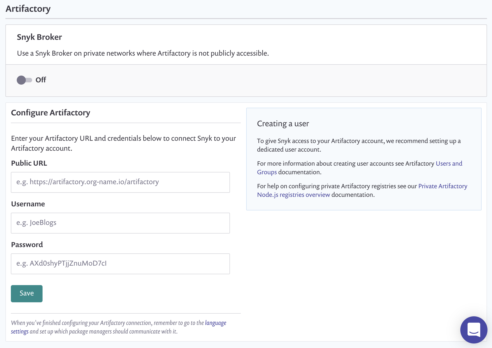

# Artifactory Package Repository 연결 설정


**기능 가용성**\
패키지 저장소 통합은 엔터프라이즈 플랜에서만 사용 가능합니다. 자세한 정보는 [요금제 및 가격 정보](https://snyk.io/plans/)를 참조하십시오.

**지원되는 프로젝트**\
Artifactory 패키지 저장소 통합은 [Node.js](../../../../supported-languages-package-managers-and-frameworks/javascript/#supported-frameworks-and-package-managers) (npm 및 Yarn) 및 [Maven](../../../../supported-languages-package-managers-and-frameworks/java-and-kotlin/#supported-frameworks-and-package-managers) 프로젝트를 지원합니다. [개선된 Gradle SCM 스캔](../../../../supported-languages-package-managers-and-frameworks/java-and-kotlin/git-repositories-with-maven-and-gradle.md#improved-gradle-scm-scanning-early-access)을 위해서는 Maven 설정을 사용하십시오.


커스텀 Artifactory 패키지 저장소를 연결하면 Snyk가 커스텀 레지스트리에 호스팅된 패키지의 모든 직접 및 간접 종속성을 해결하고 더 완전하고 정확한 종속성 그래프 및 관련 취약점을 계산할 수 있습니다.

다음과 같은 유형의 Artifactory 패키지 저장소를 구성할 수 있습니다:

- 기본 인증으로 보호되는 공개적으로 접근 가능한 인스턴스
- Snyk 브로커를 사용하여 비공개 네트워크에 있는 인스턴스(기본 인증 사용 여부에 관계 없음).

이 지침은 공개적으로 접근 가능한 인스턴스를 구성하는 데 적용됩니다. 브로커 인스턴스를 구성하는 지침은 [Artifactory 저장소와 함께 Snyk 브로커 설치 및 구성 지침](../../../../enterprise-setup/snyk-broker/install-and-configure-snyk-broker/artifactory-repository-install-and-configure-broker/)을 참조하십시오.

Artifactory Repository Manager 설정을 위한 단계는 다음과 같습니다.

1. **설정** > **통합 > 패키지 저장소 > Artifactory**로 이동합니다.
2. Artifactory 인스턴스의 URL을 입력하십시오. URL은 반드시 `/artifactory`로 끝나야 합니다.
3. 사용자 이름과 비밀번호를 입력하십시오.
4. **저장**을 선택하십시오.

<figure><figcaption>
Artifactory 저장소 설정
</figcaption></figure>